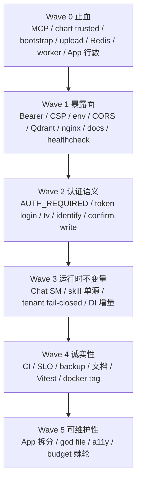
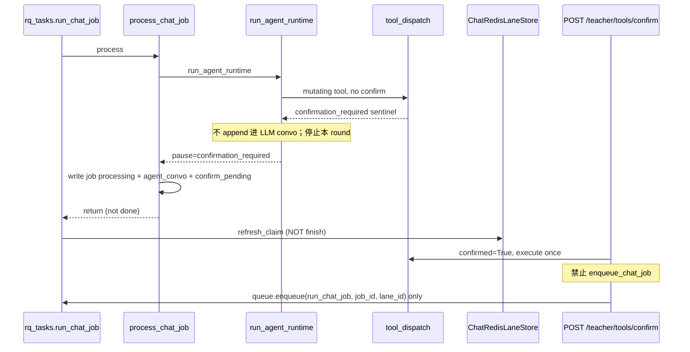
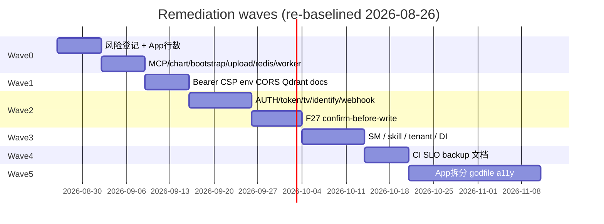
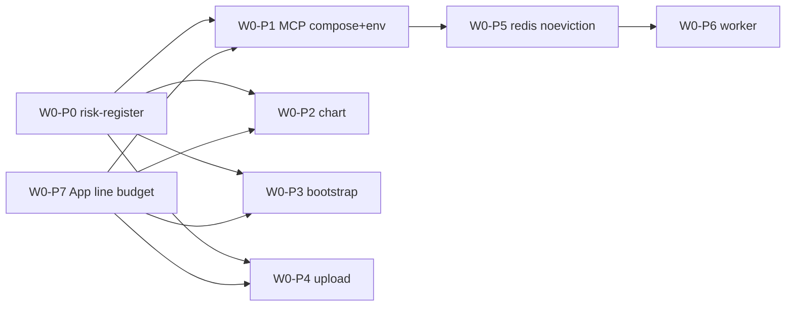

# teacherAgent 2026-08-26 全量审计修复方案

> **本文件是当前权威修复方案。** 它取代 `docs/plans/2026-08-22-audit-remediation-design.md`。2026-08-26 复审确认：**F1–F42 / L1–L7 没有任何一项落地**。08-22 的 Wave / PR DAG / 代码草图仍然有效，本文件在对照当前代码后重新编号引用，并并入新发现 F43–F53。

| 字段 | 值 |
| --- | --- |
| 文档标题 | Complete audit remediation plan for teacherAgent |
| 作者 | TBD（平台 Owner 签字后生效） |
| 日期 | 2026-08-26 |
| 状态 | Draft |
| 产品 | 教学 workflow 产品（teacher / student / admin） |
| 审计结论 | 校内单校部署 **Conditional Pass**；互联网暴露或多租户生产 **Fail** |
| 问题规模 | 工作清单：F1–F42（沿用）+ L1–L7（沿用）+ F43–F53（2026-08-26 新发现）。F22 并入 F4，F23 并入 F2，F50 并入 F18，F51 并入 F21，F52 并入 F13。 |
| 治理约束 | `CONTRIBUTING.md` L/M/H。下表「级别」= 治理等级。Critical 按 H 执行（2 评审 + 安全测试 + 风险登记）。M/H 必须 TDD。 |
| 复审基线 | 对照仓库 `/home/tdcasual/codework/teacherAgent` 于 2026-08-26；**禁止**把 08-22 行号当现状。 |

---

## Overview

本方案不是新产品设计。它把 2026-08-22 全量审计与 2026-08-26 复审合并成可独立合并、可回滚、按 `CONTRIBUTING.md` 分级的有序 PR。运行时主链路仍是 `role -> workflow(skill) -> prompt stack -> tool policy -> chat job -> memory side effects -> history`。栈：FastAPI + Vite（teacher/student）+ Docker Compose + RQ/Redis。禁止发明 skill marketplace / 通用 agent 平台 / Grafana 完整幻想。

修复原则：**fail-closed 默认值 + 小守卫 + 增量抽取**。禁止整仓重写。保持 Bearer header，本波不改 Cookie。MCP 作为可选 sidecar 保留，但空密钥必须 503。chart 三条路径分开：LLM/tool_loop 永远 sandboxed+扫描；exam/template 内部 `template`；operator trusted 仅在 `CHART_EXEC_TRUSTED_ENABLED=1` 且两个 allowlist 均非空，且永远不可从 tool_loop/chat/llm 进入。

2026-08-26 复审相对 08-22 的增量：

1. **零修复落地。** 不得把「部分改善」写成 FIXED。
2. **Wave 0 收紧。** 风险登记逾期测试已红；教师 `App.tsx` 行数守卫已红（984 vs `<980`）；MCP 的 compose `:?`、非空 example、README 警告与代码 503 **必须同一 PR**。
3. **新发现 F43–F53** 全部进表，不得静默丢弃。

---

## Background & Motivation

### 2026-08-26 复审判决

| 部署场景 | 结论 |
| --- | --- |
| 校内单校、不暴露公网、运维信任边界内 | Conditional Pass |
| 互联网暴露、多租户、或把 compose 当生产编排却不填密钥 | **Fail** |

**没有任何 F1–F42 / L1–L7 项状态为 FIXED。** 仅有以下 **partial**（不得据此关闭 ID）：

| Partial | 证据 | 仍开放的缺口 |
| --- | --- | --- |
| Redis 绑定回环 | `docker-compose.yml:107` `127.0.0.1:${REDIS_PORT:-6379}:6379` | 仍 `allkeys-lru` + `maxmemory 256mb`（L104），RQ 与 `ChatRedisLaneStore` 共用 |
| compose `AUTH_REQUIRED` 默认 1 | `docker-compose.yml:25` `AUTH_REQUIRED=${AUTH_REQUIRED:-1}` | `require_principal` 在 `auth_required()==False` 时短路（`services/api/auth_service.py:322-323`）；pytest 未设 env 自动关（L45-48） |
| exam/assignment *start* 20/80MB | `services/api/exam_upload_start_service.py:10-12`、`services/api/assignment_upload_start_service.py:18` | `/upload` 无界但已流式；`/student/submit` 与 OCR 全量 `read()`；仅 start 有后缀；`/upload` **无角色门** |
| analysis runtime metrics 持久化 | `analysis_ops_service.py:8,48-51` 读 `AnalysisMetricsService.snapshot` | `runtime_builder.py` 工厂 + `binding_registry.py` lookup 仍双表 |
| 主 compose backup 挂载收窄 | `docker-compose.yml:181-184` 不再 `./:/workspace` | profile `backup` 默认关；`docker-compose.backup.draft.yml:31` 仍挂整仓；restore 无 E2E |
| CI `smoke-e2e` 存在 | `.github/workflows/ci.yml:315` | `frontend-quality` 无 `npm run test:unit`；`teacher-e2e.yml` path-filter 仅 `frontend/**`；`docker.yml` `tags: ["v*"]` 绕过 CI |

风险登记 `docs/reference/risk-register.md` 最后验证 2026-03-03，下次复审 2026-06-03 — **已逾期**。`tests/test_docs_governance_baseline.py::test_risk_register_review_dates_are_not_expired` 在 2026-08-26 必红。`RISK-CHART-TRUSTED-001` 纸面关闭，但 LLM 路径仍可选 `trusted`。

### 痛点（当前代码）

1. 互联网可达面：MCP 空密钥放行 + compose 发布 `9000:9000`（容器内 uvicorn `0.0.0.0:9000`）；`chart.exec` 模型可选 trusted；已提交明文 admin 密码。Qdrant `:latest` + `6333:6333` 仅在 `docker compose --profile qdrant` 时启动，**不是**默认 5 分钟栈。
2. RQ 与 chat lane 共用会 LRU 驱逐的 Redis；chat idempotency 是文件系统，不是 Redis。
3. `AUTH_REQUIRED=0` 在有 principal 时也关掉授权；`/upload` 无角色门；`/student/verify` 无鉴权且泄漏 `student_id`。
4. SLO 文档声称 30 天 99% / p95≤1s；实现是进程内 5000 样本、2 个 uvicorn worker、无 Prometheus。
5. 教师 `App.tsx` 984 行，`test_teacher_app_line_budget` 断言 `< 980` — **maintainability CI 当前失败**。不得把完整 App 拆分塞进 Wave 0，但必须有一个 **行数-only 的小抽取** 先让守卫变绿。

---

## Goals & Non-Goals

### Goals

1. 关闭全部 Critical，以及 Wave 0 中的数据丢失类 High。
2. 每个 M/H 修复失败测试先行；H：2 评审 + 风险登记 + 回滚。
3. 保持 `Authorization: Bearer`。不切换 Cookie（避免本波引入 CSRF）。
4. MCP 作为可选 sidecar 保留，必须 fail-closed（空密钥 = 503，不是开放）。
5. chart 三条路径（见 Key Decisions）。
6. 不降低 pytest `--cov-fail-under=84`、frontend lint/typecheck/build 门禁。
7. 教师 App **行为保持**拆分以 Playwright 为安全网。Wave 0 **不依赖** App 拆分；Wave 0 **可以**抽取 `App.tsx:48-64` 以通过 `<980` 守卫（W0-P7）。
8. F1–F42、L1–L7、F43–F53 每条映射到**唯一主 PR 或唯一 AR-***。跟随 PR 写在 AR 或「主 PR」行里，不算第二主人。Low 不得静默丢弃。F22 并入 F4；F23 并入 F2。F16 主 = W0-P7，剩余 = AR-F16-SPLIT。F10 主 = W3-P1，跟随 W3-P2。F34 **一 god file 一 PR**：W5-P5（auth_registry）/ W5-P8（chart_executor）/ **W5-P8b**（chat_job_processing）/ **W5-P8c**（exam_upload_parse）。

### Non-Goals

1. 整仓 backend 重写，或一次做完完美 DI。
2. 删除 MCP（Owner 2026-08-26 已决：**保留 fail-closed sidecar**）。
3. Cookie session。
4. 完整 Grafana/Prometheus 平台；本方案只做诚实文档 + 可刮取的最小 `/ops/metrics.prom`。
5. 新产品功能（skill 市场、通用 agent、新工作台流程）。
6. 强制 `git filter-repo` 改写 `main` 历史（Owner 2026-08-26 已决：**否**）。
7. 生产 backup profile 默认开启（Owner 2026-08-26 已决：**否**；staging 可用 `--profile backup`）。

---

## Key Decisions

1. **不删除 MCP，锁定它（Owner 2026-08-26 已决）。** W0-P1 **同一 PR** 交付：代码空密钥 503、compose `${MCP_API_KEY:?…}`、example `MCP_API_KEY=change_me`、README 警告、`hmac.compare_digest`、脚本与 `--out`/sources 白名单。容器内 uvicorn 仍听 `0.0.0.0:9000`；发布面 loopback。`/health` 保持匿名。**不**删除 compose `mcp` 服务。
2. **Redis 只改 `noeviction`，不拆第二实例。** 客户端只有 RQ + `ChatRedisLaneStore`。idempotency 是文件。lane 不得迁到 LRU。OOM → enqueue/lane 5xx，盯 `used_memory`。
3. **chart 三条路径。** LLM/tool_loop：永远 sandbox+扫描，schema 无 `execution_profile`。exam：保留 `template`。operator trusted：`CHART_EXEC_TRUSTED_ENABLED=1` + 非空 source/role allowlist，source ∉ `{tool_loop,chat,llm}`。空 allowlist deny。sandbox FS 根去掉 `data/`。
4. **保持 Bearer header，不换 Cookie。**
5. **AUTH_REQUIRED 真值表唯一（见 F18）。** 有 principal 永远走授权。`0` 仅非 production 允许**匿名**打非 exempt 路由；production 视显式 `0` 为 1。路径豁免在 `_auth_exempt_path`（含 `/admin/`）；**OPTIONS** 在 `_is_exempt_auth_request`（`services/api/auth_service.py:188-193`），不在 path 表。`/admin/` 另需 `X-Admin-Key`（F50 并入，不缩小豁免）。禁止「0 时 teacher 一律 401」。pytest + 未设 `AUTH_REQUIRED` 保持自动关，即使 `APP_ENV=production`。
6. **SLO 诚实 + `/ops/metrics.prom` 走现有 `service`/`admin` 鉴权。**
7. **confirm-before-write：`POST /teacher/tools/confirm` + 真实 loop 暂停。** Resume **禁止** `enqueue_chat_job`（Lua `SISMEMBER queued` → `dispatch=0`）。
8. **Admin 明文：轮换 + gitignore + `git rm --cached` + 生产必须轮换 `AUTH_TOKEN_SECRET`。不 rewrite 历史（Owner 2026-08-26 已决：不做 `git filter-repo`）。**
9. **教师 App 行数：W0-P7 抽取 `App.tsx:48-64`（katex CSS + 宽度常量 + tab items + `workbenchMaxWidthForViewport`）及 tab icon imports。成功标准是 `test_teacher_app_line_budget` 绿（`<980`），不是 `<970`。** 完整拆分是 AR-F16-SPLIT（W5-P9 先于 W5-P1）。Wave 0 其余 PR 不改 `App.tsx`。此条已决，不是 Open Question。
10. **质量门禁只棘轮向下，不降低 84% 覆盖率。**
11. **租户初始化失败不再落入默认 `data/`。**
12. **W1-P5 三件套同一 PR（Owner 2026-08-26 已决）。** compose 设 `APP_ENV=${APP_ENV:-production}`、`MASTER_KEY=${MASTER_KEY:?MASTER_KEY is required}`、`CORS_ORIGINS` 默认 3001/3002 且禁止 `*`。单独设 `APP_ENV` 会因 `validate_master_key_policy` 打死 api，故三件必须同 PR。W2-P6 仍删除硬编码 `dev-master-key-unsafe-change-me`（dev 无 key 时 warning + 拒绝写入）。
13. **Worker healthcheck 用心跳文件（推荐）或括号 pgrep；禁止自匹配 argv。** W0-P6：**chat 只加 `job_timeout`，不加 `Retry`**。upload/exam/survey 可 `Retry`。不要在没有 `try_claim_running` 的情况下重试 `run_chat_job`。
14. **上传：共享数字上限在 `upload_limits.py`；后缀必须命中该流 allow-set，否则 400 `invalid_suffix`。** MIME 空 / `application/octet-stream` / 浏览器乱报的 Excel/TeX 类型 **从不**因 MIME 拒绝合法后缀。MIME **不是**第二道门，也 **不能**单凭 MIME 放行未知后缀。复用 `save_upload_file`。OCR/`/student/submit` 的全量 `read()` 纳入 W0-P4。`/upload` 加 `require_principal`（任一已认证角色）。
15. **FastAPI `/docs` `/redoc` `/openapi.json` 在 production 或 `AUTH_REQUIRED=1` 时卸载（404 + 无 schema）。** 现状：`AUTH_REQUIRED=1` 时匿名已 401，但已认证非 admin 仍可刮 schema；`AUTH_REQUIRED=0` 时匿名开放。MCP 自己的 FastAPI `/docs`（`services/mcp/app.py:35`）在 W1-P6 一并关。测试必须 `create_app()` 后换 env。
16. **Low 项全部有 PR 或 AR-***。级别列 = PR 风险列。
17. **Wave 0 之后不得把栈当公网门禁。** 仍 fail-open 的洞见「Still fail-open after Wave 0」表。任何非 loopback 暴露前必须完成 Wave 1 + W2-P1。

---

## 发现清单与处置总表

级别 = CONTRIBUTING 治理等级。审计 Critical 在本表记 H。并入项保留编号以免丢映射，**不另开 PR**。

| ID | 级别 | 摘要 | Wave | 处置 | PR |
| --- | --- | --- | --- | --- | --- |
| F1 | H | MCP 空密钥 = 无认证，且 `0.0.0.0:9000` | W0 | 修 | W0-P1 |
| F2 | H | `chart.exec` trusted 仍可被 LLM 选中；sandbox 可读 `data/`（含 F23） | W0 | 修 | W0-P2 |
| F3 | H | 已提交明文 admin 密码 | W0 | 修 | W0-P3 |
| F4 | H | `/upload`、`/student/submit` 无界；仅后缀无 MIME；OCR `read()`；`/upload` 无角色门（含 F22） | W0 | 修 | W0-P4 |
| F5 | H | Redis `allkeys-lru` 256mb 共用 RQ 与 `ChatRedisLaneStore` | W0 | 修 | W0-P5 |
| F6 | H | worker healthcheck 自匹配 / 无 retry / scan 默认 0；slim 可能无 pgrep | W0 | 修 | W0-P6 |
| F7 | H | Bearer 拦截器挂到所有 fetch；API base 可改；学生无 401 清理 | W1 | 修 | W1-P1 |
| F8 | H | nginx 无 CSP / nosniff / frame-ancestors | W1 | 修 | W1-P2 |
| F9 | H | 可选 `--profile qdrant`：`6333:6333` 无认证 + `:latest`（**不是**默认 5 分钟栈） | W1 | 修 | W1-P3 |
| F10 | H | 空心 DI；租户初始化 fail-open；进程级 LLM/cache/OBS | W3 | 修（增量） | **W3-P1（主）**；跟随 W3-P2 |
| F11 | M | chat start/fail 绕过 `ChatJobStateMachine` | W3 | 修 | W3-P3 |
| F12 | M | skill 三路打分相加 | W3 | 修 | W3-P4 |
| F13 | H | `.env.production.min.example` 缺 REDIS_PASSWORD / AUTH_TOKEN_SECRET / CORS_ORIGINS / MASTER_KEY；MCP 空（含 F52） | W1 | 修 | W1-P4（MCP 已在 W0-P1） |
| F14 | M | SLO 文档 30 天；实现进程内 5000 样本 | W4 | 修 | W4-P1 |
| F15 | M | backup profile 默认关；restore 未 E2E；draft 挂整仓 | W4 | 修；**生产保持默认关**（Owner 已决） | W4-P2 |
| F16 | M | Teacher `App.tsx` 984 vs `<980`（**测试已红**）；hooks 1110 / Topbar 827 | W0 行数 | 修 | **主 = W0-P7**；剩余拆分 = **AR-F16-SPLIT**（W5-P9→P1–P3b） |
| F17 | H | CORS 默认 `*`；compose 不设 `APP_ENV` → `MASTER_KEY` 落到 `dev-master-key-unsafe-change-me` | W1 | 修 | W1-P5 |
| F18 | H | `AUTH_REQUIRED=0` 在有 principal 时也关闭授权（含 F50 `/admin/` Bearer 豁免需文档+测试） | W2 | 修 | W2-P1 |
| F19 | M | 学生 token 登录仍存在，与文档冲突 | W2 | 修 | W2-P2 |
| F20 | H | admin token 缺 `tv` | W2 | 修 | W2-P3 |
| F21 | H | identify 泄漏稳定 ID（含 F51 `/student/verify` 无鉴权） | W2 | 修 | W2-P4 |
| F22 | H | （并入 F4）上传只校验后缀、无 MIME | W0 | 并入 | W0-P4 |
| F23 | H | （并入 F2）chart sandbox 可读 `data/` | W0 | 并入 | W0-P2 |
| F24 | M | survey webhook secret 可选 | W2 | 修 | W2-P5 |
| F25 | H | 自制流密码 + 默认 master key | W2 | 本波只去默认值 | W2-P6 |
| F26 | M | 进程内 120rpm；登录未隔离；空 XFF allowlist 信任全部 | W2 | 修 | W2-P7 |
| F27 | H | 教师变异工具无 confirm-before-write | W2 | 修 | W2-P8 |
| F28 | M | 路由仍编排（assignment download ACL） | W5 | 修 | W5-P4 |
| F29 | M | application 层导入 FastAPI 类型 | W5 | 修 | W5-P4 |
| F30 | M | exam/assignment `application.py` 透传 | W5 | 部分修 + AR-F30 | W5-P5 / AR-F30 |
| F31 | M | analysis domain 双真相（部分改善，仍双表） | W5 | 修 | W5-P6 |
| F32 | L | quality budget ruff 35 / mypy 63 / allowlist 146 | W5 | 棘轮 | W5-P7 |
| F33 | L | 462 处 `except Exception` | W5 | 棘轮 | W5-P7 |
| F34 | M | god files：auth_registry 1668 / chat_job_processing 1529 / chart_executor 1491 / exam_upload_parse 1101 | W5 | 拆（一 god file 一 PR） | W5-P5（auth_registry）；W5-P8（chart_executor）；**W5-P8b（chat_job_processing）**；**W5-P8c（exam_upload_parse）** |
| F35 | M | 师生 pending job 契约不一致 | W5 | 修（先于 App 拆分） | W5-P9 |
| F36 | M | 缺 htmlFor/aria-label；dialog 无 Tab trap | W5 | 修 | W5-P10 |
| F37 | M | 触控目标 30–36px（tab bar 除外） | W5 | 修 | W5-P10 |
| F38 | L | dialog 默认绿 `#10a37f` vs app `#0052CC`；PWA `#2f6d6b` | W5 | 修 | W5-P10b |
| F39 | M | Vitest 不在 `frontend-quality`；teacher-e2e path-filter | W4 | 修 | W4-P3 |
| F40 | M | `v*` tag 镜像发布绕过 CI | W4 | 修 | W4-P4 |
| F41 | L | `mem0_config.py` + README Mac 绝对路径 | W4 | 修 | W4-P5 |
| F42 | L | 学生 how-to 描述不存在的作业提交 UI | W4 | 修 | W4-P5 |
| L1 | L | `docs/plans/` 含**本文件**在内的计划稿（`*.md` + templates） | W5 | 索引 + 接受剩余 | W5-P11 / AR-L1 |
| L2 | L | `playwright.v2.config.ts` → 缺失 `v2/` | W4 | 删除配置 | W4-P3 |
| L3 | L | prettier 只检查 `apps/shared` | — | 接受 | AR-L3 |
| L4 | L | `.github/CODEOWNERS` 全是 `@tdcasual` | — | 接受 | AR-L4 |
| L5 | L | ErrorBoundary `localStorage.clear()` — **师生都有** | W1 | 修 | W1-P1 |
| L6 | L | OCR 依赖未钉版本 (`>=`) | W4 | 修 | W4-P6 |
| L7 | L | coverage omit `rq_worker.py` | W0 | 修 | W0-P6 |
| F43 | H | API+MCP `/docs` 已挂载无角色门：匿名仅 auth off；已认证非 admin 可刮 schema | W1 | 修 | W1-P6 |
| F44 | M | frontend `nginx:alpine` healthcheck 用 `curl`，镜像通常没有 | W1 | 修 | W1-P7 |
| F45 | L | Noto Sans SC 声明但从未加载 | W5 | 修 | W5-P10b |
| F46 | M | 无 `React.lazy`；KaTeX CSS 在 `App.tsx` 同步导入 | W5 | 修（W0-P7 只搬家） | W5-P12 |
| F47 | M | `.ghost`（`tailwind.css:102-122`）无 `:focus-visible`；Composer 按钮同类 | W5 | 修 | W5-P10 |
| F48 | L | 无 `color-scheme` / `prefers-color-scheme` | W5 | 修 | W5-P10b |
| F49 | L | `SECURITY.md` 无联系邮箱 | W4 | 修 | W4-P5 |
| F50 | H | `/admin/` 在 `auth_service` 层跳过 Bearer | W2 | 并入 F18 | W2-P1 |
| F51 | H | `/student/verify` 无鉴权且泄漏 `student_id` | W2 | 并入 F21 | W2-P4 |
| F52 | M | README「5 分钟」`cp example && compose up` 会因 `REDIS_PASSWORD:?` 失败 | W1 | 并入 F13 | W1-P4 |
| F53 | M | CI ruff/black 只扫极小文件切片 | W4 | 修（诚实+扩大安全面） | W4-P7 |

---

## Proposed Design

### 总体策略



Wave 0 **不得依赖** 教师 App 拆分。W0-P0 **与** W0-P7 是整波（及后续全仓 pytest）的根：governance 日期测试与 `test_teacher_app_line_budget` 当前都红。compose 编辑串行：W0-P1 → W0-P5 → W0-P6（其后 W1-P3 / W1-P5 / W1-P7 继续串在 compose 链上）。env/README 串行：W0-P1 → W1-P4 → W1-P5。后续 H PR 若改 `docs/reference/risk-register.md` 必须 rebase W0-P0。每个 Wave 内 PR 先失败测试再实现。H 变更：2 评审 + 风险登记 + 回滚。

### 架构落点（现有，不新造）

| 层 | 现有入口 | 本方案改什么 |
| --- | --- | --- |
| 组合根 | `services/api/app.py`、`services/api/container.py` | 租户 fail-closed；把 OBSERVABILITY / gateway 逐步挂进 container |
| 工具门 | `services/api/tool_dispatch_service.py` | 变异工具 confirm-before-write；chart trusted 不可达 |
| Chat 状态 | `services/api/chat_job_state_machine.py` | 所有 status 写入必须 `transition_chat_job_status` |
| Skill 路由 | `services/api/skill_auto_router.py` + skill manifest | 单一评分源 |
| 上传限额 | exam/assignment start 已有 20/20MB/80MB | 推广到 `/upload`、`/student/submit`、OCR |
| 前端 API | `frontend/apps/shared/authFetch.ts`、`apiBase.ts` | 仅对 API origin 加 Bearer；生产钉死 API base |

---

## Wave 0 / P0 — 止血

复审收紧：W0-P0 **与** W0-P7 必须先合（或作为「unblock CI」双根），否则 `backend-quality` 的 governance 日期测试与 `test_teacher_app_line_budget` 让**每一个**后续 PR 都红。不要把 Redis loopback / AUTH_REQUIRED 默认 1 / exam 限额当成 Wave 0 已完成。Wave 0 **不是**公网暴露门禁（见下文 fail-open 表）。

### F1 MCP 空密钥 + 全接口发布

**现状（2026-08-26）**

- `services/mcp/app.py:22` `API_KEY = os.getenv("MCP_API_KEY", "")`
- `services/mcp/app.py:73-75` `if API_KEY and x_api_key != API_KEY` → 空密钥直接放行
- `services/mcp/app.py:580-582` `/mcp` 调用 `auth()`
- `services/mcp/app.py:573-574` `run_script()`：`subprocess.run(args, …, cwd=str(APP_ROOT))`，无路径白名单
- `docker-compose.yml:50-55` `ports: "9000:9000"`，`MCP_API_KEY=${MCP_API_KEY:-}`
- `services/mcp/Dockerfile:30` `uvicorn --host 0.0.0.0 --port 9000`
- `.env.production.min.example:7` `MCP_API_KEY=`
- 工具含 `student.profile.update`、`assignment.generate`、`lesson.capture`
- `GET /health` 无认证（loopback 后可接受；compose healthcheck 依赖它）
- `services/mcp/app.py:35` `FastAPI(...)` 未设 `docs_url=None`；MCP `/docs` 在 W0 只靠 loopback 降暴露，卸载放到 W1-P6
- 现有 `tests/test_mcp_server.py::load_mcp` 调用方已传非空 `test_key` / `secret`；helper **默认** `api_key=""`（L12）未使用。W0-P1 必须把默认改成 `"test-key"`，以免夹具静默打到 503 路径

**目标行为（同一 PR 四层同时落地，禁止拆到 W1-P4）**

| | Before | After |
| --- | --- | --- |
| 代码空密钥 | `/mcp` 匿名可用 | 进程可启动；`/mcp` 返回 **503** `mcp_auth_not_configured` |
| compose | `${MCP_API_KEY:-}` + `9000:9000` | `${MCP_API_KEY:?MCP_API_KEY is required}` + `127.0.0.1:9000:9000` |
| example / README | `MCP_API_KEY=` | example 写 `MCP_API_KEY=change_me`。README **只加一句**：compose 现在要求 `MCP_API_KEY`；`REDIS_PASSWORD` 仍然必填，见下一份 env PR（W1-P4）。**不要**在本 PR 重写「5 分钟」步骤 |
| 密钥比较 | `!=`；`x_api_key is None` 未处理 | `None`→`""`；`hmac.compare_digest`。长度不匹配 → **401**，不抛 500 |
| 脚本 | 任意 `python3 <path>` | resolve 后白名单：`APP_ROOT/skills/**/scripts/*.py` 与 `APP_ROOT/scripts/render_assignment_pdf.py` |
| 用户路径 | `lesson.capture` sources、`--out` 任意 | 必须落在 `DATA_DIR` 或 `UPLOADS_DIR`；拒绝 symlink escape |
| `/health` | 无认证 | **保持**无认证，仅因 loopback 发布 |

`auth()` 必须先规范化 header：

```python
def auth(x_api_key: Optional[str]) -> None:
    expected = (API_KEY or "").encode("utf-8")
    provided = (x_api_key or "").encode("utf-8")
    if not expected:
        raise HTTPException(status_code=503, detail="mcp_auth_not_configured")
    if len(provided) != len(expected) or not hmac.compare_digest(provided, expected):
        raise HTTPException(status_code=401, detail="Unauthorized")
```

容器内 uvicorn 仍听 `0.0.0.0:9000`（Docker 网络需要），**发布面**由 compose 绑定回环。

**改动文件（全部在 W0-P1）**

- `services/mcp/app.py` — `auth()`、`run_script()`、sources/`--out` 校验
- `docker-compose.yml` — 端口与 `:?MCP_API_KEY is required`
- `.env.production.min.example`、`.env.example` — `MCP_API_KEY=change_me`
- `README.md` — 启动段警告
- `tests/test_docker_security_baseline.py`
- `tests/test_mcp_server.py` — 空密钥 503、错误密钥 401、`None` header
- 新增 `tests/test_mcp_script_allowlist.py`
- `docs/mcp_api.md`

**建议测试（TDD）**

1. `test_mcp_empty_api_key_rejects_rpc`：`MCP_API_KEY=""` 时 POST `/mcp` → 503。
2. `test_mcp_missing_header_is_401`：`x_api_key=None` → 401，不 500。
3. `test_mcp_wrong_key_401`：错误 key → 401；正确 key → 200。
4. `test_compose_mcp_binds_loopback_and_requires_key`。
5. `test_env_examples_have_nonempty_mcp_api_key_placeholder`。
6. `test_run_script_rejects_path_outside_allowlist`。
7. `test_lesson_capture_rejects_source_outside_data_dir`。
8. `test_tool_out_flag_rejects_etc_passwd_and_symlink_escape`。
9. `load_mcp` 默认 `api_key="test-key"`（`tests/test_mcp_server.py`）。

**风险登记**：新增 `RISK-MCP-UNAUTH-001`。Owner：平台。复审：2026-11-26。退出：空密钥 503 + compose `:?` + example 非空 + loopback + allowlist 测试连续绿。

**回滚**：不要回滚到空密钥放行。最多临时注释 compose `:?`，代码 503 必须留下。

---

### F2 chart.exec trusted 仍可被 LLM 选中（容器内 RCE）

**现状（2026-08-26）**

- `services/common/tool_registry.py:523-527` schema `enum: ["trusted", "sandboxed", "template"]`，模型可传 `trusted`
- `services/api/chart/policy_service.py:20-22` 直接读 `exec_args["execution_profile"]`
- `policy_service.py:79-81` 只对 `sandboxed` 做 `scan_code_patterns`
- `services/api/chart_executor.py:84-91` `_trusted_policy_denial`：allowlist **非空才拒绝**；compose 未设置 → 空 = 允许
- `chart_executor.py:982-985` sandbox 读允许 `[output_dir, uploads_dir, data_dir]`，`data_dir = uploads_dir.parent / "data"`（F23）
- `chart_executor.py:1133` subprocess `cwd=str(app_root)`
- `services/api/chart_sandbox.py:25-27` `_ENV_WHITELIST` 含 `DATA_DIR`
- `exam_analysis_charts_service.py:467` 内部 `execution_profile: "template"`（必须保留）
- `RISK-CHART-TRUSTED-001` 已关闭，退出条件被绕过

**目标行为：三条路径，禁止“内部一律 sandboxed”**

`tool_registry` 的 `_schema_object` 已 `additionalProperties: false`。从 LLM schema 删除 `execution_profile` 后，tool-loop 再传该字段会因 unexpected 被拒。

| 路径 | 调用点 | After |
| --- | --- | --- |
| A. LLM / tool_loop | `tool_dispatch` → `chart.exec`；source ∈ `{tool_dispatch.chart.exec, tool_loop, chat, llm}` | schema 无 `execution_profile`；**永远** `sandboxed` + `scan_code_patterns` |
| B. exam/template 内部 | `exam_analysis_charts_service.py:467` | **保留 `template`**。继续扫描。不是 LLM 可选档 |
| C. operator trusted | 仅非 tool_loop 的内部/CLI，且 env 打开 | 必须 `CHART_EXEC_TRUSTED_ENABLED=1` **且** `CHART_EXEC_TRUSTED_ALLOWED_SOURCES` / `_ROLES` 都非空；`source` 命中白名单且 **不得** 为 `tool_loop`/`chat`/`llm`。空 allowlist = deny |

**`_trusted_policy_denial` 伪代码（反转空值语义）**

```python
def _trusted_policy_denial(*, role: str, source: str) -> Optional[str]:
    if not _truthy(os.getenv("CHART_EXEC_TRUSTED_ENABLED")):
        return "trusted_not_enabled"
    allowed_sources = _parse_csv_lower_set(os.getenv("CHART_EXEC_TRUSTED_ALLOWED_SOURCES"))
    allowed_roles = _parse_csv_lower_set(os.getenv("CHART_EXEC_TRUSTED_ALLOWED_ROLES"))
    if not allowed_sources or not allowed_roles:
        return "trusted_allowlist_empty"
    if source not in allowed_sources or source in {"tool_loop", "chat", "llm"}:
        return "trusted_source_not_allowed"
    if role not in allowed_roles:
        return "trusted_role_not_allowed"
    return None
```

Sandbox FS roots：**只允许** `output_dir` + `uploads_dir`。env 白名单可留 `DATA_DIR` 变量名（`test_sandboxed_whitelist_includes_data_dir` 测的是 env key），但 **FS allowed_roots 不得含** `uploads_dir.parent / "data"`。trusted/template 的 `cwd` 不得是 `app_root`；sandboxed `cwd` 必须是 `output_dir`（或专用 scratch）。

**改动文件**

- `services/common/tool_registry.py`
- `services/api/chart/policy_service.py`
- `services/api/chart_executor.py`（denial + allowed_roots + cwd）
- `services/api/chart_sandbox.py`（可选：sandboxed env 去掉 `DATA_DIR` 值注入，或注入空）
- 重写：`tests/test_chart_exec_tool.py::test_chart_exec_tool_schema_exposes_optional_execution_profile`
- 重写：`tests/test_chart_executor_runtime_paths.py`（空 allowlist 不再跑 trusted；FS roots 不含 `data/`）
- 新增 `tests/test_chart_exec_trusted_fail_closed.py`
- `docs/reference/risk-register.md`：**重开** `RISK-CHART-TRUSTED-001`

**建议测试**

1. schema 不再含 `execution_profile`
2. tool_loop 传入 trusted → forbidden 或被忽略为 sandboxed
3. 空 allowlist deny trusted
4. `ENABLED=1` 但 source/role allowlist 缺一仍 deny
5. exam 路径 `template` 仍执行
6. 所有 profile 都调用 `scan_code_patterns`
7. sandboxed FS roots **不含** `data/`；sandboxed cwd ≠ `app_root`

**回滚**：保留 denial 反转，即使回滚 schema 也不要回到空 allowlist 放行。

---

### F3 已提交明文 admin 密码

**现状（2026-08-26）**

- `data/auth/admin_bootstrap.txt` 被 git 跟踪：`username=admin` / `password=1Hbz4hny_1Tx3Ye0h7BWIyqi`，`generated_at=2026-02-15T07:57:01+00:00`
- `.gitignore:57-61` 忽略 sqlite3* 与 `config/auth_token_secret`，**不忽略** 该 txt
- 写入点：`AuthRegistryStore._write_admin_bootstrap_file`（`auth_registry_service.py:612-627`），chmod 0600 已有

**运维步骤（必须写进 how-to，按顺序）**

1. **立即视为口令已泄露。**
2. 生产/校内：改密；若无法登录，设 `ADMIN_PASSWORD` 并删除 volume 内 `admin_auth` 行后重启（仅当确认无其他 admin）。
3. `.gitignore` 增加 `data/auth/admin_bootstrap.txt` 与 `data/auth/*bootstrap*`。
4. `git rm --cached data/auth/admin_bootstrap.txt`。不要提交新明文。
5. `_write_admin_bootstrap_file` 保留，0600，路径位于 DATA_DIR。
6. **不 rewrite `main` 历史**（Owner 2026-08-26 已决：不做 `git filter-repo`）。W0-P3 仅轮换 + gitignore + `git rm --cached`。`SECURITY.md` 写明历史口令已作废。
7. **生产必做**：同时轮换 `AUTH_TOKEN_SECRET`。旧 Bearer 全部失效。

**测试**：`test_gitignore_covers_admin_bootstrap_txt`；`test_tracked_auth_dir_has_no_plaintext_password`。

**回滚**：gitignore 规则不要回滚。口令轮换不可回滚到旧明文。

---

### F4 + F22 无界上传 + 仅后缀 + `/upload` 无角色门

**现状（2026-08-26）** — 按路由分开（不要把 `/upload` 说成全量 `read()`）：

| 路由 | 文件 | 角色门 | 数量/字节 | 后缀 | MIME | IO |
| --- | --- | --- | --- | --- | --- | --- |
| `POST /upload` | `services/api/routes/misc_general_routes.py:9-11` → `services/api/student_ops_service.py:20-30` | **无** | 无 | 无 | 无 | 已流式：`deps.save_upload_file` → `services/api/upload_text_service.py:43-68` |
| `POST /student/submit` | `services/api/routes/student_ops_routes.py:42-50` → `services/api/student_submit_service.py:80` | `resolve_student_scope`（auth off 时短路） | 无 | 无 | 无 | **全量** `await upload_file.read()`；同名覆盖 |
| assignment OCR | `services/api/assignment_questions_ocr_service.py:55` | 走 assignment 路由 | 无 | 无 | 无 | **全量** `read()` |
| exam/assignment *start* | `services/api/exam_upload_start_service.py:10-36`、`services/api/assignment_upload_start_service.py:18` | 有 | **已有** 20 / 20MB / 80MB | 有（按流） | **无** | 已 `save_upload_file` |

**目标行为**

`services/api/upload_limits.py` **只放共享数字**（不要再发明 `save_upload_streaming`）：

```python
MAX_FILES = 20
MAX_FILE_BYTES = 20 * 1024 * 1024
MAX_TOTAL_BYTES = 80 * 1024 * 1024
```

所有写盘复用现有 `save_upload_file`（`upload_text_service.py` / `job_repository.py`）。

**后缀是唯一录取门。MIME 从不单独放行，也从不否决合法后缀：**

- 后缀 **必须** 落在该流 allow-set，否则 **400 `invalid_suffix`**（无后缀、`.exe`、`.bin` 一律拒）。
- MIME 为空、`application/octet-stream`、或浏览器乱报的 Excel/TeX 类型 → **不**因此拒绝合法后缀。
- MIME **不是**第二道门：**禁止**「已知 MIME + 未知后缀 → 200」（例如 `Content-Type: application/pdf` 配 `.exe` 必须 400）。
- 禁止「MIME 与后缀不一致 → 400」——那会打掉合法 `.xlsx` + `octet-stream`。

| 流 | 角色 | 后缀集 | 碰撞 |
| --- | --- | --- | --- |
| `/upload` | `require_principal()` **无 roles** = 任一已认证角色（teacher/student/admin/service）。`AUTH_REQUIRED=0` 时该调用 no-op（W2-P1 前仍匿名，但已有大小帽） | 学生流：`.pdf .png .jpg .jpeg .webp .txt .md .csv` | **禁止覆盖**：同名加 `-<8hex>` 或 `-2`；所有流同一策略 |
| `/student/submit` | 保持 `resolve_student_scope` | 同上学生流 | 同上，不再按原始文件名覆盖 |
| OCR | 保持 assignment 调用方鉴权 | 与 assignment paper 对齐（含 `.bmp .tex .markdown`） | 同上；禁止 `read()` |
| exam start | 不变 | 现有 paper/score/answer 集（含 `.xlsx .xls .bmp`） | 现有行为 + 同一数字常量 |
| assignment start | 不变 | 现有集（含 `.tex .bmp .markdown`） | 同上 |

exam/assignment start **只改数字 import**，不收缩后缀。

超限 HTTP **400**；中文错误风格保持，另加机器可读 `error`：`too_many_files` / `file_too_large` / `invalid_suffix`。

**建议测试**

1. `/upload`、`/student/submit`、OCR：第 21 个文件 400；>20MB 400
2. `AUTH_REQUIRED=1` 时 `/upload` 无 Bearer → 401
3. submit/OCR 走 `save_upload_file`，不再一次性 `read()`；同名不覆盖
4. exam start：`.xlsx` + `Content-Type: application/octet-stream` → **200**（不是 400）
5. `/upload` 或 exam start：未知后缀（如 `.exe`）+ `Content-Type: application/pdf` → **400 `invalid_suffix`**
6. assignment start 仍接受 `.tex` / `.bmp`；exam 仍接受 `.xlsx`

**回滚**：可调大 MAX，不得删检查，不得收缩 exam/assignment 类型，不得去掉 `/upload` 角色门。

---

### F5 Redis `allkeys-lru` 共用 RQ 与 chat lane

**现状（2026-08-26）** — loopback **已做**，policy **未做**。

- `docker-compose.yml:99-107`：`maxmemory 256mb` + `allkeys-lru` + AOF + `127.0.0.1:…:6379`
- Redis 客户端：RQ（`services/api/workers/rq_tasks.py` / `services/api/workers/rq_worker.py`）+ `ChatRedisLaneStore`（`services/api/chat_redis_lane_store.py`）
- chat idempotency **不是 Redis**：`services/api/chat_idempotency_service.py` 用文件 `O_EXCL`

**目标：只做 W0-P5**

| | Before | After |
| --- | --- | --- |
| policy | `allkeys-lru` | `noeviction` |
| 效果 | 满时静默踢 RQ 与 lane key | 满时写入失败（enqueue / lane 5xx），job 不消失 |

不要把 `ChatRedisLaneStore` 迁到 LRU 实例。256mb 不够则加 `maxmemory`，不加回 LRU。

**测试**：`test_compose_redis_uses_noeviction`；已有 loopback + password 断言保持。

**回滚**：不要回滚到 LRU。

---

### F6 + L7 Worker 可靠性

**现状（2026-08-26）**

- command：`python3 -m services.api.workers.rq_worker`（`docker-compose.yml:74`）
- healthcheck：`pgrep -f 'rq worker'`（L93）。`services/api/Dockerfile` 是 `python:3.13-slim`，**未安装 procps**，`pgrep` 可能根本不存在 → 检查恒红或镜像碰巧带 busybox。
- 无 `setproctitle`。`CMD-SHELL` 的 `/bin/sh -c` 命令行包含同一子串，即使有 pgrep 也可能自匹配父 shell。
- `RQ_SCAN_PENDING_ON_START` compose 默认 `0`（L81）；example 为 `1`
- `services/api/workers/rq_tasks.py:56-89` `queue.enqueue(...)` 无 `retry` / `job_timeout`
- `run_chat_job` **不 claim**；claim 发生在 `enqueue_chat_job` 的 Lua `SISMEMBER queued`（`rq_tasks.py:74-90`，`chat_redis_lane_store.py:28-62`）
- `run_chat_job` 的 `finally` **总是** `store.finish()`（`rq_tasks.py:215-219`）。失败路径 `raise`（L214）之后 finish 已释放 lane，RQ Retry 会在无 claim 下再跑 `process_chat_job`
- `services/api/workers/rq_tasks.py:183-190` worker 异常直接 `write_chat_job(status=failed)` — **本 PR 不改 SM**（W3-P3）
- `pyproject.toml:50` omit `services/api/workers/rq_worker.py`（L7）
- 今日 **没有** `refresh_claim` / `reacquire_active` / `try_claim_running`（W2-P8 才加 lane 方法）

**目标行为**

1. **禁止**再写无括号的 `pgrep -f 'rq worker'`。W0-P6 采用心跳文件（不新增 pip 依赖）：

   - `services/api/workers/rq_worker.py` `main()` 启动后写 `$RQ_HEARTBEAT_PATH`（默认 `/tmp/rq_worker_heartbeat`），独立 daemon 线程每 10s `os.utime`
   - healthcheck：`test $(( $(date +%s) - $(stat -c %Y /tmp/rq_worker_heartbeat) )) -lt 30`

   可接受替代：`pgrep -f '[p]ython3 -m services.api.workers.rq_worker'`，且 `services/api/Dockerfile` 安装 `procps`。文档钉死一种。**不要**用 `pgrep -f 'services.api.workers.rq_worker'`。

2. compose 默认 `RQ_SCAN_PENDING_ON_START=1`。
3. enqueue 策略（**不要**给 `run_chat_job` 挂 `Retry`，除非同时落地 `try_claim_running`——本 PR **不**做 claim API）：

   ```python
   from rq import Retry
   RETRY = Retry(max=3, interval=[10, 30, 90])
   # upload / exam / survey：timeout + retry
   queue.enqueue(run_upload_job, job_id, tenant_id=tenant_id,
                 job_timeout=JOB_TIMEOUT, result_ttl=RESULT_TTL, retry=RETRY)
   # chat：timeout only — run_chat_job 无 claim，Retry 会双跑
   queue.enqueue(run_chat_job, job_id, lane_final, tenant_id=tenant_id,
                 job_timeout=JOB_TIMEOUT, result_ttl=RESULT_TTL)
   ```

4. 单测 `services/api/workers/rq_worker.py` 后从 coverage omit 删除。不降低 `--cov-fail-under=84`。

**建议测试**

1. `test_enqueue_upload_job_passes_retry_and_timeout`
2. `test_enqueue_chat_job_has_timeout_but_no_retry`
3. `test_compose_worker_healthcheck_is_heartbeat_or_bracket_pgrep`
4. `test_compose_scan_pending_defaults_on`
5. `test_rq_worker_main_scans_when_env_truthy`（mock）
6. `test_coverage_config_integrity` 不再 omit `rq_worker.py`

**回滚**：scan 可改回 0。不要给 chat 补 Retry 却不改 `finally`。心跳 healthcheck 不要回滚到自匹配 pgrep。

---

### F16（行数部分）W0-P7 — 教师 App.tsx 预算已红

**现状**：`frontend/apps/teacher/src/App.tsx` **984** 行。`tests/test_teacher_frontend_structure.py:13-15` `assert line_count < 980`。该测试在 CI `backend-quality` 的 maintainability guardrails 步骤运行 → **main 当前应红**。

**本 PR 只做行为保持的行数抽取，不是 W5 拆分。**

抽取 **`App.tsx:48-64`**（不要 48–59：L56–60 是一个数组，59 截断会留下悬空 `]`）：

- L48 `import 'katex/dist/katex.min.css'`
- L49–55 宽度常量
- L56–60 `TEACHER_MOBILE_TAB_ITEMS`
- L61–64 `workbenchMaxWidthForViewport`
- L26 的 `MobileTabChatIcon` / `MobileTabSessionIcon` / `MobileTabWorkbenchIcon` **一起搬走**（否则 chrome 文件用图标、App 残留 unused import；eslint 目前不因 unused 红，但仍应搬走）

新文件：`frontend/apps/teacher/src/teacherAppChrome.tsx`。`App.tsx` 改为 `import { … } from './teacherAppChrome'`。

**成功标准：`tests/test_teacher_frontend_structure.py::test_teacher_app_line_budget` 绿（`<980`）。** `<970` 只是抽取 48–64 后的大致余量，不是门禁。**禁止**改 localStorage key、workbench tab、pending parser、ConfirmDialog 行为。KaTeX 仍同步加载（F46 的 lazy 留给 W5-P12）。与 W5-P9 并行时只 rebase `App.tsx` import，无产品依赖。

**测试**：`test_teacher_app_line_budget` 变绿；`npm run typecheck`；不强制新 Playwright，但不得改 `data-testid`。

**回滚**：git revert。守卫阈值不得上调到 ≥984。

---

## Wave 1 — 前端令牌 / CSP / compose 契约 / CORS / Qdrant / nginx / docs

### F7 + L5 Bearer 拦截器、API base、学生 401、ErrorBoundary

**现状（2026-08-26）**

- `frontend/apps/shared/authFetch.ts:53-61`：只要 localStorage 有 token，**所有** `fetch` 都加 `Authorization`
- Teacher `frontend/apps/teacher/src/main.tsx:11-15` 有 `onUnauthorized`；学生 `frontend/apps/student/src/main.tsx:10` **无**回调
- `frontend/apps/teacher/src/features/settings/ModelSettingsPage.tsx:328-329` API Base 可自由编辑
- **师生** `ErrorBoundary.tsx:11-16` 均 `window.localStorage.clear()`（08-22 只写了学生；复审确认教师同样）

**目标**

1. interceptor 只对 **API origin** 加 Bearer。相对路径视为 API；绝对 URL origin 必须等于 `normalizeApiBase(apiBase)`。
2. `installAuthFetchInterceptor(tokenKey, { onUnauthorized, apiBase })`。`import.meta.env.PROD` 忽略用户改写的 API base，强制 `VITE_API_URL`。
3. 学生安装 `onUnauthorized: clearStudentAccessToken`。
4. ErrorBoundary「清空本地缓存」只删除 `studentAuthAccessToken` / `teacherAuthAccessToken`、pending job key、session view keys。
5. ModelSettingsPage：生产隐藏或只读 API base。

保持 Bearer-in-header。

**测试**：`adds bearer only for api origin`；`student 401 clears studentAuthAccessToken only`；ErrorBoundary 不清空无关 key。

**回滚**：interceptor 收窄是安全修复，回滚会重新泄漏 token。

---

### F8 nginx 安全头

**现状**：`frontend/nginx.conf` 只有 `try_files`。`frontend/Dockerfile.student` / `frontend/Dockerfile.teacher` `COPY frontend/nginx.conf`，无 envsubst。两文件均 `USER nginx`。

**目标（W1-P2 必须改两个 Dockerfile）**

```
add_header X-Content-Type-Options nosniff always;
add_header X-Frame-Options DENY always;
add_header Referrer-Policy no-referrer always;
add_header Content-Security-Policy "default-src 'self'; img-src 'self' data: blob:; font-src 'self'; worker-src 'self'; manifest-src 'self'; style-src 'self' 'unsafe-inline'; script-src 'self'; connect-src 'self' __API_ORIGIN__; frame-ancestors 'none'; base-uri 'self'; form-action 'self'" always;
```

`font-src` / `worker-src` / `manifest-src` 覆盖 KaTeX 字体与 `vite-plugin-pwa` worker（`frontend/vite.teacher.config.ts` / `vite.student.config.ts`）。构建期从 `VITE_API_URL` 算出 origin，`sed` 进 conf。缺 ARG 则构建失败。禁止 `connect-src https:`。

**测试**：`tests/test_nginx_security_headers.py` 断言 conf 含 nosniff / frame-ancestors / `__API_ORIGIN__` / `font-src` / `worker-src` / `manifest-src`；两个 Dockerfile 含替换。Playwright 或 fixture：烘焙 CSP 下 KaTeX 仍渲染（至少加载 `katex.min.css` + 同 origin `.woff2`，不断 CSP）。

---

### F9 Qdrant（可选 profile，不是默认 5 分钟栈）

**现状**：`docker-compose.yml:274-279` `profiles: ["qdrant"]`，`image: qdrant/qdrant:latest`，`ports: "6333:6333"`，无 API key。`docker compose up` **不会**启动它。主路径是 `QDRANT_PATH` 本地盘。不要把它和始终在跑的 MCP `9000:9000` 并列成默认暴露面。

**目标**（仅当启用 profile）：`127.0.0.1:6333:6333`；钉版本（实现时查 Docker Hub 稳定 tag，优先 digest）；文档写明互联网暴露必须有 `QDRANT__SERVICE__API_KEY`。

---

### F13 + F52 生产 env example 与 README「5 分钟」

**现状对比**

| 变量 | compose | `.env.production.min.example` |
| --- | --- | --- |
| `REDIS_PASSWORD` | `:?` 必填 | **缺失**（`REDIS_URL` 无密码） |
| `MCP_API_KEY` | 可空（W0-P1 改为 `:?`） | 空（W0-P1 改为 `change_me`） |
| `AUTH_TOKEN_SECRET` | file | 缺失 |
| `CORS_ORIGINS` | 未设，代码默认 `*` | 缺失 |
| `MASTER_KEY` | 未设 | 缺失 |
| `AUTH_REQUIRED` | 默认 1 | 缺失 |
| `RQ_SCAN_PENDING_ON_START` | 默认 0 | 1 |

`README.md:19-22`：

```bash
cp .env.production.min.example .env
docker compose up -d
```

在当前 compose 下会因缺 `REDIS_PASSWORD` **失败**。这就是 F52。W0-P1 README **只加一句** MCP/`REDIS_PASSWORD` 仍必填；**5 分钟步骤的完整重写只在 W1-P4**：复制 example → 填 `REDIS_PASSWORD` / `MCP_API_KEY` / `AUTH_TOKEN_SECRET` → compose。不要假装 5 分钟无密钥能起来。

**目标** example 列出剩余必填（不含真实密钥）：

```
REDIS_PASSWORD=change_me
AUTH_TOKEN_SECRET=change_me
AUTH_REQUIRED=1
RQ_SCAN_PENDING_ON_START=1
```

`APP_ENV` / `CORS_ORIGINS` / `MASTER_KEY` 归 W1-P5，本 PR **不要**单独设 `APP_ENV=production`。

**测试**：`tests/test_env_production_example_matches_compose.py`（compose `${VAR:?` ⊆ example keys）。`test_readme_five_minute_start_mentions_required_secrets`。

---

### F17 CORS 默认 `*` + compose `APP_ENV`

**现状**：`services/api/app.py:29-30` `_cors_origins()` 默认 `*`。compose **不设** `CORS_ORIGINS`，也 **不设** `APP_ENV`。`services/api/teacher_provider_registry_service.py:73` 回落到 `MASTER_KEY_DEV_DEFAULT=dev-master-key-unsafe-change-me`。`.env.example:10` 含 `localhost:3000`（compose 前端实际是 3001/3002）。

**W1-P5 同一 PR 必须同时落地（Owner 2026-08-26 已决，禁止再拆）。治理 = H。**

```
APP_ENV=${APP_ENV:-production}
MASTER_KEY=${MASTER_KEY:?MASTER_KEY is required}
CORS_ORIGINS=${CORS_ORIGINS:-http://localhost:3001,http://localhost:3002}
```

代码：`CORS_ORIGINS` 未设且 production → 启动失败。development 且未设 → 仅 3001/3002，**禁止** `*`。W2-P6 仍删除 `dev-master-key-unsafe-change-me`。

---

### F43 FastAPI `/docs` 已挂载、无角色门（含 MCP）

**现状（纠正）**

- `services/api/app.py:96` `create_app` / `FastAPI(...)` **未**设 `docs_url=None` — 路由已挂载。
- `core_context_middleware` 对每个请求调用 `resolve_principal_from_headers(..., allow_exempt=True)`（`services/api/core_context_middleware.py:33-38`）。`/docs` `/redoc` `/openapi.json` **不在** `_auth_exempt_path`（`services/api/auth_service.py:56-72`）。
- 因此 **`AUTH_REQUIRED=1` 时匿名 GET `/docs` 已经 401**（`missing_authorization`，`auth_service.py:274-284`）。compose 默认就是 1。**不要**写成「AUTH_REQUIRED=1 仍可能匿名打开 Swagger」。
- 真正剩余：
  1. `AUTH_REQUIRED=0` → 匿名 Swagger。
  2. **任意已认证 student/teacher token** 仍可加载完整 OpenAPI（docs 无角色门）。
  3. MCP 自己的 FastAPI `/docs`（`services/mcp/app.py:35`）在 sidecar 上同样挂载；W0-P1 loopback 后只对本机。

**目标**：production 或 `AUTH_REQUIRED=1` 时 **卸载** docs（404 + 无 schema dump），而不是再加一层 Bearer。开发且 auth off 可留。

```python
docs_enabled = (not _is_production()) and (not auth_required())
app_obj = FastAPI(
    ...,
    docs_url="/docs" if docs_enabled else None,
    redoc_url="/redoc" if docs_enabled else None,
    openapi_url="/openapi.json" if docs_enabled else None,
)
```

MCP `services/mcp/app.py` 同样：空密钥已 503 之后，非空密钥仍不要把 `/docs` 暴露给非 loopback；W1-P6 设 `docs_url=None`（loopback 降级不够，schema 仍可被本机任意进程刮）。

备选（A9，不采用）：保留挂载、按 admin 角色门。拒绝理由：schema 仍存在，漏配角色就泄漏。

**测试**（必须 `create_app()` / reload MCP app，docs 开关在构造时计算）：

- `AUTH_REQUIRED=1` 下 `create_app()`：GET `/docs` **404**（不是 401）。
- 显式 dev + `AUTH_REQUIRED=0` 下 `create_app()`：`/docs` 200。
- 学生 token + docs 仍挂载的旧行为用「卸载后 404」覆盖。
- MCP：`docs_url is None` 或 GET `/docs` 404。

---

### F44 frontend healthcheck `curl`

**现状**：`docker-compose.yml:130` / `148` `curl -f http://localhost:80/`。`frontend/Dockerfile.teacher:10` / `Dockerfile.student:10` `FROM nginx:alpine`，官方镜像 **通常无 curl**。healthcheck 会假红（容器其实在服务）。

**目标**：改用 `wget -qO- http://127.0.0.1/`（nginx:alpine 带 wget）或 `nginx -t` + 静态文件探测。不要为 healthcheck 再装 curl。

**测试**：`test_compose_frontend_healthcheck_does_not_use_curl`；断言 Dockerfile 仍是 `nginx:alpine`。

---

## Wave 2 — 认证语义与变异工具确认

### F18 + F50 `AUTH_REQUIRED=0` 短路；`/admin/` Bearer 豁免

**现状（2026-08-26）**

- `require_principal` / `principal_can_access_tenant` / `resolve_teacher_scope` / `resolve_student_scope` / `enforce_chat_job_access`：`auth_required()==False` 时全部短路（`services/api/auth_service.py:322-323, 334-335, 348-349, 368-369, 387-388`）
- `auth_required()`（`auth_service.py:43-53`）：unset + pytest → False；unset + production → True；unset + development → `bool(_secret())`
- `_auth_exempt_path`：`path.startswith("/admin/")` → True（L70-71）。**OPTIONS 不在此函数**，在 `_is_exempt_auth_request`（L188-193）。`tests/test_auth_service.py::test_exempt_admin_path` 固化 `/admin/`。tenant admin 走 `X-Admin-Key`。
- `.env.example:7` `AUTH_REQUIRED=0`

**唯一真值表（产品语义）** — 必须原样保留 path exempt（含 `/admin/`）；OPTIONS 走 `_is_exempt_auth_request`：

| AUTH_REQUIRED | APP_ENV | pytest | principal | 路径 | 结果 |
| --- | --- | --- | --- | --- | --- |
| 1 | * | * | 无 | exempt（`/admin/*` 或 OPTIONS） | 200（`/admin/*` 另需 `X-Admin-Key`） |
| 1 | * | * | 无 | 其他 | **401** |
| 1 | * | * | 有，越权 | 受保护 | **403** |
| 0 | 非 production | * | 无 | 其他 | **200 匿名**（本地 DX） |
| 0 | 非 production | * | **有** | 越权 | **403**（修复点） |
| 0 | production | 未设 | — | — | **视为 AUTH_REQUIRED=1**（显式 0 被忽略） |
| **unset** | 非 production | 未设 | — | — | **保持今日** `bool(_secret())`（有 `AUTH_TOKEN_SECRET` 则启用 auth） |
| **unset** | production | 未设 | — | — | True（今日已是） |
| **unset** | production | `PYTEST_CURRENT_TEST` | — | — | **False（自动关）**；不得被「production 视 0 为 1」打断 |

显式 `AUTH_REQUIRED=0` 且非 production → 走上表。禁止把「0 时 `/teacher/*` 一律 401」写进实现。

**必测**：`test_pytest_auto_off_even_if_app_env_production`：`PYTEST_CURRENT_TEST` + `APP_ENV=production` + unset `AUTH_REQUIRED` → `auth_required() is False`。

**F50 处置（并入，不缩小豁免）**

- 保留 `/admin/` Bearer 豁免，因为 `MultiTenantDispatcher` 的 tenant admin 用 `X-Admin-Key`。
- 补测试：`AUTH_REQUIRED=1` 时 `/admin/stats` 无 `X-Admin-Key` → 401/403（admin app），不是匿名 200 业务数据。
- 文档：`docs/reference/auth-and-token-model.md` 写明 `/admin/` ≠ 公网匿名。
- 若 default_app（非 dispatcher）出现 `/admin/` 路由，必须有独立 key 检查；本 PR 禁止在 default_app 新增 `/admin/` 业务路由。

`.env.example` 改为 `AUTH_REQUIRED=1`。

---

### F19 学生 token 登录

**现状**：`docs/reference/auth-and-token-model.md` 写「仅支持 password」；`services/api/auth/login_service.py:46` `cred_type not in {"token", "password"}` 对学生也允许 token。

**目标**：`role=student` 且 `credential_type=token` → `invalid_credential_type`。教师/管理员 token 登录保留。

---

### F20 Admin token 缺 `tv`

**现状**：`services/api/routes/auth_route_handlers.py:258` `mint_access_token(..., role="admin")` 无 `token_version`。`_validate_principal_token_version`（`services/api/auth_service.py:207`）只校验 teacher/student。

**目标**：`admin_auth` 增加 `token_version INTEGER NOT NULL DEFAULT 1`；登录写 `tv`；改密/禁用递增；校验覆盖 admin。旧 admin token 无 `tv`：**拒绝**（force re-login）。

---

### F21 + F51 identify / `/student/verify` 泄漏稳定 ID

F21 在总表为 **H**（F51 并入；`/student/verify` 无鉴权是授权面）。W2-P4 治理 H。

**现状**

- `services/api/auth_registry_service.py:174-178` identify 的 `candidate_id` **等于** `student_id`，`student.student_id` 再暴露一次
- `services/api/routes/student_ops_routes.py:38-40` `POST /student/verify`：**无** `require_principal`；`services/api/student_ops_service.py:81-89` 直接返回 `candidates` / `student`，其中含 `student_id`（`services/api/student_directory_service.py:82-88`）
- `AUTH_REQUIRED=0` 时二者都可匿名枚举；即使 `AUTH_REQUIRED=1`，`/student/verify` 仍无角色门

**目标**

- identify：对外 `candidate_id` = `cid_<32hex>`，TTL 10 分钟；响应 `student` 只含 `student_name` / `class_name`；登录入参继续用不透明 id；token `sub` 仍是内部 `student_id`
- `/student/verify`：加 `require_principal(roles=("teacher","admin"))`；返回同样不透明 id，**禁止** `student_id` 字段。教师 UI 若依赖该字段，改为 `candidate_id`

**测试**：`test_identify_does_not_leak_student_id`；`test_student_verify_requires_teacher_and_omits_student_id`。

---

### F24 Survey webhook secret 可选

**现状**：`services/api/survey_webhook_service.py:93-95` `if secret: verify`；secret 空则接受任意 POST。

**目标**：production / `AUTH_REQUIRED=1` 时 secret 为空 → **503** 且不写 job。dev 可用 `SURVEY_WEBHOOK_ALLOW_INSECURE=1`（默认关）。compose 不设该开关。

---

### F25 自制加密 + 默认 master key

**本 Wave 只去硬编码默认密钥。** 不迁 AES-GCM，不引入 `cryptography`。

- 删除 `MASTER_KEY_DEV_DEFAULT` 的 `dev-master-key-unsafe-change-me`（`services/api/teacher_provider_registry_service.py:73`）。治理 **H**。本波不迁 AES-GCM（Owner 已决；AR-MASTERKEY-ALGO）。
- 生产缺 `MASTER_KEY` 已 fail（保持）
- dev 无 key：warning，并拒绝 **写入** 新 provider api_key
- `RISK-MASTERKEY-CRYPTO-001` 算法债接受，退出：后续独立 PR 换成 AES-GCM 或 Fernet

---

### F26 限流与 XFF

**现状**：`services/api/rate_limit.py:21` 120rpm 进程内；`services/api/rate_limit.py:42-43` `TRUST=1` 且 allowlist 空 → **信任全部 XFF**。`tests/test_rate_limit.py` 固化了该错误。

**目标**

1. 空 allowlist **禁止** 信任 XFF。
2. 登录路径独立桶：每 IP 10/min（`RATE_LIMIT_LOGIN_RPM`）。
3. 保持进程内；文档写明 2 worker ≈ 2×120。

必须改 `test_uses_x_forwarded_for_first_ip_when_trusted`。

---

### F27 教师变异工具 confirm-before-write

**Key Decision**：新增窄接口 `POST /teacher/tools/confirm`。不把确认塞进下一轮 LLM。`ConfirmDialog` 今日只用于归档会话（`frontend/apps/teacher/src/App.tsx:972`）。

变异名单（`tool_dispatch` 最终门）：

```
student.profile.update
student.import
assignment.generate
assignment.render
assignment.requirements.save
lesson.capture
core_example.register
teacher.memory.apply
analysis.report.rerun
survey.report.rerun
chart.exec
chart.agent.run
```

Workbench 已有人工确认的 HTTP（`/exam/upload/confirm`、`/assignment/upload/confirm`）**不**走此门。

协议必须对着真实 loop 停。`services/api/workers/rq_tasks.py` `run_chat_job` 的 `finally` **总是** `store.finish()`（L215-219）；若只返回 `{error: confirmation_required}`，模型会当工具失败继续说完，lane 被释放。今日 **没有** `refresh_claim` / `reacquire_active` / `park_behind_active`（grep 空）。默认 `CHAT_JOB_CLAIM_TTL_SEC` = **600**（`services/api/settings.py:88`），≥300s confirm TTL 只要 pause 期间真的 `EXPIRE`。

**依赖**：W2-P8 **after W0-P6**（都改 `run_chat_job`）。W0-P6 给 chat **不加 Retry**；pause 路径仍必须 **return 成功、不 raise**，以免将来 Retry 或 RQ 失败重入。



实现约束：

1. `ToolDef.mutating: true` **不**进入 `to_mcp()` / LLM schema。
2. pending 文件 `DATA_DIR/tool_confirms/{confirm_id}.json`（0600），TTL 300s，单次。`confirm_id = hex(hmac(AUTH_TOKEN_SECRET, tool|sha256(args)|actor|job|exp))`。
3. agent 层禁止把 sentinel append 进 convo。pause 必须让 `process_chat_job` / `run_chat_job` **正常返回**（不 `raise`）。
4. 在 `services/api/chat_redis_lane_store.py` **新增**（均 Lua 或带 TTL 的原子 Redis；`claim_ttl_sec` 默认 600）：

```python
def refresh_claim(self, job_id: str, lane_id: str, *, ttl_sec: int | None = None) -> bool:
    """GET active_key; if value == job_id: EXPIRE active_key max(ttl_sec or claim_ttl, 300); return True.
    If missing or other job: return False. Must not DEL or LPOP."""

def reacquire_active(self, job_id: str, lane_id: str) -> bool:
    """SET active_key job_id EX ttl NX (or Lua: SET only if key missing). True iff we own it."""

def park_behind_active(self, job_id: str, lane_id: str) -> None:
    """If job not in list, RPUSH queue_key + SADD queued_key. Never steal another active job_id."""

def get_active(self, lane_id: str) -> str | None:
    """GET active_key."""
```

5. `run_chat_job`：若 job `confirm_pending` 未过期 → `refresh_claim`（EXPIRE ≥ 300）后 **return**（跳过 `finish()`）。无 pending 才 `finish()`。
6. confirm API：**禁止** `enqueue_chat_job`（Lua `SISMEMBER queued` → `dispatch=0`）。`get_active==本 job` → 只 `queue.enqueue(run_chat_job, …)`；active 空 → `reacquire_active` 再 raw enqueue；active 是别人 → `park_behind_active`。
7. 前端：SSE `tool.confirm_required` → `ConfirmDialog` → POST。

**测试**：`refresh_claim` 在 active==self 时 EXPIRE≥300、不 finish；active 是别人时 False；`reacquire_active` 仅空 key 成功；pause 后 `enqueue_chat_job` dispatch=false；pause **不 raise**；confirm 只用 raw RQ enqueue；工具只执行一次；`done` 之后才 `finish`；`frontend/e2e/teacher-tool-confirm.spec.ts`。

---

## Wave 3 — 运行时不变量

### F10 空心 DI + 租户 fail-open

**现状**：`services/api/container.py:9-10` 只有 `core: CoreRuntime`。`services/api/app.py:164-169` 租户初始化异常 **fallback 单租户 default app**。`services/api/app_core.py:211` `LLM_GATEWAY = LLMGateway()`。`services/api/observability.py:126` `OBSERVABILITY = ObservabilityStore()`。F10 主 PR = W3-P1；W3-P2 是跟随，不算第二主人。

**目标（增量）**

1. `_build_runtime_entrypoint` 捕获异常后 **raise**。显式 `TENANT_MODE=off` 才走单租户。一旦 `TENANT_ADMIN_KEY` 或 `TENANT_DB_PATH` 出现，失败即退出。
2. `AppContainer` 增加 `observability`、`llm_gateway`；禁止新增模块级 singleton。
3. 文档：2 worker 导致 cache/OBS 不共享。

---

### F11 Chat 状态机被绕过

**现状**

- `services/api/chat_start_service.py:390-394` 预写失败直接 `write_chat_job({status: failed})`
- `:407-411` enqueue 失败同样
- `services/api/chat_job_repository.py:68` `data.update(updates)` 无 SM
- `services/api/workers/rq_tasks.py:183-190` worker 异常直接写 failed

W3-P3 **depends on W0-P6**（同改 `services/api/workers/rq_tasks.py`）。若 W2-P8 已改 `run_chat_job` 的 `finally`，W3-P3 还要 rebase W2-P8。

`ChatJobStateMachine` 允许 `queued→failed`，所以碰巧合法，但非法迁移（`done→queued`）将来也会成功。

**目标**：`write_chat_job` 若 `updates` 含 `status`：读当前 status（overwrite 创建 → `queued`），调用 `transition_chat_job_status`，非法则拒绝。例外：`overwrite=True` 初次 insert 允许直接 `queued`。

---

### F12 Skill 三路打分

**现状**：`services/api/skill_auto_router.py:310-323` `total_score = int(cfg_score) + int(rule_score)`。`docs/architecture/module-boundaries.md:24` 要求 manifest 为真相。

**目标**：`score = cfg if cfg_defined else rule`。禁止双加。

---

## Wave 4 — CI / SLO / backup / 文档诚实

### F14 SLO

文档 `docs/operations/slo-and-observability.md:22` 声称 30 天 `p95 <= 1.0s`。实现 `services/api/observability.py:11` `_MAX_RECENT_SAMPLES = 5000`，进程内，2 worker。

**目标**：重写文档为进程窗口；同 PR 更新 `ops/dashboards/backend-slo-overview.json`；新增 `GET /ops/metrics.prom`，鉴权与 `/ops/metrics` 相同（`service`/`admin`）。不发明匿名 scrape。

---

### F15 Backup

主 compose 挂载已收窄。`docker-compose.backup.draft.yml:31` 仍 `./:/workspace`。profile 默认关。

**目标**：删除或标明 draft 废弃；禁止 `./:/workspace`；staging 文档建议 `docker compose --profile backup`；CI 对 `verify_restore.sh` 做 `--dry-run` / `bash -n`。**生产 backup profile 保持默认关**（Owner 2026-08-26 已决）；S3/OSS 密钥配好后由运维显式 `--profile backup`。

---

### F39 + L2 Vitest / e2e / 空 v2

`frontend-quality` **没有** `npm run test:unit`。`smoke-e2e` 已存在。`.github/workflows/teacher-e2e.yml:5-7` path-filter `frontend/**`。`frontend/playwright.v2.config.ts:4` `testMatch: ['v2/*.spec.ts']`，目录不存在。

**W4-P3**：`frontend-quality` 增加 `npm run test:unit`；删除或改写 v2 config。不要声称 YAML 能设 GitHub required checks。

---

### F40 tag 发布绕过 CI

`.github/workflows/docker.yml:7-8` `push.tags: ["v*"]` 且 job `if` 含 tag 分支（L26），不检查 CI。

**目标**：删除 `on.push.tags`。发版只用 `workflow_run`（CI 成功且 push 到 main）+ `workflow_dispatch`。禁止 combined status API。

---

### F41 + F42 + F49 路径、how-to、安全联系人

- `mem0_config.py:46` 默认改为 `str(PROJECT_ROOT / ".qdrant")`；`README.md:94` 删除 `/Users/lvxiaoer/...`。W4-P5 治理 **M**（运行时默认路径）。
- `docs/how-to/student-login-and-submit.md:14` 删除「打开作业提交入口」；改为 Today Home / 聊天附件。`/student/submit` 仅 API。
- `SECURITY.md` 增加联系邮箱占位：`security@<owner-domain>` 或明确「仅 GitHub Security Advisory」。governance 测试可断言「邮箱或 Advisory」二者有一。

---

### L6 钉死 OCR

`services/api/requirements.txt:16-17`：

```
deepseek-ocr>=0.3.0
multi-ocr-sdk>=0.5.1
```

改为 `==` 钉当前解析版本。`check_backend_dep_audit.sh` 增加：OCR 两行必须 `==`。

---

### F53 CI ruff/black 切片

**现状**：`.github/workflows/ci.yml:46-59` ruff 只扫 `settings.py`、`runtime_manager.py`、`services/api/routes`、两个测试文件；black 更窄，不含 `routes`。

**目标（诚实 + 扩大安全面，不是一次 format 全仓）**

1. 文档/CI step 名称标明 **scoped slice，不是 whole-tree ruff**。
2. 把 ruff（及 black，若能无 diff）扩大到安全关键文件：`services/mcp/app.py`、`services/api/auth_service.py`、`services/api/chart/policy_service.py`、`services/api/rate_limit.py`。若 black 全文件会大 diff，本 PR 只扩 ruff，black 保持现状并在 PR 说明。
3. 守卫测试断言这些路径出现在 `ci.yml` ruff 命令中。
4. 全仓 ruff 是 AR-F53 退出条件，不在本 PR。

---

## Wave 5 — 可维护性

### F16 剩余 + F35 教师 App 拆分（行为保持）

W0-P7 之后 `test_teacher_app_line_budget` 必须绿（`<980`）。剩余拆分归 **AR-F16-SPLIT**，不是 F16 的第二主人：

| 文件 | 行数（2026-08-26） | 守卫 |
| --- | --- | --- |
| `App.tsx` | 984（P7 后门禁仍 `<980`） | `< 980`；拆分后逐步 `< 700` / `< 400` |
| `useTeacherChatApi.ts` | 1110 | 无 → P3a 后加 |
| `TeacherTopbar.tsx` | 827 | 无 → P3b 后加 |

顺序（Wave 0 其余 PR 仍不碰 App.tsx）：

0. **W5-P9**：抽出 `frontend/apps/shared/pendingChatJob.ts`，教师加上与学生相同的 15min TTL。App.tsx **只改 import**。
1. **W5-P1** 抽出 `useTeacherPendingChatJob` + `useTeacherMobileShell`，App.tsx `< 700`。禁止再实现一份 pending parser。
2. **W5-P2** 抽出 `TeacherAppLayout`，`< 400`；`module-boundaries.md` 补 Teacher 边界。依赖 P1。
3. **W5-P3a** 拆 `useTeacherChatApi`。
4. **W5-P3b** 拆 `TeacherTopbar`。与 3a 可并行。

禁止改变 localStorage key（除 TTL 丢弃过期 job）、workbench tab。安全网：现有 Playwright `teacher-chat-critical` / layout sentinel / session-sidebar。

---

### F28 + F29 路由编排与 FastAPI 类型

- `services/api/routes/assignment_delivery_routes.py:21,59,86` `_require_assignment_access` 下沉到 `services/api/assignment/application.py`
- `services/api/assignment/application.py:5`、`services/api/exam/application.py:5` `from fastapi import UploadFile` 改为 `typing.Any` 或协议。`services/api/student_submit_service.py` 去掉 `HTTPException`（改领域错误，route 翻译）

---

### F30 + F34 god file / 透传

`services/api/exam/application.py`、`services/api/assignment/application.py` 当前是 deps 透传。禁止再加新的透传方法。god file **一文件一 PR**（F34 不再把两个 god file 塞进 W5-P8，也不再漏 chat）：

1. **W5-P5**：`services/api/auth_registry_service.py`（1668）identify/bootstrap → `services/api/auth/identify_service.py`
2. **W5-P8**：`services/api/chart_executor.py`（1491）继续把 runner 写出
3. **W5-P8b**：`services/api/chat_job_processing_service.py`（1529）再切 timeline — **不得静默丢弃**
4. **W5-P8c**：`services/api/exam_upload_parse_service.py`（1101）按文件类型拆 parser

F30 剩余透传：**AR-F30**。

---

### F31 analysis 双真相（部分改善）

`services/api/domains/binding_registry.py:9-20` lookup 与 `services/api/domains/runtime_builder.py:29-53` 手工 `build_*_deps` 仍是两份名字表。目标：lookup 表成为唯一注册；`runtime_builder` 只保留工厂函数，**删除**第二份 domain 列表。`scripts/check_analysis_domain_contract.py` 断言 registry keys == manifest specialists。

---

### F32 + F33 quality budget 棘轮

`config/backend_quality_budget.json`：`ruff_max=35`、`mypy_max=63`。`config/exception_policy_allowlist.txt` **146** 行。`except Exception` **462**（`services/**/*.py`）。规则：**只降不升**。每个 Wave 5 子 PR 结束把 max 降到 `actual + 2`。不降低 84% 覆盖率。

---

### F36–F37 + F47 a11y / 触控 / 焦点（W5-P10，M）

- `frontend/apps/shared/dialog.tsx:36-41` 只有 Escape，无 Tab trap。`frontend/apps/shared/mobile/BottomSheet.tsx:48-66` **已有** trap — 把同一 helper 抽到 shared，dialog 复用。
- 表单补 `htmlFor` / `aria-label`（`TeacherTopbar.tsx` 仅 545、569；ModelSettingsPage / Composer 无 htmlFor）。
- `--mobile-topbar-compact-btn-height: 30px`（`frontend/apps/shared/mobile/mobile.css:8`）改为 **44px**。`.ghost` `min-height: 32px`（`frontend/apps/teacher/src/tailwind.css:109`）改为 44px。
- F47：`.ghost` 在 `frontend/apps/teacher/src/tailwind.css:102-122`（及 student 同名 class）**没有** `outline: none`，缺的是 `:focus-visible`。输入框 `outline: none` 在 **L76**（`:where(input…)`），那是另一条；本 PR 给 `.ghost:focus-visible` 和 Composer 按钮补可见焦点。输入框已有 `:focus` box-shadow（L79-98），可再加 `:focus-visible` 对齐。

**必跑网**：`frontend/e2e` 的 teacher layout sentinel / mobile tab spec（名称以仓库现有 `*layout*sentinel*` / mobile tab 文件为准），因为 44px 几乎一定会动布局。

### F38 + F45 + F48 token / 字体 / 色方案（W5-P10b，L）

- `frontend/apps/shared/dialog.css:83-84` `#10a37f` → `var(--color-accent, #0052CC)`。PWA `theme_color`：`frontend/vite.teacher.config.ts` / `vite.student.config.ts` `#2f6d6b` → `#0052CC`。
- F45：用 `@font-face` 自托管 Noto Sans SC 子集，或删除 `--font-sans` 里的 `"Noto Sans SC"`。禁止运行时打 Google Fonts（CSP `font-src 'self'`）。
- F48：`:root { color-scheme: light; }`；可选 `prefers-color-scheme: dark` 最小反色。不做完整 dark theme。

---

### F46 React.lazy + KaTeX

W0-P7 已把 `import 'katex/dist/katex.min.css'` 挪出 `App.tsx`，但仍同步加载。W5-P12：`React.lazy` 工作台 / ModelSettings；KaTeX CSS 随 markdown 渲染器动态 `import()`。测量 student/teacher 主 chunk，不得突破现有 student 550kB 预算。

---

### L1 / L3 / L4

- **L1**：`docs/plans/` 含**本文件**在内的计划稿，不删。W5-P11 更新 `docs/reference/plan-migration-map.md`，INDEX 标明 plans 非运行时契约。本文件列为当前权威。剩余 **AR-L1**。
- **L3 prettier 仅 shared**：**AR-L3**。补偿：CI eslint teacher/student。
- **L4 CODEOWNERS 全 `@tdcasual`**：**AR-L4**。H 仍要求 2 评审（可外部）。

---

## API / Interface Changes

### MCP

- `/mcp` 无密钥或空配置：`503 {detail: mcp_auth_not_configured}`
- 错误密钥：`401`
- 脚本路径非法：JSON-RPC `-32602`

### chart.exec

- LLM schema **移除** `execution_profile`
- tool_loop 请求 trusted → `chart_exec_trusted_forbidden`
- 内部 exam 仍可 `template`
- operator trusted 仅 ENABLED + 非空 allowlist，且 source 非 tool_loop

### 上传

- `/upload`、`/student/submit`：超限 `400`（`too_many_files` / `file_too_large` / `invalid_suffix`）
- `/upload`：`AUTH_REQUIRED=1` 无 Bearer → `401`；角色 = 任一已认证 principal
- 后缀必须命中 allow-set，否则 400 `invalid_suffix`；空 MIME / `application/octet-stream` 不否决合法后缀；MIME 不能单独放行

### Auth

- 学生 `credential_type=token` → `invalid_credential_type`
- identify / verify 不再返回 `student_id`
- `/student/verify` 无 teacher/admin → `401`/`403`
- admin token 含 `tv`；旧 token 拒绝
- production 或 `AUTH_REQUIRED=1`：API 与 MCP 的 `/docs` `/redoc` `/openapi.json` → **404**（卸载，不是 401）

### 新/窄接口

- `POST /teacher/tools/confirm`（F27）：禁止 `enqueue_chat_job`
- `GET /ops/metrics.prom`（F14），auth 与 `/ops/metrics` 相同

不改 Bearer header 方案。

---

## Data Model Changes

| 存储 | 变更 | 迁移 |
| --- | --- | --- |
| `admin_auth` sqlite | `token_version INTEGER NOT NULL DEFAULT 1` | 启动时 `ALTER TABLE` 忽略 duplicate column |
| identify 映射 | `cid_*` → 内存或 sqlite TTL 10min | 无历史数据 |
| chat `job.json` | `confirm_pending`、`agent_convo`、`confirm_tool_call_id`、`confirm_resume_result` | 无迁移 |
| `DATA_DIR/tool_confirms/*.json` | 单次 HMAC ticket，0600，TTL 300s | 过期删除 |
| Redis | 单实例 `noeviction`；`refresh_claim` 延长 lane active | 不 flush；内存不足则加大 maxmemory |
| `data/auth/admin_bootstrap.txt` | 不再入库 | `git rm --cached` |
| provider secrets | 本方案不改密文格式 | 算法替换 **AR-MASTERKEY-ALGO**（本波不迁 AES-GCM） |

回滚：sqlite 新列可留；无 `tv` 的 admin token 在发布窗口必须重新登录。

---

## Alternatives Considered

### A1 删除 MCP sidecar

- 优点：永久去掉 9000 端口与脚本 RCE 面
- 缺点：`docs/mcp_api.md`、compose `mcp` 服务、外部编排可能依赖
- **决定**：锁定而非删除（Owner 2026-08-26 已决：**KEEP fail-closed sidecar**）。不删除 compose `mcp` 服务。90 天无调用再提删除 RFC 不在本方案范围。

### A2 Redis 拆 LRU 第二实例 / 按 DB 隔离

- `maxmemory-policy` 实例级，LRU 仍会踢 RQ **与 lane**
- 把 lane 迁到 LRU：同类静默丢失换地方
- **决定**：只做 `noeviction`

### A2b Redis 同一实例、lane 用另一个 DB index（非第二进程）

- 比 A2 便宜：`SELECT 1` 给 lane，RQ 留 DB0
- **仍不够**：`maxmemory-policy` 是 **实例级**，allkeys-lru 会跨 DB 驱逐。fail-closed 仍然要求 `noeviction`
- **决定**：不在 W0 做 DB 分片；若以后要隔离，先 `noeviction` 再考虑第二实例而不是第二 DB

### A3 认证改 Cookie + SameSite

- 立刻引入 CSRF，超出本修复范围
- **决定**：保持 Bearer；收窄 interceptor + CSP

### A4 chart trusted 保留但默认 sandboxed（现状纸面方案）

- 已被证伪：模型可选 trusted 且空 allowlist 放行
- **决定**：schema 删除 + 空 allowlist deny

### A5 上完整 Prometheus/Grafana 再改 SLO 文档

- 本仓库无 scrape 基础设施，会变成假承诺
- **决定**：先诚实文档 + `/ops/metrics.prom`

### A6 Wave 0 做完整 App.tsx 拆分以修行数

- 行为风险高，阻塞止血
- **决定**：W0-P7 只抽 `App.tsx:48-64` + icon imports；门禁 `<980`；拆分留 AR-F16-SPLIT

### A7 `/admin/` 取消 Bearer 豁免

- 会打爆 tenant admin `X-Admin-Key` 与现有测试
- **决定**：保留豁免，补 X-Admin-Key 测试与文档（F50 并入 F18）

### A9 `/docs` 按角色门 vs 卸载

- 中间件 deny 非 admin：仍挂载 schema，漏配角色或 `AUTH_REQUIRED=0` 就泄漏
- **决定**：W1-P6 **卸载** `docs_url`/`openapi_url`（404）。开发 + auth off 才挂载

---

## Security & Privacy Considerations

| 威胁 | 路径 | 缓解 | 严重度 |
| --- | --- | --- | --- |
| 未授权 MCP 工具 / RCE | 空密钥 + `0.0.0.0:9000` | 503 + loopback + allowlist | Critical |
| 容器内 RCE | `chart.exec` trusted + cwd=`app_root` + 可读 `data/` | schema 删除 trusted；空 allowlist deny；sandbox roots 收窄；cwd=output_dir | Critical |
| 凭据泄露 | git 明文 admin | 轮换 + gitignore；历史 rewrite 开放 | Critical |
| 磁盘/内存耗尽 | `/upload` `/student/submit` OCR | 20/20MB/80MB + MIME + 角色门 | High |
| 作业 / lane 丢失 | Redis LRU 踢 RQ 与 lane | `noeviction` | High |
| Token 发给第三方 | 全局 fetch 拦截器 | origin allowlist | High |
| 点击劫持 / MIME sniff | nginx 无头 | CSP + nosniff + frame-ancestors | High |
| OpenAPI schema | 已认证非 admin 可刮；auth off 匿名 | 卸载 docs（404） | High |
| 身份枚举 | identify + `/student/verify` | 不透明 id + verify 要 teacher | Medium |
| 未授权问卷写入 | webhook 无 secret | 生产必填 | Medium |
| 模型误改学生档案 | 无 confirm | tool_dispatch 确认门 | High |
| 健康检查假绿/假红 | worker pgrep；frontend curl | 心跳文件；wget | Medium |
| XSS 后全清存储 | ErrorBoundary `clear()` | 只清 auth/pending keys | Low |

认证保持 Bearer。生产 `AUTH_REQUIRED=1`。不在日志打印 token、bootstrap 密码、MCP key。

### Still fail-open after Wave 0

Wave 0 **关闭** MCP 空密钥、chart 空 allowlist、Redis LRU、bootstrap 跟踪、上传大小（检查运行时）。下列洞 **按设计仍开**，在对应 Wave 关闭。**Internet-exposed Fail 不因 Wave 0 结束而变成 Pass。** 任何非 loopback 公网暴露前必须完成 **Wave 1 + W2-P1**。

| 洞 | Wave 0 之后 | 关闭于 |
| --- | --- | --- |
| `auth_required()==False` 跳过全部 scope（即使有 principal） | 仍 | W2-P1 |
| `POST /student/verify` 无 `require_principal`，返回 `student_id` | 仍 | W2-P4 |
| CORS 默认 `*` | 仍 | W1-P5 |
| Bearer 挂到每一个 `fetch` | 仍 | W1-P1 |
| nginx 无 CSP | 仍 | W1-P2 |
| `/upload` + `require_principal()` 在 `AUTH_REQUIRED=0` 时 no-op | 仍匿名（已有大小帽） | W2-P1 + compose 默认 1 |
| MCP FastAPI `/docs` 仍挂载；容器内 uvicorn `0.0.0.0:9000` | 仅 loopback | `/docs` → W1-P6；容器内 `0.0.0.0` **永不改**（Docker 网络需要） |
| API `/docs` 已认证非 admin 可刮 schema | 匿名已 401（compose 默认 1） | W1-P6 卸载 |
| Qdrant `:latest` + 6333 | 仅 `--profile qdrant` | W1-P3 |
| example 密钥 `change_me` | 众所周知占位符 | 运维轮换 |

MCP 容器内继续听 `0.0.0.0:9000`；发布面 loopback。

---

## Observability

| 信号 | 现在 | 本方案 |
| --- | --- | --- |
| HTTP 计数/延迟 | 进程内 5000 | 同上 + Prometheus text |
| SLO | 文档 30 天 | 文档改为进程窗口 |
| 审计 | chart.exec.audit | 保留；MCP auth 失败 warning（不打 key） |
| 限流 | 429 | 登录桶独立 |
| Worker | 假 healthcheck | 心跳文件 |
| Frontend 容器 | curl 可能失败 | wget |
| 告警 | 文档 5xx 5 分钟 | 标明「需外部 scrape 才达得到」 |

---

## Rollout Plan



### Feature flags

尽量用 fail-closed 默认而非旗标。例外：`CHART_EXEC_TRUSTED_ENABLED`（默认关）、`SURVEY_WEBHOOK_ALLOW_INSECURE`（默认关）、生产 API base 只读（`import.meta.env.PROD`）。

### 分阶段

1. 先合 **W0-P0 + W0-P7** 解 CI，再合其余 Wave 0，**只部署内网 / loopback**。确认 MCP loopback、chart tool_loop 拒绝 trusted、admin 新口令、上传超限 400、`.xlsx`+octet-stream 仍 200、worker 杀进程后 unhealthy、`test_teacher_app_line_budget` 绿。
2. **任何非 loopback 暴露前**完成 Wave 1 + W2-P1（见 fail-open 表）。不要把 Wave 0 当公网门禁。
3. 轮换 admin 密码与 `AUTH_TOKEN_SECRET` 后再合其余 Wave 2。F27（W2-P8）按独立 8 天切片排期，依赖 W0-P6。
4. 教师 App 拆分可与 Wave 2–4 并行，但 **不得** 阻塞 Wave 0（W0-P7 除外）。

### 回滚

每个 H PR 写清 git revert 是否安全。安全默认值（空密钥拒绝、noeviction、trusted deny、docs 关闭）**回滚代码时也应保留**。

---

## 风险登记更新清单（W0-P0 当天必须先合）

否则 `test_risk_register_review_dates_are_not_expired` 持续红。下次复审统一 **2026-11-26**。

| ID | 动作 | Owner | 下次复审 | 退出条件 |
| --- | --- | --- | --- | --- |
| RISK-CHART-TRUSTED-001 | **重开** 再按 W0-P2 关闭 | 后端平台 | 2026-11-26 | LLM 不可选 trusted；空 allowlist deny；schema 无 execution_profile；FS roots 无 `data/` |
| RISK-MCP-UNAUTH-001 | 新增并关闭中 | 平台 | 2026-11-26 | 空密钥 503；loopback；脚本白名单 |
| RISK-ADMIN-BOOTSTRAP-001 | 新增 | 平台 | 2026-11-26 | git 无明文；gitignore；口令与 `AUTH_TOKEN_SECRET` 已轮换 |
| RISK-UPLOAD-UNBOUNDED-001 | 新增并关闭中 | 平台 | 2026-11-26 | `/upload` 与 `/student/submit` 共享限额 + MIME + `/upload` 角色门 |
| RISK-REDIS-LRU-JOBS-001 | 新增并关闭中 | Runtime | 2026-11-26 | 单实例 noeviction；lane 与 RQ 同实例 |
| RISK-WORKER-HEALTH-001 | 新增 | Runtime | 2026-11-26 | healthcheck 匹配进程；upload/exam/survey enqueue 有 timeout+retry；chat timeout-only |
| RISK-AUTH-REQUIRED-AUTZ-001 | 新增 | 平台 | 2026-11-26 | 有 principal 必须授权；production 忽略 AUTH_REQUIRED=0 |
| RISK-MASTERKEY-CRYPTO-001 | 新增（接受算法债） | 平台 | 2026-11-26 | 无代码内默认 key；AES-GCM 迁移另 PR |
| RISK-SLO-WINDOW-001 | 新增并关闭中 | 平台 | 2026-11-26 | 文档与实现窗口一致 |
| RISK-OPENAPI-EXPOSE-001 | 新增 | 平台 | 2026-11-26 | production/`AUTH_REQUIRED=1` 时 `/docs` 404 |

---

## Accepted / Deferred Risks（AR-*）

每条都有 Owner / 补偿 / 复审日 / 退出条件。Low 不静默丢弃。

### AR-F30 — exam/assignment application 透传

- **Owner**：平台 / Assignment+Exam Domain
- **补偿**：禁止新增「函数体仅 `return await deps.x`」的方法；新编排进 application。`tests/test_assignment_wiring_structure.py` 保持边界。
- **下次复审**：2026-11-26
- **退出**：application 含至少一处非平凡编排，或文档明确「application 仅为 facade 直到 YYYY-MM-DD」

### AR-F16-SPLIT — 教师 god 组件剩余拆分

（F16 主 PR 是 W0-P7 行数。此 AR 跟踪 W5 拆分完成度，避免行数修复被当成拆分完成。）

- **Owner**：Frontend Platform
- **补偿**：Playwright `teacher-chat-critical` / layout sentinel；结构守卫 `<980` 已绿
- **下次复审**：2026-11-26
- **退出**：W5-P9 + P1 + P2 + P3a/P3b 合并；`App.tsx < 400`；hooks/Topbar 有行数守卫

### AR-F53 — 全仓 ruff/black

- **Owner**：平台
- **补偿**：W4-P7 已覆盖 mcp/auth/chart policy/rate_limit；CI step 名称诚实
- **下次复审**：2026-11-26
- **退出**：ruff/black 覆盖 `services/api` + `services/mcp` 且 budget 不上升

### AR-L1 — `docs/plans/` 历史稿

- **Owner**：文档
- **补偿**：W5-P11 migration-map + INDEX 声明 plans 非运行时契约；**本文件为审计修复权威**
- **下次复审**：2026-11-26
- **退出**：migration-map 覆盖仍被运行时引用的稿；其余可归档目录

### AR-L3 — prettier 仅 `apps/shared`

- **Owner**：前端
- **补偿**：CI eslint teacher/student；`format:check` 至少 shared
- **下次复审**：2026-11-26
- **退出**：prettier 纳入 `apps/teacher` + `apps/student` 且一次 format PR

### AR-L4 — 单一 CODEOWNER `@tdcasual`

- **Owner**：平台
- **补偿**：H 变更仍要求 2 评审（可外部）；`ownership-map.md` 角色表仍有效
- **下次复审**：2026-11-26
- **退出**：ownership-map 角色有第二人 GitHub handle 写入 CODEOWNERS
- **接受理由**：单维护者现实约束，08-22 已接受，复审维持

### AR-MASTERKEY-ALGO — 自制流密码

- 跟踪 ID：`RISK-MASTERKEY-CRYPTO-001`
- **Owner**：平台
- **补偿**：W2-P6 去掉硬编码默认 key；production 缺 key fail
- **下次复审**：2026-11-26
- **退出**：AES-GCM 或 Fernet 独立 PR，密文迁移 runbook

---

## Owner decisions (2026-08-26)

Owner 已签字，以下不再辩论、不再当合入勾选：

| Q | 决定 | 落点 |
| --- | --- | --- |
| 1 | **NO** `git filter-repo` | W0-P3：轮换 + gitignore + `git rm --cached` only |
| 2 | **NO** 生产 backup 默认 on | W4-P2 / F15：staging 可用 `--profile backup`；生产 opt-in（S3/OSS 密钥配好后由运维显式打开） |
| 3 | **KEEP** fail-closed MCP sidecar | W0-P1：503 + compose `:?` + loopback；**不**删除 `mcp` 服务 |
| 4 | **YES** compose `APP_ENV=production` | W1-P5 三件套同 PR：`APP_ENV` + 禁 CORS `*` + `MASTER_KEY=:?`（Key Decision 12） |
| 5 | ~~App.tsx 行数~~ | 已决：W0-P7（Key Decision 9） |
| 6 | **NO** AES-GCM this wave | W2-P6 只删硬编码默认；算法迁移 **AR-MASTERKEY-ALGO** |
| 7 | Qdrant pin tag | 实现时查找，不是产品决策 |

## Open Questions

1. **是否用 `git filter-repo` 从 `main` 历史去掉明文 admin 密码？** **已决（2026-08-26）：否。** W0-P3 只做轮换 + gitignore + `git rm --cached`。不 rewrite 历史。克隆/fork 仍可能持有 blob，靠口令与 `AUTH_TOKEN_SECRET` 轮换失效。
2. **生产 backup profile 是否默认 on？** **已决（2026-08-26）：否。** Staging 可用 `docker compose --profile backup`。生产保持默认关；S3/OSS 密钥存在后由运维显式打开。
3. **是否删除 MCP vs 保持 fail-closed sidecar？** **已决（2026-08-26）：KEEP fail-closed sidecar。** W0-P1 按原规格（503 + compose `:?` + loopback）。不删除 compose `mcp` 服务。
4. **是否在 compose 设 `APP_ENV=production`（会强制 `MASTER_KEY`）？** **已决（2026-08-26）：是。** 与禁 CORS `*` + `MASTER_KEY=:?` **同一 PR（W1-P5）**。不再是合入前 Owner 勾选。单独合 `APP_ENV` 会让 `validate_master_key_policy` 打死 api。
5. ~~教师 App.tsx 预算 W0 vs W5~~ **已决（Key Decision 9 / W0-P7）**。
6. **provider secret 是否本轮就迁 AES-GCM？** **已决（2026-08-26）：否。** W2-P6 只去掉硬编码默认值。算法迁移留 **AR-MASTERKEY-ALGO**。
7. **Qdrant 钉哪个具体 tag/digest？** 实现 W1-P3 时查当前稳定版，不要留 `latest`。仅 `--profile qdrant`。**不是产品决策**，是实现时查找。

---

## References

- 被取代：`docs/plans/2026-08-22-audit-remediation-design.md`
- `CONTRIBUTING.md`、`SECURITY.md`
- `docs/architecture/module-boundaries.md`、`docs/architecture/ownership-map.md`
- `docs/reference/risk-register.md`、`auth-and-token-model.md`、`upload-resource-guardrails.md`、`agent-runtime-contract.md`、`permissions-and-security.md`
- `docs/operations/change-management-and-governance.md`、`slo-and-observability.md`、`security-incident-response-runbook.md`
- `docker-compose.yml`、`.env.production.min.example`、`.env.example`
- `tests/test_docker_security_baseline.py`、`tests/test_security_auth_hardening.py`、`tests/test_mcp_server.py`、`tests/test_docs_governance_baseline.py`、`tests/test_teacher_frontend_structure.py`

---

## PR Plan

约定：标题用 conventional commits。每个 PR 独立可审、可 revert（W5-P2 串行依赖 P1 除外）。M/H：失败测试先行。H：2 评审 + 风险登记 + 回滚。Wave 0 除 W0-P7 外不改 `App.tsx`。

### Wave 0 DAG



W0-P0 **与** W0-P7 是根：全仓 `pytest tests/` 在二者落地前都红。P2/P3 只 rebase `risk-register.md`。compose 串行 **P1 → P5 → P6**（其后 W1-P3 → W1-P5 → W1-P7 继续改 `docker-compose.yml`）。env/README 串行 **P1 → W1-P4 → W1-P5**。无 P5b。后续 H PR 改风险登记时 rebase P0。

---

### W0-P0 — `docs(security): refresh overdue risk-register for 2026-08-26 audit`

- **文件**：`docs/reference/risk-register.md`
- **依赖**：无（与 W0-P7 同为 Wave 0 根）
- **说明**：最后验证日期改为 2026-08-26；下次复审 2026-11-26。重开 CHART-TRUSTED。加入 MCP/bootstrap/upload/redis/worker/auth/openapi 占位（关闭说明可写「修复 PR 进行中」）。让 `test_risk_register_review_dates_are_not_expired` 变绿。后续改此文件的 H PR 必须 rebase。
- **治理**：L
- **映射**：风险登记解冻（无 F 编号；解锁后续 H）
- **测试**：`pytest tests/test_docs_governance_baseline.py`
- **回滚**：可 revert；后续 H PR 会再改此文件

---

### W0-P1 — `fix(security): fail-closed MCP auth and bind loopback`

- **文件**：`services/mcp/app.py`、`docker-compose.yml`、`.env.production.min.example`、`.env.example`、`README.md`、`tests/test_mcp_server.py`、`tests/test_mcp_script_allowlist.py`、`tests/test_docker_security_baseline.py`、`docs/mcp_api.md`
- **依赖**：W0-P0、W0-P7（CI 根；compose/env 链的第一环）
- **说明**：Owner 已决 **KEEP sidecar**。同一 PR：代码 503 + compose `:?` + example `MCP_API_KEY=change_me` + README **一句**（compose 现要求 `MCP_API_KEY`；`REDIS_PASSWORD` 仍必填，见 W1-P4）+ loopback + `compare_digest` + 脚本/`--out`/sources 白名单。`load_mcp` 默认 `"test-key"`。不重写 5 分钟步骤。不关 MCP `/docs`（W1-P6）。**不删除** compose `mcp` 服务。
- **治理**：H
- **映射**：F1
- **测试**：见 F1 列表；`load_mcp` 默认非空；现有非空 key 用例保持绿
- **回滚**：保留代码 503；不要回滚到空密钥放行

---

### W0-P2 — `fix(security): default-deny chart.exec trusted and scan all profiles`

- **文件**：`services/common/tool_registry.py`、`services/api/chart/policy_service.py`、`services/api/chart_executor.py`、`services/api/chart_sandbox.py`、相关 tests、`docs/reference/risk-register.md`
- **依赖**：W0-P0、W0-P7（CI 根；rebase 风险登记）
- **说明**：三条路径。空 allowlist deny。sandbox 去掉 `data/` FS 根；sandboxed cwd=`output_dir`。
- **治理**：H
- **映射**：F2、F23
- **测试**：见 F2；旧 schema/allowlist/`data/` 断言必须改红再修
- **回滚**：保留 denial 反转

---

### W0-P3 — `fix(security): untrack admin bootstrap plaintext and rotate runbook`

- **文件**：`.gitignore`、`data/auth/admin_bootstrap.txt`（rm cached）、`tests/test_admin_bootstrap_not_tracked.py`、how-to、incident runbook、risk-register、`SECURITY.md`（历史口令作废说明）
- **依赖**：W0-P0、W0-P7（CI 根）
- **说明**：gitignore + `git rm --cached`。how-to **强制**生产轮换 admin 密码与 `AUTH_TOKEN_SECRET`。Owner 已决：**不做** `git filter-repo` / 不 rewrite `main` 历史。
- **治理**：H
- **映射**：F3
- **测试**：gitignore/tracked 扫描；`test_write_admin_bootstrap_file_chmod_600`
- **回滚**：gitignore 不要回滚；口令轮换不可逆

---

### W0-P4 — `fix(security): cap misc upload and student submit with suffix and size checks`

- **文件**：`services/api/upload_limits.py`（新，**仅数字**）、`services/api/student_ops_service.py`、`services/api/student_submit_service.py`、`services/api/assignment_questions_ocr_service.py`、`services/api/routes/misc_general_routes.py`（加 `require_principal`）、`services/api/exam_upload_start_service.py` / `assignment_upload_start_service.py`（数字 import）、tests、`docs/reference/upload-resource-guardrails.md`
- **依赖**：W0-P0、W0-P7（CI 根）
- **说明**：共享 20/20MB/80MB。复用 `save_upload_file`。**后缀必须命中 allow-set**；空/`octet-stream` MIME **不**否决合法后缀；MIME **不能**单独放行。OCR 纳入。`/upload` 角色 = 任一已认证。碰撞不覆盖。
- **治理**：H
- **映射**：F4、F22
- **测试**：见 F4；`.xlsx` + `application/octet-stream` exam start 200；`.exe` + `application/pdf` → 400 `invalid_suffix`
- **回滚**：可调大 MAX，不得删检查

---

### W0-P5 — `fix(ops): stop Redis LRU from evicting RQ and chat-lane keys`

- **文件**：`docker-compose.yml`、`tests/test_docker_security_baseline.py`、可选 `docs/explain/locking-and-idempotency-rationale.md`
- **依赖**：W0-P1（compose 串行）
- **说明**：`--maxmemory-policy noeviction`。不拆第二实例、不按 DB index 隔离（policy 实例级）。文档注明 OOM→5xx。
- **治理**：H
- **映射**：F5
- **测试**：`test_compose_redis_uses_noeviction`；loopback+password 保持
- **回滚**：不要回滚到 LRU

---

### W0-P6 — `fix(ops): align worker healthcheck and enqueue retry/timeout`

- **文件**：`docker-compose.yml`、`services/api/workers/rq_tasks.py`、`services/api/workers/rq_worker.py`、`tests/test_rq_tasks.py`、`tests/test_rq_worker.py`、`pyproject.toml`
- **依赖**：W0-P5（compose 串行）
- **说明**：心跳文件（推荐）或括号 pgrep+procps；scan 默认 1。upload/exam/survey：`Retry`+`job_timeout`。**chat：只 `job_timeout`，无 `Retry`。** coverage 纳入 worker。不改 chat SM，不加 lane claim API。
- **治理**：H
- **映射**：F6、L7
- **测试**：见 F6
- **回滚**：scan 可改回 0；不要回滚自匹配 pgrep

---

### W0-P7 — `chore(teacher): extract App chrome so line budget passes`

- **文件**：`frontend/apps/teacher/src/App.tsx`、新 `frontend/apps/teacher/src/teacherAppChrome.tsx`、`tests/test_teacher_frontend_structure.py`（阈值不放宽）
- **依赖**：无（与 W0-P0 同为根）。**不**依赖 W5-P9；并行只 rebase import。
- **说明**：抽取 `frontend/apps/teacher/src/App.tsx:48-64` + tab icon imports 到 `teacherAppChrome.tsx`。成功标准 **`<980` 测试绿**，不是 `<970`。零行为变化。不是 lazy（F46），不是 pending TTL（F35）。
- **治理**：M（触碰 App.tsx，无行为变化；测试已红，抽出后绿即可）
- **映射**：F16（主）
- **测试**：`pytest tests/test_teacher_frontend_structure.py::test_teacher_app_line_budget`；`npm run typecheck`（frontend）
- **回滚**：git revert；**禁止**把预算改成 `<= 984`

---

### W1-P1 — `fix(security): scope bearer interceptor and pin production API base`

- **文件**：`frontend/apps/shared/authFetch.ts`+test、`frontend/apps/student/src/main.tsx`、`frontend/apps/teacher/src/main.tsx`、`frontend/apps/teacher/src/features/settings/ModelSettingsPage.tsx`、**师生** `ErrorBoundary.tsx`+test
- **依赖**：无（不改 compose）
- **说明**：仅 API origin 加 token；学生 401 清 token；生产只读 API base；ErrorBoundary 不全清。
- **治理**：H
- **映射**：F7、L5
- **测试**：vitest authFetch + ErrorBoundary；相关 Playwright 仍绿
- **回滚**：不要回滚 origin 收窄

---

### W1-P2 — `fix(security): add CSP nosniff and frame-ancestors to nginx`

- **文件**：`frontend/nginx.conf`、`frontend/Dockerfile.student`、`frontend/Dockerfile.teacher`、`tests/test_nginx_security_headers.py`
- **依赖**：无
- **说明**：构建期烘焙 `VITE_API_URL` origin。CSP 含 `font-src`/`worker-src`/`manifest-src`。
- **治理**：H
- **映射**：F8
- **测试**：conf 含 `__API_ORIGIN__`、nosniff、font-src、worker-src、manifest-src；两个 Dockerfile 含替换；KaTeX 在烘焙 CSP 下仍加载
- **回滚**：可 revert conf；不要把 CSP 改成 `https:`

---

### W1-P3 — `fix(ops): bind Qdrant to loopback and pin image tag`

- **文件**：`docker-compose.yml`、`tests/test_docker_security_baseline.py`
- **依赖**：W0-P6（compose 链）
- **治理**：H
- **映射**：F9
- **说明**：仅 `profiles: ["qdrant"]`。钉 tag + loopback + 文档 API key。不要暗示默认 `compose up` 发布 6333。
- **测试**：qdrant 服务块断言非 latest + `127.0.0.1:6333` + `profiles`
- **回滚**：可改 tag；不要回到 `latest` 或 `0.0.0.0:6333`

---

### W1-P4 — `fix(ops): align production env example with compose fail-closed contract`

- **文件**：`.env.production.min.example`、`.env.example`、`README.md`、`tests/test_env_production_example_matches_compose.py`
- **依赖**：W0-P1（env/README 串行；MCP 已在 example）
- **说明**：补 REDIS_PASSWORD / AUTH_TOKEN_SECRET / AUTH_REQUIRED。**在此 PR 重写 README 5 分钟步骤**为「填必填密钥」。**不含** `APP_ENV`/`CORS`/`MASTER_KEY`（W1-P5）。
- **治理**：M
- **映射**：F13、F52
- **测试**：example keys ⊇ 剩余 compose `:?`；README 提 `REDIS_PASSWORD`
- **回滚**：git revert docs/example

---

### W1-P5 — `fix(security): stop default CORS star and fail-closed production APP_ENV+MASTER_KEY`

- **文件**：`services/api/app.py`、`docker-compose.yml`、`.env.production.min.example`、`.env.example`、`tests/test_cors_origins_fail_closed.py`
- **依赖**：W1-P4（env/README 串行）、W1-P3（compose 串行）
- **说明**：Owner 已决三件套同 PR：`APP_ENV=${APP_ENV:-production}` + `MASTER_KEY=${MASTER_KEY:?MASTER_KEY is required}` + `CORS_ORIGINS` 默认 3001/3002 且禁止 `*`。不再勾选。
- **治理**：H
- **映射**：F17
- **测试**：无 `*`；production 模板同时含 `MASTER_KEY` 与 `APP_ENV`；compose 含 `:?MASTER_KEY` 与 `APP_ENV:-production`
- **回滚**：不要回到 CORS `*`

---

### W1-P6 — `fix(security): disable OpenAPI docs when auth is on or production`

- **文件**：`services/api/app.py`、`services/mcp/app.py`、`tests/test_openapi_disabled_when_auth_required.py`
- **依赖**：W1-P5（同一 `create_app` / `FastAPI(...)` 构造器）
- **说明**：API 与 MCP 在 production 或 `AUTH_REQUIRED=1` 时 `docs_url`/`redoc_url`/`openapi_url` = None。测试用 `create_app()` 在设定 env 之后构造。
- **治理**：H
- **映射**：F43
- **测试**：`AUTH_REQUIRED=1` + `create_app()` → GET `/docs` **404**（不是 401）；dev + `AUTH_REQUIRED=0` → 200；MCP docs 卸载
- **回滚**：不要在生产重新打开匿名 `/docs`

---

### W1-P7 — `fix(ops): replace frontend nginx healthcheck curl with wget`

- **文件**：`docker-compose.yml`、`tests/test_docker_security_baseline.py`
- **依赖**：W1-P5（compose 链末）
- **说明**：`wget -qO- http://127.0.0.1/` 或等价；不要在 nginx 镜像装 curl。
- **治理**：M
- **映射**：F44
- **测试**：compose 前端 healthcheck 不含 `curl`
- **回滚**：git revert；不要用永远成功的 `true` 当 healthcheck

---

### W2-P1 — `fix(security): keep authorization on when AUTH_REQUIRED=0`

- **文件**：`services/api/auth_service.py`、`.env.example`、`tests/test_auth_service.py`、`tests/test_security_auth_hardening.py`、`docs/reference/auth-and-token-model.md`
- **依赖**：无
- **说明**：真值表见 F18（含 unset + pytest+production 自动关）。不缩小 `/admin/`；OPTIONS 在 `_is_exempt_auth_request`。补 X-Admin-Key 测试（F50）。
- **治理**：H
- **映射**：F18、F50
- **测试**：`test_auth_required_off_anonymous_teacher_ok`；`test_auth_required_off_with_token_still_enforces_scope`；`test_production_ignores_auth_required_0`；`test_pytest_auto_off_even_if_app_env_production`；`test_exempt_admin_path` 仍绿
- **回滚**：不要回到「有 token 也短路」

---

### W2-P2 — `fix(security): disable student token login`

- **文件**：`services/api/auth/login_service.py`、`tests/test_auth_token_password_flow.py`、auth docs
- **依赖**：无
- **治理**：M
- **映射**：F19
- **测试**：学生 token → `invalid_credential_type`；教师 token 仍成功
- **回滚**：git revert

---

### W2-P3 — `fix(security): add token_version to admin access tokens`

- **文件**：`services/api/auth_registry_service.py`、`services/api/routes/auth_route_handlers.py`、`services/api/auth_service.py`、`tests/test_admin_token_version.py`
- **依赖**：无
- **治理**：H
- **映射**：F20
- **测试**：admin 改密后旧 token `token_revoked`；无 `tv` 拒绝
- **回滚**：列可留；代码回滚后旧 token 仍无 tv — 发布窗口强制重登

---

### W2-P4 — `fix(security): stop identify and verify leaking stable student IDs`

- **文件**：`services/api/auth_registry_service.py`、`services/api/routes/student_ops_routes.py`、`services/api/student_ops_service.py`、login 入参解析、教师前端 verify 类型（若依赖 `student_id`）
- **依赖**：W2-P2 可选
- **说明**：identify 不透明 id；`/student/verify` 要 teacher/admin 且不返回 `student_id`。
- **治理**：H（verify 无鉴权是授权面）
- **映射**：F21、F51
- **测试**：identify JSON 无 `student_id`；verify 无 token 401；verify 有 teacher 无 `student_id`
- **回滚**：git revert

---

### W2-P5 — `fix(security): require survey webhook secret in production`

- **文件**：`services/api/survey_webhook_service.py`、compose/env、tests
- **依赖**：无
- **治理**：M
- **映射**：F24
- **测试**：空 secret 生产 503；错误签名 401
- **回滚**：不要回到空 secret 放行

---

### W2-P6 — `fix(security): remove hardcoded MASTER_KEY dev default`

- **文件**：`services/api/teacher_provider_registry_service.py`、`.env.example`、`tests/test_security_auth_hardening.py`、`docs/reference/risk-register.md`
- **依赖**：W1-P5
- **说明**：删除 `dev-master-key-unsafe-change-me`。Owner 已决本波不迁 AES-GCM。dev 无 key：warning + 拒绝写入。
- **治理**：H
- **映射**：F25
- **测试**：无默认字符串；生产缺 key 仍 fail；dev 无 key 拒绝 write
- **回滚**：不要恢复 `dev-master-key-unsafe-change-me`

---

### W2-P7 — `fix(security): fail-closed XFF allowlist and isolate login rate limit`

- **文件**：`services/api/rate_limit.py`、`tests/test_rate_limit.py`
- **依赖**：无
- **治理**：M
- **映射**：F26
- **测试**：空 allowlist 不信任 XFF；登录 10rpm
- **回滚**：不要恢复空 allowlist 信任 XFF

---

### W2-P8 — `fix(security): confirm-before-write for mutating teacher tools`

- **文件**：`services/api/tool_dispatch_service.py`、`services/common/tool_registry.py`、`services/api/tool_confirm_service.py`（新）、`services/api/agent_service.py`、`services/api/chat_job_processing_service.py`、`services/api/workers/rq_tasks.py`（`resume_chat_job_after_confirm`）、`services/api/chat_redis_lane_store.py`（**新** `refresh_claim` / `reacquire_active` / `park_behind_active` / `get_active`）、teacher routes、ConfirmDialog 接线、tests、`frontend/e2e/teacher-tool-confirm.spec.ts`
- **依赖**：W0-P2、**W0-P6**（`run_chat_job`）；pause **不 raise**
- **治理**：H
- **映射**：F27
- **测试**：`refresh_claim` EXPIRE≥300；pause 不 raise、不 finish；`enqueue_chat_job` dispatch=false；confirm 只用 raw RQ enqueue；工具只执行一次
- **回滚**：复杂；必须保留「无 confirm 不执行 mutating」。可关前端入口但后端门留下

---

### W3-P1 — `fix(ops): fail-closed multi-tenant initialization`

- **文件**：`services/api/app.py`、`tests/test_tenant_admin_and_dispatcher.py`
- **依赖**：无（Wave 3；rebase Wave 1 对 `services/api/app.py` 的改动，尤其 W1-P5 CORS/`APP_ENV` 与 W1-P6 `docs_url`）
- **治理**：H
- **映射**：F10（主；跟随 W3-P2）
- **测试**：TenantRegistry 抛错 → 入口构建失败，不返回 default_app
- **回滚**：不要恢复 fail-open fallback

---

### W3-P2 — `refactor(api): mount gateway and observability on AppContainer`

- **文件**：`services/api/container.py`、`services/api/app.py`、少量 wiring
- **依赖**：W3-P1 可选
- **治理**：M
- **映射**：F10（跟随 W3-P1，非第二主人）
- **测试**：`tests/test_container_has_gateway_and_obs.py`
- **回滚**：git revert

---

### W3-P3 — `fix(chat): route all job status writes through ChatJobStateMachine`

- **文件**：`services/api/chat_job_repository.py`、`services/api/chat_start_service.py`、`services/api/workers/rq_tasks.py`、tests
- **依赖**：W0-P6；若 W2-P8 已合则 rebase（都改 `run_chat_job` `finally`）
- **治理**：M
- **映射**：F11
- **测试**：非法 `done→queued` 拒绝；start 失败仍 `failed`
- **回滚**：git revert

---

### W3-P4 — `fix(chat): single-source skill routing scores`

- **文件**：`services/api/skill_auto_router.py`、`tests/test_skill_auto_router.py`、eval 脚本如需
- **依赖**：无
- **治理**：M
- **映射**：F12
- **测试**：config 与 rule 同时命中时总分等于 config
- **回滚**：git revert

---

### W4-P1 — `docs(ops): honest SLO window and prometheus text export`

- **文件**：`docs/operations/slo-and-observability.md`、`observability.py`、`app.py`、`ops/dashboards/backend-slo-overview.json`、`tests/test_prometheus_metrics_export.py`
- **依赖**：无
- **治理**：M
- **映射**：F14
- **测试**：`/ops/metrics.prom` 需 service/admin；无 token 401
- **回滚**：git revert

---

### W4-P2 — `fix(ops): drop backup draft root mount and add restore dry-run`

- **文件**：`docker-compose.backup.draft.yml`（删或修）、`scripts/backup/*`、tests、docs
- **依赖**：无
- **治理**：M
- **映射**：F15
- **说明**：删/废 draft 整仓挂载。staging 文档可用 `--profile backup`。**生产 profile 保持默认关**（Owner 已决）。restore dry-run 进 CI。
- **测试**：无 `./:/workspace`；verify script dry-run；主 compose backup 服务仍在 `profiles: ["backup"]`
- **回滚**：git revert；不要恢复整仓挂载；不要把生产 backup 改成默认 on

---

### W4-P3 — `ci(frontend): run vitest on frontend-quality`

- **文件**：`.github/workflows/ci.yml`、删除或修 `playwright.v2.config.ts`、`tests/test_ci_workflow_quality.py`
- **依赖**：无
- **治理**：M
- **映射**：F39、L2
- **测试**：断言 `frontend-quality` 含 `npm run test:unit`。不改 `smoke-e2e`。
- **回滚**：git revert

---

### W4-P4 — `ci(docker): stop publishing images on raw v* tags`

- **文件**：`.github/workflows/docker.yml`、`tests/test_docker_workflow_requires_ci.py`
- **依赖**：无
- **治理**：M
- **映射**：F40
- **测试**：YAML **没有** `tags: ["v*"]`；保留 `workflow_run` + `workflow_dispatch`
- **回滚**：不要恢复无 CI 的 tag 发布

---

### W4-P5 — `docs: fix mem0 default path, student how-to, and security contact`

- **文件**：`mem0_config.py`、`README.md`、`docs/how-to/student-login-and-submit.md`、`SECURITY.md`、对应 tests
- **依赖**：无
- **治理**：M（`mem0_config.py` 改运行时默认路径，不是纯文档）
- **映射**：F41、F42、F49
- **测试**：`test_mem0_config_default_path.py`；`test_docs_student_howto_matches_ui.py`；SECURITY 含邮箱或 Advisory
- **回滚**：git revert

---

### W4-P6 — `fix(deps): pin OCR package versions`

- **文件**：`services/api/requirements.txt`、`scripts/quality/check_backend_dep_audit.sh`
- **依赖**：无
- **治理**：L
- **映射**：L6
- **测试**：audit 脚本；构建仍过
- **回滚**：可改 pin 版本，不要回到 `>=`

---

### W4-P7 — `ci(quality): expand ruff to security-critical files and stop pretending whole-tree`

- **文件**：`.github/workflows/ci.yml`、`tests/test_ci_workflow_quality.py`、可能的 ruff 修复于 `services/mcp/app.py` `services/api/auth_service.py` `services/api/chart/policy_service.py` `services/api/rate_limit.py`
- **依赖**：无
- **治理**：M
- **映射**：F53
- **测试**：ci.yml ruff 命令包含上述路径；step 名称含 scoped
- **回滚**：git revert
- **后续**：AR-F53 全仓 ruff

---

### W5-P9 — `fix(frontend): unify pending chat job TTL for teacher and student`

（Wave 5 教师拆分的第一刀，故意排在 P1 前。）

- **文件**：`frontend/apps/shared/pendingChatJob.ts`、学生模块改 re-export、教师 `App.tsx` **只改 import**、tests
- **依赖**：无（W0-P7 已合更稳，因都改 App.tsx import；若并行需 rebase）
- **治理**：M
- **映射**：F35
- **测试**：过期 teacher job → null；学生 15min 不变
- **回滚**：git revert

---

### W5-P1 — `refactor(teacher): extract pending hook and mobile shell from App`

- **文件**：`frontend/apps/teacher/src/App.tsx`、`useTeacherPendingChatJob`（**import shared**）、`useTeacherMobileShell`、结构预算
- **依赖**：**W5-P9**（及 W0-P7）
- **治理**：M
- **映射**：AR-F16-SPLIT（F16 主已是 W0-P7）
- **测试**：结构守卫 `< 700` + Playwright 关键 spec
- **回滚**：git revert

---

### W5-P2 — `refactor(teacher): extract TeacherAppLayout and document teacher boundaries`

- **文件**：layout 组件、`module-boundaries.md`、ownership-map、budget `< 400`
- **依赖**：W5-P1（有意串行）
- **治理**：M
- **映射**：AR-F16-SPLIT
- **测试**：layout sentinel e2e
- **回滚**：git revert

---

### W5-P3a — `refactor(teacher): split useTeacherChatApi`

- **文件**：`frontend/apps/teacher/src/features/chat/useTeacherChatApi.ts` 及拆出的 send/stream/status
- **依赖**：W5-P2 更顺；不依赖 Topbar
- **治理**：M
- **映射**：AR-F16-SPLIT
- **测试**：`useTeacherChatApi.stream.test.tsx`、Playwright chat
- **回滚**：git revert

---

### W5-P3b — `refactor(teacher): split TeacherTopbar`

- **文件**：`frontend/apps/teacher/src/features/layout/TeacherTopbar.tsx` 及 menu/overflow
- **依赖**：无（与 3a 独立）
- **治理**：M
- **映射**：AR-F16-SPLIT
- **测试**：`TeacherTopbar.test.tsx`、session-sidebar e2e
- **回滚**：git revert

---

### W5-P4 — `refactor(api): move assignment download auth out of routes and drop FastAPI types in application`

- **文件**：`services/api/routes/assignment_delivery_routes.py`、`services/api/assignment/application.py`、`services/api/exam/application.py`、`services/api/student_submit_service.py`
- **依赖**：无
- **治理**：M
- **映射**：F28、F29
- **测试**：assignment download 403 回归；application 文件无 `from fastapi`
- **回滚**：git revert

---

### W5-P5 — `refactor(auth): extract identify and bootstrap from auth_registry_service`

- **文件**：`services/api/auth_registry_service.py`、`services/api/auth/*`、结构测试
- **依赖**：W2-P3/P4 已合更稳
- **治理**：M
- **映射**：F34（仅 auth_registry）；F30 部分见 AR-F30
- **测试**：auth 全量；行数预算下调
- **回滚**：git revert

---

### W5-P6 — `refactor(analysis): single binding registry for domain specialists`

- **文件**：`services/api/domains/binding_registry.py`、`services/api/domains/runtime_builder.py`、domain contract 脚本
- **依赖**：无
- **治理**：M
- **映射**：F31
- **测试**：`scripts/check_analysis_domain_contract.py`
- **回滚**：git revert

---

### W5-P7 — `chore(quality): ratchet ruff mypy and exception allowlist downward`

- **文件**：`config/backend_quality_budget.json`、`exception_policy_allowlist.txt`
- **依赖**：穿插在拆分之后：每次拆完立刻棘轮
- **治理**：L
- **映射**：F32、F33
- **测试**：`check_backend_quality_budget.py`、`check_exception_policy.py`
- **回滚**：禁止上调数字；只能再棘轮

---

### W5-P8 — `refactor(api): split chart_executor god file`

- **文件**：`services/api/chart_executor.py` 及已有 `services/api/chart/` runner 抽出
- **依赖**：W0-P2
- **治理**：M
- **映射**：F34（仅 chart_executor）
- **测试**：chart 全量
- **回滚**：git revert

---

### W5-P8b — `refactor(chat): split chat_job_processing_service timeline`

- **文件**：`services/api/chat_job_processing_service.py`（1529）及切出的 timeline 模块、结构测试
- **依赖**：W3-P3 更稳（status 已走 SM）；W2-P8 若已合则 rebase confirm_pending 路径
- **治理**：M
- **映射**：F34（仅 chat_job_processing — 不得丢弃）
- **测试**：chat 处理全量；行数预算下调
- **回滚**：git revert

---

### W5-P8c — `refactor(exam): split exam_upload_parse_service by file type`

- **文件**：`services/api/exam_upload_parse_service.py`（1101）及按文件类型拆出的 parser
- **依赖**：无（与 W5-P8 独立；不改 chart）
- **治理**：M
- **映射**：F34（仅 exam_upload_parse）
- **测试**：exam upload parse 全量
- **回滚**：git revert

---

### W5-P10 — `fix(a11y): dialog focus trap, 44px targets, ghost focus-visible`

- **文件**：`frontend/apps/shared/dialog.tsx`、`frontend/apps/shared/mobile/mobile.css`、`frontend/apps/teacher/src/tailwind.css`、`frontend/apps/student/src/tailwind.css`、相关表单
- **依赖**：无
- **治理**：M
- **映射**：F36、F37、F47
- **测试**：dialog Tab trap 组件测试；`.ghost:focus-visible` CSS 断言；触控 min-height 44；**必跑** teacher layout sentinel / mobile tab Playwright
- **回滚**：git revert

---

### W5-P10b — `fix(ui): accent tokens, self-hosted font, color-scheme`

- **文件**：`frontend/apps/shared/dialog.css`、`frontend/vite.teacher.config.ts`、`frontend/vite.student.config.ts`、师生 `tailwind.css` `--font-sans`
- **依赖**：无（与 P10 并行；若同改 tailwind 则串行 P10）
- **治理**：L
- **映射**：F38、F45、F48
- **测试**：无 `#10a37f` 默认；无 Google Fonts URL；`:root` 含 `color-scheme`
- **回滚**：git revert

---

### W5-P11 — `docs: index historical plans and record accepted frontend tooling risks`

- **文件**：`docs/reference/plan-migration-map.md`、`docs/INDEX.md`、risk-register AR-L1/L3
- **依赖**：无
- **治理**：L
- **映射**：L1
- **测试**：docs governance 链接检查
- **回滚**：git revert

---

### W5-P12 — `refactor(teacher): lazy-load workbench and KaTeX`

- **文件**：`frontend/apps/teacher/src/App.tsx` / layout、markdown 渲染器、可能的 vite 分包
- **依赖**：W5-P2 更顺；W0-P7 已把 katex import 挪走
- **治理**：M
- **映射**：F46
- **测试**：`React.lazy` 存在守卫；student 550kB 预算仍绿；teacher typecheck/build
- **回滚**：git revert

---

## 实施备忘（工程师可直接开干）

1. 每个 M/H PR：先推失败测试，CI 红，再写实现。
2. H PR 模板必须填回滚 + 风险登记 ID。
3. 不要在同一 PR 混入教师 App 拆分与 MCP/chart。W0-P7 是唯一允许的 App.tsx Wave 0 改动。
4. 不要把 `AUTH_REQUIRED=0` 的测试环境误当成生产默认；compose 保持 `:-1`。
5. 覆盖率 84% 是地板：新增 `upload_limits.py` / `rq_worker` 测试应让 omit 删除后仍过线。
6. `test_teacher_app_line_budget` 已红：W0-P0 **与** W0-P7 先合；抽取 `App.tsx:48-64`；门禁仍是 `<980`。
7. W0-P6 **不要**给 `run_chat_job` 加 `Retry`，**不要**顺手改 `ChatJobStateMachine`（W3-P3）。
8. 不要把 `ChatRedisLaneStore` 放到 LRU Redis，也不要指望第二 DB index 隔离 eviction。
9. W0-P1 的 compose `:?`、example 非空、README **一句**、代码 503 **禁止拆 PR**。5 分钟重写只在 W1-P4。
10. Python：`/usr/bin/python3`。不要降低 frontend lint/typecheck/build。
11. 非 loopback 暴露前必须 Wave 1 + W2-P1。
12. W2-P8 列出的 `refresh_claim` / `reacquire_active` / `park_behind_active` 是**新方法**，今日不存在。
