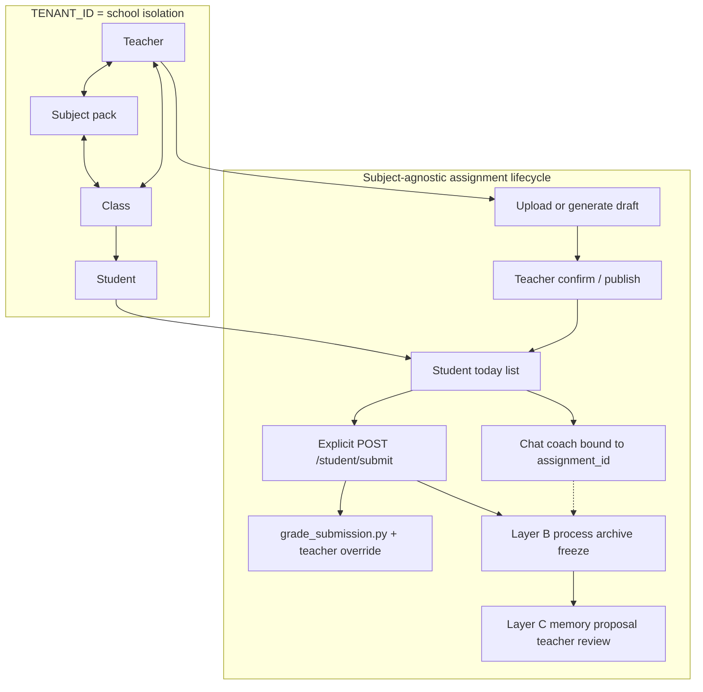
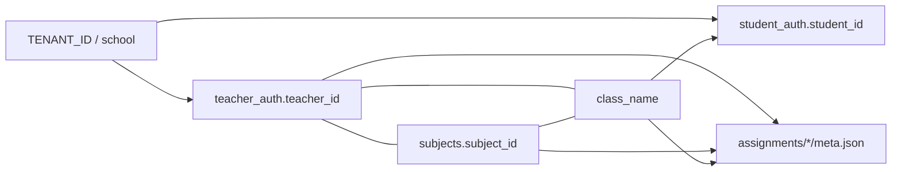
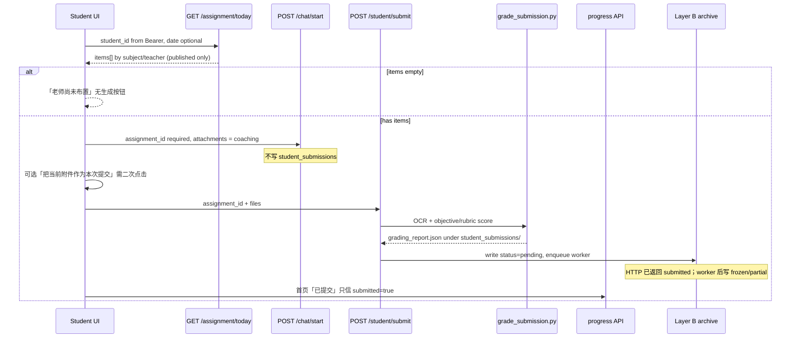
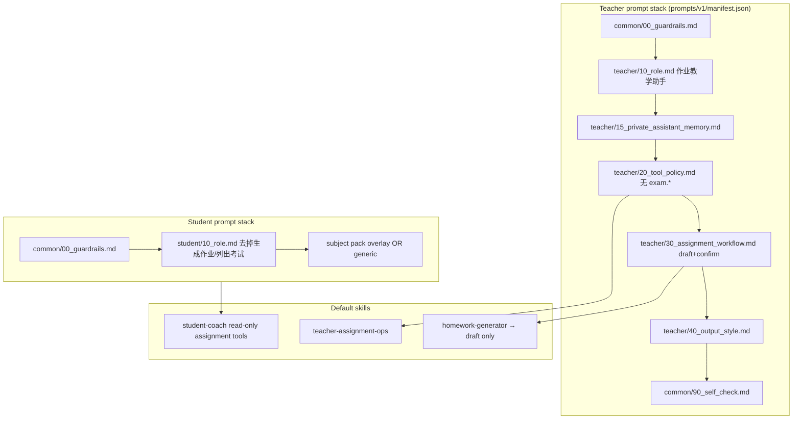
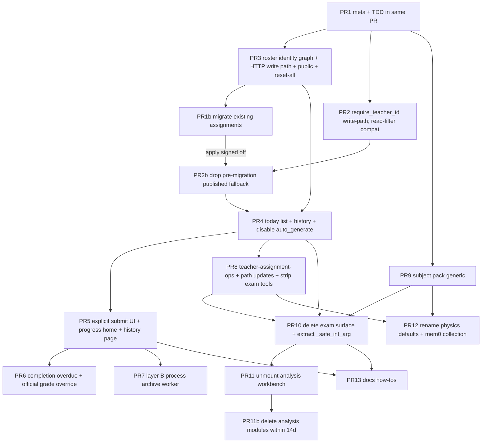

# teacherAgent 作业内核产品化 + 删除考试 + 多学科多教师

| 字段 | 值 |
| --- | --- |
| 文档标题 | Assignment-core productization: drop exam, multi-subject multi-teacher |
| 作者 | TBD（平台 Owner 签字后生效） |
| 日期 | 2026-08-28（Grok 复审修订 2026-08-29） |
| 状态 | Draft（2026-08-29 Grok 复审 Issue 1–14 及 follow-up Issue 1–2 已吸收；Kimi 复审 Issue 1–6 仍有效） |
| 产品 | 单校作业产品（teacher / student / admin）；考试另立项目 |
| 仓库 | `/home/tdcasual/codework/teacherAgent` |
| 权威副本 | `docs/plans/2026-08-28-assignment-core-product-design.md` |
| 治理约束 | `CONTRIBUTING.md` L/M/H；M/H 必须 TDD；`pytest --cov=services/api --cov-fail-under=84` 只棘轮不降 |
| 既有约束（沿用） | fail-closed；Bearer not Cookie；MCP sidecar 保留但剥掉 exam tools；禁止 git filter-repo；prod backup profile 默认关（`docker-compose.yml` `profiles: ["backup"]`）；本波不迁 AES-GCM |

---

## Overview

本仓库当前把「作业 + 考试分析 + survey/video/class_report 工作台」绑在同一产品表面上。作业内核却不完整：老师上传 confirm 的 `meta.json` 没有 `teacher_id`/`subject_id`；学生今日任务走 `find_assignment_for_date` 单赢家，并默认 `auto_generate=true`；首页「已提交」读 3 分钟聊天完成 TTL，而真正写 `student_submissions/` 的 `POST /student/submit` 没有 UI；完成判定默认要求讨论标记 `【个性化作业】`。教师默认 skill 是 `physics-teacher-ops`，工具 allow-list 与 MCP 仍暴露整组 `exam.*`。

本方案把本仓库收成 **单校作业产品**：老师是唯一发布者；学生显式提交才算完成；官方成绩走 `scripts/grade_submission.py` + 老师覆盖；过程纪要（layer B）一等公民但不进完成/成绩；身份图是 school → teacher ↔ subject ↔ class → student；学科以 plugin pack 接入，缺失学科用 generic pack，禁止静默物理回退。考试从本仓库产品面、API、worker、tools、MCP、skills、prompts、workbench UI **完整删除**，运行时停止读取 `data/exams/`。不作为第一步 `rm -rf` 教师数据，不做 git filter-repo。分析工作台（survey/video/class_report）本波不作为主 UI，随考试一起冻结下线。

---

## Background & Motivation

### 当前状态（已对照代码，禁止把旧文档当现状）

| 痛点 | 代码事实 | 产品后果 |
| --- | --- | --- |
| 作业无所有权 | `_build_assignment_meta`（`services/api/assignment_upload_confirm_service.py`）不写 `teacher_id`/`subject_id`。`teacher_id` 只出现在 upload job（`assignment_upload_start_service.py` `_build_upload_record`）。`select_practice.py` 写的 `meta.json` 同样缺这两字段。 | 多教师无法隔离；学生记忆提案 `student_submit_service.submit` 调 `resolve_teacher_id(None)` 落到默认老师。 |
| 今日任务单赢家 | `assignment_catalog_service.find_assignment_for_date` 按 `(teacher_flag, spec, updated_at)` 取一条。`assignment_today` 再可选 `auto_generate`。 | 同一天物理+数学无法并存；空日被学生端生成作业。 |
| 学生可发布 | `frontend/apps/student/src/hooks/useAssignment.ts` 固定 `auto_generate=true&generate=true`。`physics-student-coach` allow-list 含 `assignment.generate`。`tool_dispatch_service` 对 `assignment.generate` **没有** `_teacher_only_handler`。 | 学生是事实发布者。 |
| 假提交 | `studentTodayHomeState.ts` 消费 `recentCompletedReplies` 标「已提交」（TTL 常量 `RECENT_COMPLETION_TTL_MS = 3 * 60 * 1000` 定义在 `frontend/apps/student/src/hooks/useStudentState.ts`，不在 home state 文件）。`docs/how-to/student-login-and-submit.md` 写明「`/student/submit` 只是 API，不是界面入口」。 | 聊天结束 ≠ 提交；成绩目录可能是空的。 |
| 讨论当完成门闩 | `_DEFAULT_COMPLETION_POLICY["requires_discussion"] = True`（`assignment_progress_service.py`、confirm meta）。`session_discussion_service._scan_session_file` 扫 assistant 内容是否含 `DISCUSSION_COMPLETE_MARKER`（默认 `【个性化作业】`）。`assignment_context_service.build_assignment_context` K0 规则要求模型输出该标记。 | 陪练成为完成门槛；逾期用 `not completed` 而不是 `not submitted`。 |
| 空日期被当成今天 | `paths.parse_date_str`（**仅** `services/api/paths.py:51-58`；`core_utils.py` **没有**同名函数）把空串/`None` → `today_iso()`。写路径 `start_assignment_upload`（`assignment_upload_start_service.py:217`）用它把作业 `date` 写成今天；查询路径 `assignment_today`（`assignment_today_service.py:53`）用它把省略的 `date` 参数当成「今天」——后者是正确的 query 语义。upload UI 不传 `due_at`（`useAssignmentWorkflow.ts` 只 append `date`）。 | 「未设布置日」被写成今天；若全局改 `parse_date_str` 会弄坏 GET `/assignment/today`。必须拆成两个函数（§3）。 |
| `scope=public` = 全校名册 | `core_services_application.compute_expected_students`：非 student/class 时 `return list_all_student_ids()`。`assignment_specificity` 对 `public` 返回 1（任意学生匹配）。 | 一科老师布置的「公共作业」打到全校学生档案。 |
| 教师身份默认为 `teacher` | `paths.resolve_teacher_id(None)` → `_settings.default_teacher_id()`（`DEFAULT_TEACHER_ID`，默认 `"teacher"`）→ `safe_fs_id`。chat、memory、submit、session 大量调用。 | 未带 teacher_id 的写路径全部污染默认工作区。 |
| 授权只看 role | `assignment/application.py` `require_assignment_access`：`teacher`/`admin`/`service` 直接放行。`GET /assignments`、`GET /teacher/assignment/progress` 只 `require_principal(roles=("teacher","admin"))`。 | 任何老师可看/改进度全校作业。 |
| 考试仍是主 skill | `skills/router.py` `default_skill_id_for_role("teacher")` = `physics-teacher-ops`。该 skill allow `exam.list/get/analysis.get/charts.generate/students.list/student.get`。MCP `MCP_TOOL_NAMES` 含 6 个 exam 工具。`prompts/v1/manifest.json` 教师栈含 `25_exam_workflow.md`。 | 聊天默认走考试分析。 |
| 学科身份是物理 | 角色 prompt「物理教学助手」；Mem0 `MEM0_COLLECTION` 默认 `physics_mem`（`mem0_config.py`）；skill id 全部 `physics-*`；缺失学科没有 generic pack，考试成绩解析曾把物理当分科回退（`docs/plans/2026-02-10-physics-subject-fallback-design.md`）。 | 数学老师会被静默当成物理。 |

### 为什么现在做

Owner 已锁定：本仓库只做作业产品；考试未来另立项目。继续留僵尸 exam API「以后再用」会让默认 skill、MCP、E2E、coverage 永远绑在考试上，作业所有权/今日列表/提交也无法在多教师下正确工作。必须先补作业元数据与授权地基，再撕掉考试，避免聊天调用已删工具或学生今日任务真空。

---

## Goals & Non-Goals

### Goals

1. 本仓库产品面只保留作业生命周期：老师上传/生成草稿 → 确认发布 → 学生今日列表 → 陪练（侧信道）→ 显式提交 → 客观评分 + 老师覆盖 → 过程纪要（layer B）→ 跨作业记忆提案（layer C，老师审核）。
2. 运行时不再 mount 考试路由、不再启动 exam worker、不再读 `data/exams/`、不再在 tool registry / MCP / skill allow-list / prompt stack 中出现 `exam.*`。
3. 身份图支持 **一校多学科多教师**。`TENANT_ID` 只表示学校隔离。
4. 学生今日是 **按 subject/teacher 的列表**，空态文案「老师尚未布置」，永不「生成任务」。
5. 完成默认 = 已提交；官方成绩 = `grade_submission.py` 路径 + 老师覆盖；聊天评语须老师「采纳为评语」才进入成绩记录。
6. 学科以 plugin pack 接入；缺失 pack 用 **generic**，禁止静默 physics fallback。
7. 覆盖率地板 84%；M/H 变更 TDD；fail-closed；Bearer。

### Non-Goals（本波明确不做）

- 考试产品、成绩列映射、`score_mode=subject/physics` 解析、考试图表。不要 port 进作业。
- SaaS 多校区 / 跨 `TENANT_ID` 的学科市场。
- 把 survey / video homework / class_report 做成主 UI（随考试冻结下线；video 仅作为「以后的附件类型」记一笔）。
- `git filter-repo`、第一步 `rm -rf` 教师历史数据、AES-GCM、打开 prod backup profile。
- Cookie session、关闭 MCP sidecar。
- 学生 `auto_generate`、把聊天/附件当作正式提交。
- 同一 `(subject_id, class_name)` **双师共教**（本波一名教师 of record；见 §2.1）。后续若要共教，再把 `student_enrollments` PK 扩到含 `teacher_id`。

---

## Key Decisions

下列均为 Owner 已决，实施中不得重新打开为 Open Questions。

| # | 决定 | 理由（对照现状） |
| --- | --- | --- |
| D1 | 本仓库 **只做作业产品**。考试另立项目。从产品面、API、workers、tools、MCP、skills、prompts、workbench UI **完整删除** exam。不留僵尸 exam API。运行时停止读 `data/exams/`。不作为 step 1 `rm -rf` 教师数据；不做 git filter-repo。可选后续 export tarball。 | `app_routes.py` 仍 `include_router(build_exam_router)`；exam worker 在 `runtime/bootstrap.py` 启动；`exam_catalog_service.list_exams` 扫 `data_dir/exams`。留路由 = 聊天/E2E/MCP 永远依赖它。 |
| D2 | **老师是唯一发布者**。主路径保持 upload → draft → confirm。`assignment.generate` 只允许老师侧 **草稿**，必须 confirm 后学生才可见。**关闭学生 `auto_generate`**。空今日态：「老师尚未布置」，永不「生成任务」。 | `useAssignment.ts` 与 `studentTodayHomeState.ts` 的 `pending_generation`/`生成任务` 把学生当成发布者。`select_practice.py` 直接写 `data/assignments/<id>/meta.json`，学生立刻可见。 |
| D3 | **提交是学生显式动作**，与聊天分离。Chat + 附件是陪练上下文，不是正式提交。可选便利：「把当前附件作为本次提交」仍需第二次确认。首页「已提交」**必须**读 progress API，禁止 3 分钟聊天完成（`RECENT_COMPLETION_TTL_MS`）。UI 接到 `/student/submit`（或等价）写入 `student_submissions/`。 | `POST /student/submit` 已存在（`student_ops_routes.py` → `student_submit_service.submit` → `scripts/grade_submission.py`），UI 未用。 |
| D4 | **完成默认 = 已提交**。讨论/陪练是侧信道，不是门闩。新作业默认 `requires_discussion=false`。逾期 = 过 `due_at` **且未提交**。Upload/confirm UI 必须发送 `due_at`；空 due = 无截止（禁止把空日期 coerce 成 today 来决定可见性）。 | 现状逾期用 `not completed`（讨论∧提交）。`parse_date_str("")` → today。UI 不传 `due_at`。 |
| D5 | **官方成绩** = 既有 `grade_submission.py` 客观自动分 + 老师事后覆盖/评语。LLM 陪练评语 **不是** 成绩记录，除非老师「采纳为评语」。不要把考试 score-column mapping port 进作业。 | `grade_submission.py` 已写 `grading_report.json`（objective match + 可选 rubric/`llm_grade_subjective`）。聊天评语无落库成绩字段。考试 `score_schema`/`SUBJECT_PHYSICS` 属于删除面。 |
| D6 | **过程/思维记录（layer B）一等公民，但不是提交/成绩**：A 提交文件+分数；B 作业绑定讨论纪要（学生原话、推理类型、卡点、`evidence_refs` 指向 session turns）；C 跨作业学生记忆提案（稳定误解等），老师审核。禁止把扫描 `【个性化作业】` 当完成。禁止每轮聊天都提案过程归档；在 **submit 时冻结**（及可选「生成本次讨论纪要」）。老师进度同时显示结果列与过程列。Chat 绑定 `assignment_id`。 | `session_discussion_pass` 只扫 marker。`chat_job_processing_service._student_extra_system` 在缺 `assignment_id` 时回退 `find_assignment_for_date`。`useStudentSendFlow` 用 `sessionId === assignment_id` 推断绑定，脆弱。 |
| D7 | **Retarget/删除 `physics-teacher-ops`。** 默认教师 skill 改为作业运营（list / progress / missing / overdue / attempt）。从 allow-list、MCP、prompts 去掉全部 `exam.*`。`physics-homework-generator` 保留但出口改为 draft+confirm。学生教练：禁止假的 `assignment.generate`；若保留工具，只读「我的今日作业 / 我的结果」。 | `default_skill_id_for_role` 与 MCP `MCP_TOOL_NAMES` 仍以考试为中心。 |
| D8 | **分析工作台（survey/video/class_report）本波非核心。** 不作为主 UI 挂载。Class report 随考试冻结下线。Survey 忽略。Video = 以后的附件类型。本波 PR11 **unmount** 路由；**不得**把「留树待清」做成永久僵尸（那正是 D1 批评的 exam 状态）。硬性 follow-up：PR11 合入后 **14 天内** 必须另开 `chore(analysis): delete unmounted survey/class_report/analysis_report routes`（记入 issue，到期未合则视为回归）。 | `WorkflowTab.tsx` **实际挂载** `ExamDraftSection`、`AnalysisReportSection`、`VideoHomeworkAnalysisSection`（与作业草稿并列）。`SurveyAnalysisSection.tsx` **存在但未被 WorkflowTab import**；survey **路由**仍在 `app_routes.py` 注册，本波随 PR11 unmount。 |
| D9 | **多学科多教师（一校）。** 本波不是 SaaS 多校区。`TENANT_ID` 永远是学校隔离，不是学科。身份图：school → teacher ↔ subject ↔ class → student。作业 meta **必须**一等字段 `teacher_id` + `subject_id`。禁止 `resolve_teacher_id(None)` → `DEFAULT_TEACHER_ID`（`teacher`）。教师授权按作业所有权，而不仅是 `role=teacher`。学生今日是列表。学科是 **plugin pack**（prompts + 可选 grader）；缺失用 generic，永不静默物理。默认名去掉 `physics-*`。Mem0 collection 不得以 `physics_mem` 作为产品身份。`scope=public` 不得等于全校学生档案。密码重置 `scope=all` 不得作为普通老师默认。学生记忆提案必须归属作业的 teacher + `subject_id`。 | 见 Background 表。`teacher_auth` 只有 `teacher_id/name/email`，无学科/班级任教关系。 |
| D10 | 沿用既有 Owner 约束：fail-closed；Bearer not Cookie；保留 MCP sidecar（剥 exam tools）；无 git filter-repo；prod backup profile 默认关；本波无 AES-GCM；coverage 84% 地板；M/H TDD。 The numeric coverage floor is revised by 2026-09-05 plan A4 to 85 (honest floor(TOTAL) after leftover analysis/multimodal delete; no omit). | 与 `docs/plans/2026-08-26-audit-remediation-design.md` 一致，不回退。 |

---

## Proposed Design

### 1. 目标架构



核心生命周期与学科 pack 解耦：pack 只提供 prompts、可选 grader、知识点目录。`services/api/assignment/*` 不 import 物理专用模块。

### 2. 身份图与授权

#### 2.1 数据模型（学校内，落在现有 tenant auth sqlite，不新建租户维度）

现状：`auth_registry_service.py` 的 `teacher_auth` / `student_auth` 无学科、无任教班级。`auth_candidate_map.subject_id` 是 **账号主体 id**（student_id/teacher_id），不是课程学科。

新增表（命名避开与 candidate `subject_id` 冲突）：

```sql
CREATE TABLE IF NOT EXISTS subjects (
  subject_id TEXT PRIMARY KEY,          -- e.g. physics, math, generic
  display_name TEXT NOT NULL,
  pack_id TEXT NOT NULL,                -- filesystem pack id; generic if missing
  created_at TEXT NOT NULL
);

CREATE TABLE IF NOT EXISTS teacher_roster (
  teacher_id TEXT NOT NULL,
  subject_id TEXT NOT NULL,
  class_name TEXT NOT NULL,
  PRIMARY KEY (teacher_id, subject_id, class_name)
);

-- 本波一名教师 of record：禁止两名老师任教同一 (subject_id, class_name)
CREATE UNIQUE INDEX IF NOT EXISTS teacher_roster_one_owner
  ON teacher_roster (subject_id, class_name);

-- 班级成员权威：作业可见性只读此表，不读 profile.class_name
-- PK 不含 teacher_id：teacher_id 由 unique roster owner 决定（反规范化，写入时必须与 roster 一致）
CREATE TABLE IF NOT EXISTS student_enrollments (
  student_id TEXT NOT NULL,
  subject_id TEXT NOT NULL,
  class_name TEXT NOT NULL,
  teacher_id TEXT NOT NULL,
  PRIMARY KEY (student_id, subject_id, class_name)
);
```

**共教规则（本波锁定，非 Open Question）：** 每个 `(subject_id, class_name)` **恰好一名**教师 of record。`teacher_roster_one_owner` 冲突 → 409 `class_already_owned`。不把 `teacher_id` 纳入 enrollments PK——否则同一学生同一班会被拆成多行，today/progress 名单无法唯一展开。后续若产品要双师，另开变更把 PK 扩为 `(student_id, subject_id, class_name, teacher_id)` 并取消 unique index。

**班级成员单一事实源：**

| 事实 | 权威 | 非权威 |
| --- | --- | --- |
| 学生属于哪个 `(teacher_id, subject_id, class_name)` | `student_enrollments` | `student_auth.class_name` / profile `class_name` **仅显示名**，作业 today/progress/submit **不得**用它做可见性 |
| 老师任教哪些 `(subject_id, class_name)` | `teacher_roster` | 作业 `meta.class_name` 是发布快照，不是任教关系源 |

管理入口：admin TUI（`scripts/admin_auth_tui.py`）本波最小增量——创建教师时必须指定至少一条 `teacher_roster`；不允许「无学科教师」发布作业。TUI 是 **双模**：`trusted_local` 直接调 `AuthRegistryStore`；否则 HTTP 调 `/auth/admin/*`（现状 `_fetch_teachers_payload` / `_request_json` 只覆盖 teacher list/disable/reset）。**身份图写路径必须在 Store 与 HTTP 两侧同时落地**，否则 API-login TUI 无法 persist。

**学科种子（PR3 合入时必须写入，先于任何 PR1b `--apply`）：**

`AuthRegistryStore.ensure_roster_tables()` 在 CREATE TABLE 之后调用 `seed_subjects()`：

1. **硬种子（缺则 INSERT，已有则 skip）：** `generic`（display=通用，pack_id=`generic`）、`physics`（display=物理，pack_id=`physics`）。即使 `packs/subjects/` 尚无文件（PR9 才迁 pack），migration 也有可映射的行。
2. **pack-sync：** 若 `packs/subjects/<id>/pack.yaml` 存在，按 yaml upsert `subjects`（不覆盖已手工改过的 `display_name`）。
3. 缺 `generic`/`physics` 行 → PR1b 启动检查失败（与缺表同级，exit 2 `subjects_seed_missing`）。禁止 `--apply` 把作业静默打成不存在的 subject。

TUI / HTTP 命令（写入 fail-closed；HTTP 表见 API / Interface Changes；admin role only）：

| 动作 | TUI | HTTP | 规则 |
| --- | --- | --- | --- |
| 列学科 | `subject list` | `GET /auth/admin/subjects` | 只读 |
| 加学科 | `subject add <id> <display> [pack_id]` | `POST /auth/admin/subjects` | `subject_id` 非空；默认 pack_id=`generic` |
| 种子/同步 | `subject seed` | `POST /auth/admin/subjects/seed` | 幂等；跑 `seed_subjects()` |
| 任教 | `roster add <teacher_id> <subject_id> <class_name>` | `POST /auth/admin/roster` | `class_name` 非空；`subject_id` 必须已在 `subjects`；**至少命中一名** `student_auth.class_name`（防错别字/空班）；unique owner 冲突 → 409 `class_already_owned` |
| 取消任教 | `roster remove <teacher_id> <subject_id> <class_name>` | `DELETE /auth/admin/roster` | 该 `(subject_id, class_name)` 仍有 enrollments → 409 `enrollments_remain`（先 unenroll/bulk-move） |
| 列任教 | `roster list [teacher_id]` | `GET /auth/admin/roster?teacher_id=` | |
| bootstrap 整班 | `enroll-class <teacher_id> <subject_id> <class_name>` | `POST /auth/admin/enrollments/enroll-class` | 把当前 `student_auth.class_name == class_name` 的学生写入 enrollments；`teacher_id` 必须已是该班该科 of record |
| 退班 | `unenroll <student_id> <subject_id> <class_name>` | `POST /auth/admin/enrollments/unenroll` | 删 enrollments 行；**不**删 `student_submissions/` 或 layer B。该生立即从 today 有效名单消失（快照 ∩ enrollments） |
| 转班/批量 | `bulk-move <subject_id> <from_class> <to_class> [student_id…]` | `POST /auth/admin/enrollments/bulk-move` | 目标班必须已有 roster owner；空 student 列表 = 整班。不自动改 profile 显示名 |
| 改班名 | `rename-class <subject_id> <old> <new>` | `POST /auth/admin/enrollments/rename-class` | 事务内更新 enrollments.class_name + 对应 roster.class_name。作业 `meta.class_name` 是快照不改；老师对仍 published 的作业跑 `recompute-roster` |
| 列成员 | `enrollments list <subject_id> <class_name>` | `GET /auth/admin/enrollments?subject_id=&class_name=` | |

创建教师：必须同时写入至少一条 roster（TUI `teacher add … --subject --class`；HTTP `POST /auth/admin/teacher` 若本波扩字段，否则 TUI 两步但第二步失败则提示教师尚不能 publish）。不允许「无学科教师」发布作业（publish 时 `roster_required`）。

之后成员变更 **只改 enrollments**，不靠改显示名生效。年级升级走 `bulk-move` / `rename-class`，再 `POST /assignment/{id}/recompute-roster`。

`AuthRegistryStore` 新增方法（local 与 HTTP handler 共用，禁止只写 TUI）：`seed_subjects`、`list_subjects`、`add_subject`、`add_roster`、`remove_roster`、`list_roster`、`enroll_class`、`unenroll`、`bulk_move_enrollments`、`rename_class`、`list_enrollments`。



#### 2.2 禁止默认教师

替换 `paths.resolve_teacher_id` 语义：

```python
def require_teacher_id(teacher_id: Optional[str]) -> str:
    raw = str(teacher_id or "").strip()
    if not raw:
        raise TeacherIdentityError("teacher_id_required")  # fail-closed
    return safe_fs_id(raw, prefix="teacher")
```

`AuthPrincipal`（`services/api/auth_service.py`）字段是 `actor_id` / `role` / `tenant_id`，**没有** `teacher_id`。调用约定：

| 调用方 | 传入 | 禁止 |
| --- | --- | --- |
| teacher / admin / service 的作业发布、记忆提案、进度、submit 后处理、作业授权、**教师** chat/session 工作区 | `require_teacher_id(principal.actor_id)` | `resolve_teacher_id(None)`；读不存在的 `principal.teacher_id` |
| **学生** chat/session/today/submit | 用 `principal.actor_id` 当 `student_id` | **永不**对这条路径调用 `require_teacher_id`。现状 `chat_start_service.py:211` 已是 `resolve_teacher_id` **仅** `policy.role == "teacher"`——保持并改为 `require_teacher_id` 只在教师分支 |

- **删除**「`None` → `DEFAULT_TEACHER_ID`/`teacher`」这条路径在 **作业发布、记忆提案、进度、submit 后处理、作业授权、教师 chat** 上的使用。
- 教师/admin/service 的 Chat/session 若 `principal.actor_id` 为空：401/403，不写默认工作区。学生 chat 缺的是 `student_id`（已有校验），不是 teacher_id；对全角色「无 principal.teacher_id → 401」会把学生产品打穿（D2–D6 依赖学生陪练）。
- `runtime_settings.default_teacher_id` 仅允许 **dev bootstrap / admin 种子账号**，不得再被作业运行时调用。测试里 `resolve_teacher_id(None)` 断言必须改为失败（`tests/test_student_memory_auto.py` 今日仍接受 default）。

#### 2.3 作业授权

替换 `require_assignment_access`（`assignment/application.py:17-47`）：

| 角色 | 规则 |
| --- | --- |
| student | today/submit：必须在 **enrollments 有效名单** 内（见 §2.4）且 `visibility_status=published`。材料/历史/`GET /assignment/{id}`：published 用快照∩enrollments；archived 用冻结快照，**允许**读。draft/orphan → 403。public 不再 = 全校。 |
| teacher | `meta.teacher_id == principal.actor_id`，或 admin。禁止仅凭 `role=teacher`。 |
| admin / service | 跨作业只读/运维；写操作审计。 |

`GET /assignments`、`GET /teacher/assignment/progress`、`GET /teacher/assignments/progress`、upload job 读写、confirm：一律按 ownership 过滤。Upload start 已从 principal 取 `teacher_id`（`assignment_upload_start_service.py:237-238`）——confirm 必须把该字段写入 meta，后续读路径以此为准。

#### 2.4 `scope=public` 重定义

`core_utils.resolve_scope` 仍可返回 `public|class|student`，但：

- `public` = 该 `(teacher_id, subject_id)` 在 `teacher_roster` 下的 **全部任教班级**，不是 `list_all_student_ids()`。
- `class` = 该老师在该学科任教的指定班级（校验 roster，否则 403）。
- `student` = 显式 `student_ids`，且每个 id 必须属于该老师该学科的班级。

`compute_expected_students` 签名扩展为需要 `teacher_id` + `subject_id`。实现 **只查 `student_enrollments`**（`class`/`public` 按 roster 班级展开 enrollments；`student` 校验每个 id 有对应 enrollment）。缺任教关系或该班 enrollments 为空 → fail-closed 400 `roster_required` / `enrollment_empty`，不回退 `list_all_student_ids()`，也不静默用 profile `class_name` 凑名单。

`expected_students` 策略：

- **Publish 时**写入 meta 作为审计快照（谁被布置过）。
- **Today / progress / submit 读路径**按当前 enrollments **重算**有效名单（与快照取交集：快照有但已退班 → 不可见；快照无但新入学 → 默认不可见，避免静默扩大范围）。老师若要纳入新生：`POST /assignment/{id}/recompute-roster`（ownership 校验）用当前 enrollments 覆盖快照并打审计。
- **已 `archived` 作业**不再自动重算；认领/归档后名单冻结。

密码重置：`POST /auth/teacher/student/reset-passwords` 的 `scope=all` **仅 admin**。普通教师默认且唯一推荐范围是 `student` 或 `class`（且 class 必须在其 roster 内）。`scope=class` 的目标班级必须能在 `teacher_roster` 命中，学生集合来自 enrollments。前端 `TeacherTopbarAdminMenu.tsx` 已默认 `studentResetScope='student'`，但 `all` 仍对普通老师可见——本波对非 admin 隐藏并在 API 层 403。

### 3. 作业元数据（一等字段）

Confirm 与 generate 两条写路径必须产出同一 schema。

**现状** `_build_assignment_meta`（节选）：

```python
return {
    "assignment_id": assignment_id,
    "date": date_str,
    "due_at": deps.normalize_due_at(job.get("due_at")) or "",
    "mode": "upload",
    ...
    "scope": scope_val,
    "completion_policy": {
        "requires_discussion": True,  # 将改为 False
        ...
    },
    "source": "teacher",
    # 缺 teacher_id / subject_id / visibility_status
}
```

**目标 `meta.json`：**

```json
{
  "assignment_id": "HW-2026-08-28-mech",
  "teacher_id": "t_zhang",
  "subject_id": "physics",
  "pack_id": "physics",
  "date": "2026-08-28",
  "due_at": "2026-08-29T23:59:59",
  "visibility_status": "published",
  "archived_at": null,
  "mode": "upload",
  "scope": "class",
  "class_name": "高二2403班",
  "student_ids": [],
  "expected_students": ["高二2403班_刘昊然"],
  "completion_policy": {
    "requires_discussion": false,
    "requires_submission": true,
    "min_graded_total": 1,
    "best_attempt": "score_earned_then_correct_then_graded_total",
    "version": 2
  },
  "source": "teacher",
  "job_id": "job_...",
  "generated_at": "2026-08-28T10:00:00"
}
```

规则：

- `teacher_id`、`subject_id` **必填**。confirm 时从 job + principal 写入，禁止空。generate 工具从 chat principal 写入，禁止 args 伪造他人 `teacher_id`（服务端覆盖）。
- `visibility_status`：`draft` | `published` | `archived`（老师生命周期）。migration 另用 `orphan_draft` / `retired_auto`（仅 admin 可见）。学生 today **只**见 `published`。`archived` 作业不出现在 today；老师列表可筛「已归档」。
- `due_at`：`normalize_due_at` 已对空返回 `None`（`core_utils.py:81-92`）。confirm 写入 `""` 或省略，**表示无截止**。禁止把空 due/date coerce 成 today。
- `date`：可选的「布置日」。空 date **不**等于今天可见。今日列表规则见 §4.1（确定性窗口 + 归档，无「直到老师归档」空话）。
- **两个日期函数，禁止混用：**

  | 函数 | 位置 | 语义 | 调用点 |
  | --- | --- | --- | --- |
  | `paths.parse_date_str` | **保持原样** | 空/`None` → `today_iso()` | **仅查询日**：`GET /assignment/today` 的 `date` 参数、老师进度按日筛选。省略 = 今天 |
  | `paths.optional_assignment_date` | **PR1 新增** | 空/`None`/空白 → `None`（不写 today）；非法格式 → 400 `invalid_assignment_date` | **仅写路径**：upload start/confirm、generate、select_practice meta。`start_assignment_upload` **停止**调用 `parse_date_str` |

  ```python
  def optional_assignment_date(date_str: Optional[str]) -> Optional[str]:
      raw = str(date_str or "").strip()
      if not raw:
          return None
      try:
          return datetime.fromisoformat(raw).date().isoformat()
      except ValueError as exc:
          raise InvalidAssignmentDate("invalid_assignment_date") from exc
  ```

  **禁止**把 `parse_date_str` 改成「空不默认 today」——那会让 GET `/assignment/today` 在客户端省略 `date` 时不再落在今天。
- `completion_policy.requires_discussion` 默认 `false`。旧作业 migration 见 Migration；产品默认以提交为准，不把旧 marker 当完成。
- `pack_id`：解析自 `subjects.pack_id`（PR3 之后）；PR1 阶段无表则原样持久化客户端给的 opaque `subject_id`，缺 pack 文件时运行时按 §8 在 PR9 落后到 generic。禁止写 `physics` 作为缺省。

Upload UI（`UploadSection.tsx` / `useAssignmentWorkflow.ts`）分 PR，**不把 PR1 阻塞在 PR3 roster**：

- **PR1：** 删除作业/考试 toggle。发送 `subject_id`（必填非空，否则 400 `subject_id_required`）+ `due_at`（可空）。`subject_id` 控件 = **静态列表**（读已有 `packs/subjects/*/pack.yaml` 的 id；目录尚空时 hardcode `physics` / `math` / `generic` 可自由选择），**不是** roster 下拉。后端 **不** 对 `subjects` 表做 FK（表还不存在）。`date` 可空；空则不传；后端走 `optional_assignment_date`，不填 today。
- **PR3：** 同一控件改为老师 `teacher_roster` 范围内拉（`GET /auth/admin/roster` 或教师侧 `GET /teacher/roster`）。**Publish/confirm** 时校验 of-record：无匹配 roster 行 → 400 `roster_required`。静态列表可留作 admin 加学科后的显示名补全。
- confirm 按钮文案保持「创建作业」= publish。

### 4. 学生今日列表 + 提交 + 陪练



#### 4.1 替换单赢家

删除学生路径对 `find_assignment_for_date` 的依赖（`assignment_today_service.py:66`、`chat_job_processing_service.py:465`）。保留函数仅给迁移测试或标记 deprecated，学生/聊天不得再调用。

新函数 `list_assignments_for_student(student_id, date_str) -> list`：

1. 解析该生在 `student_enrollments` 的 `(teacher_id, subject_id, class_name)` 集合（**不**读 profile `class_name` 做过滤）。
2. 扫描 `data/assignments/*/meta.json`（可后续加索引；本波学校规模可全扫，与今日 `list_assignments` 相同）。
3. 过滤：`visibility_status == "published"`（排除 `draft`/`archived`/`orphan_draft`/`retired_auto`）；`teacher_id`/`subject_id` 非空；学生 ∈ 读时重算的有效名单（快照 ∩ enrollments，§2.4）。
4. **布置日** `assigned_date`：`meta.date` 若非空则用；否则用 `generated_at` 的日期。**禁止**把空 `date` coerce 成 today 再写入或比较。
5. **日历时钟（单一，禁止混用 UTC 与 naive local）。** 作业产品的「今天」一律是 `paths.today_iso()` → `datetime.now().date().isoformat()`（naive **进程本地**日历日，`services/api/paths.py:47-48`）。`parse_date_str` 在查询参数省略时调用它。下列四处 **必须** 调 `today_iso()`（或经 `parse_date_str` 得到的同一字符串），**禁止** `datetime.now(timezone.utc).date()`，也禁止另写 `datetime.now().date()` 副本：

   | 用途 | 比较 |
   | --- | --- |
   | Today 查询日（省略 `date`） | `today = parse_date_str(date)` → 空则 `today_iso()` |
   | Today / progress `overdue` 日期比较 | `date.fromisoformat(today_iso() 或查询日) > due_at.date()` |
   | Unarchive 后再入今日 | 重跑 §4.1 表，查询日 = `today_iso()` |
   | Auto-archive 年龄与「due 已过」 | `today = date.fromisoformat(today_iso())`；`age_days = today - submitted_at.date()`；`due` 已过 = `today > due_at.date()` |

   本波 **不**把 `today_iso` 改成 UTC（会在本地午夜平移 GET `/assignment/today`）。学校机器 TZ 配错是运维问题，不是代码里再开一座钟。`due_at` / `submitted_at` / `generated_at` 存 naive ISO；取 `.date()` 用字符串日历日，不按 UTC 再转换。

6. **今日可见性（确定性，无空话「直到老师归档」）**。令 `today = date_str`（**查询日**，来自 `parse_date_str`，省略 = `today_iso()`），`lookback = ASSIGNMENT_TODAY_LOOKBACK_DAYS`（env，默认 **14**）。**`overdue` 在 PR4 的 today 组装里本地计算，不读 progress API 的 `overdue` 字段：**

   ```python
   submitted = has_qualifying_attempt(student_submissions)  # 与 progress 的 submitted 同源，只看 attempt 目录
   overdue = bool(due_at) and (date.fromisoformat(today) > due_at.date()) and (not submitted)
   ```

   **忽略** `completion_policy.requires_discussion`。现状 `_student_progress`（`assignment_progress_service.py:226-227`）是 `overdue = due_ts and now > due_ts and not completed`，而 `completed` 在 PR6 之前仍可能要求讨论通过。若 PR4 直接嵌入 progress 的 `overdue`，已提交但无 marker 的学生会一直 overdue 并因「逾期未交」例外留在今日，与 D4 冲突。PR6 才把 progress 的 `overdue`/`completed` 改成 `¬submitted`；在那之前 today **不得**复用 progress.overdue。`submitted` 来自 `student_submissions/`，不是聊天 TTL。

   | 条件 | 今日列表 |
   | --- | --- |
   | `archived` / 非 `published` | **不展示** |
   | `assigned_date > today`（尚未到布置日） | **不展示** |
   | 逾期 **且未提交** | **展示**，标 `overdue`（不受 lookback 截断，直到归档） |
   | 逾期 **且已提交** | **不展示**（§4.1.1 作业历史可查；置底标灰仅历史页，不占今日主列表） |
   | 未逾期（含无 `due_at`）且 **未提交** | 仅当 `today - assigned_date <= lookback` 时展示 |
   | 未逾期（含无 `due_at`）且 **已提交** | **不展示**（已完成退出今日；§4.1.1 作业历史可查） |

   无 `due_at` 的作业不会因为「空截止」而永远留在今日：未交靠 lookback 退出，已交立即退出。老师可随时归档提前退出。**不得**把 `StudentTodayHome.tsx` 现有「历史任务」按钮当作业历史——它打开的是 **session 侧栏**（`App.tsx` `handleOpenHistory`）。
7. 排序：`overdue` 未交优先，然后 `subject_id`，然后 `teacher_id`，然后 `due_at`（空 due 放后）。
8. **永不** `auto_generate`。删除 `assignment_today` 的 generate 分支；HTTP `auto_generate` 参数若传入 `true` → 400 `auto_generate_disabled`（fail-closed，避免旧客户端静默生成）。

**归档机制（与上表配套，不是口头依赖）：**

- 老师：`POST /assignment/{id}/archive`（ownership）把 `published → archived`，写 `archived_at`。工具 `assignment.archive`。
- **Unarchive（本波有，不是口头）：** `POST /assignment/{id}/unarchive` + 工具 `assignment.unarchive`。仅 owner 老师。`archived → published`，清空 `archived_at`。服务端 **不**另做「lookback 是否允许 unarchive」闸门——unarchive 只恢复 published；学生是否再出现在今日 **完全重跑 §4.1 表**，查询日 = `paths.today_iso()`（与 GET `/assignment/today` 省略 `date` 同一时钟）。已提交且未逾期的仍不进今日（走历史）；逾期未交的重新进今日。名单：unarchive 后归档冻结解除，读路径恢复「快照 ∩ 当前 enrollments」。
- **自动归档（选定一种，禁止 OR）：惰性，且只挂在老师写路径，不挂学生 GET。** 触发点：`POST /assignment/{id}/archive` 之外，老师 `GET /teacher/assignment/progress` 与 `GET /teacher/assignments/progress` 在返回前对 **该老师自己的** published 作业跑 `_maybe_auto_archive(meta)`（单次请求最多扫本老师作业，fail-open 记 `assignment.auto_archive.error`，不 5xx）。compose **不**加 cron unit。令 `today = date.fromisoformat(today_iso())`。条件：`published` 且 `expected_students` **全员** submitted 且（无 `due_at` **或** `today > due_at.date()`）且 `(today - 最晚 submitted_at.date()).days >= ASSIGNMENT_AUTO_ARCHIVE_DAYS`（默认 **7**）→ `archived`。部分未交 → 不自动归档（逾期未交继续出现在未交学生的今日列表）。**学生** `GET /assignment/today`、`GET /student/assignment/{id}/progress`、`GET /student/assignments/history` **只读**，禁止惰性写 archived。
- `archived` 不进学生 today，进老师「已归档」筛选项；学生仍可从 §4.1.1 历史打开材料（见下）。

#### 4.1.1 学生作业历史（与聊天 session 历史分离）

今日列表在 PR4 之后不再保留已提交卡片，必须同时提供作业历史，否则学生无法重开材料、补交（若未超 attempt 上限）或看官方分——除非他们已经记住 `assignment_id`。现有「历史任务」= session 侧栏，**禁止复用**。

- **HTTP：** `GET /student/assignments/history?limit=&cursor=`（Bearer 学生）。返回该生 **曾经在快照 `expected_students` 内** 且 `visibility_status ∈ {published, archived}` 的作业（排除 `draft`/`orphan_draft`/`retired_auto`）。含已提交、逾期已提交、lookback 以外未交（未交仍在 published 时也可在历史看到，避免「今日消失 = 作业消失」）。每项：`assignment_id, teacher_id, subject_id, title, due_at, visibility_status, submitted, official_score, archived_at`。
- **材料：** `GET /assignment/{id}` 与 download：学生在有效名单（published：快照 ∩ enrollments；archived：只认 **冻结快照** `expected_students`，不再重算）内可读。draft/orphan → 403。archived **不对**学生 403。
- **UI（PR4 API + PR5 接线，与 today 同批发学生端）：** `StudentTodayHome` 增加独立入口「作业记录」（不是「历史任务」）。打开作业历史页/第二 tab：列表 + 进入 `GET /student/assignment/{id}/progress` 与提交面板（已提交也可看分；未交且 published 可再提交）。聊天侧栏按钮文案保持「历史任务」= sessions。

`GET /assignment/today` 响应改为：

```json
{
  "date": "2026-08-28",
  "assignments": [
    {
      "assignment_id": "...",
      "teacher_id": "t_zhang",
      "subject_id": "physics",
      "title": "...",
      "due_at": "2026-08-29T23:59:59",
      "progress": {
        "submitted": false,
        "overdue": false,
        "official_score": null,
        "process_archive_status": "none"
      }
    }
  ]
}
```

`progress.overdue` **由 today handler 按上面的本地公式填入**（PR4），即使当时 progress 服务仍用 discussion-gated `completed`。PR6 之后两处公式重合，today 仍保持本地计算以免再耦合。`process_archive_status` 取值 `none|pending|frozen|partial`（§6）。

兼容：删除顶层 `assignment` 单对象。学生前端必须与该 API **同批发布**（见 R6）；不保留旧字段以免旧客户端继续画单任务卡。发版间隙旧前端若仍读 `data.assignment` 会看到空——这是可接受的短暂窗口，靠同批部署消除，不在服务端双写单对象。

前端：

- `useAssignment.ts`：去掉 `auto_generate`/`generate`；消费 `assignments[]`。新增 `useAssignmentHistory.ts` 消费 `/student/assignments/history`。
- `studentTodayHomeState.ts`：空列表 → title「老师尚未布置」，无主按钮或 disabled；**禁止** `生成任务`。`submitted` 只来自 `progress.submitted`。删除对 `recentCompletedReplies` 的完成判定（`RECENT_COMPLETION_TTL_MS` 定义在 `useStudentState.ts`，可留作聊天气泡恢复，不得驱动首页状态）。
- `StudentTodayHome.tsx`：主任务卡改为列表（按学科分组）。保留「历史任务」= session 侧栏；**另加**「作业记录」→ 作业历史页（PR5 接线）。

#### 4.2 显式提交

`POST /student/submit` 保留，收紧：

- `assignment_id` **必填**。删除 `auto_assignment` 与 `grade_submission.py --auto-assignment` 在学生 API 上的入口（脚本 flag 可留给药剂/离线，HTTP 传 `auto_assignment=true` → 400）。
- 校验：学生在 roster 内、作业 published、未超交上限（沿用现有 attempt 目录结构 `student_submissions/<assignment_id>/<student_id>/submission_<ts>/`）。
- 成功后：写 attempt；跑 `grade_submission.py`；**enqueue** layer B（§6，不在本请求内跑 LLM）；layer C 提案带 `teacher_id=meta.teacher_id`、`subject_id=meta.subject_id`（禁止 `resolve_teacher_id(None)`）。
- 响应包含 `attempt_id`、`official_score` 摘要、`process_archive_id`、`process_archive_status`（通常 `pending`）。

学生 UI（新，挂在任务卡而非聊天 send）：

1. 「提交作业」打开提交面板（文件选择）。
2. 可选：「把当前聊天附件作为本次提交」→ 预览文件列表 → 二次按钮「确认提交」才 POST。
3. 聊天 send 文案/帮助：明确「对话不会记为提交」。

`docs/how-to/student-login-and-submit.md` 同步改掉「作业材料通过聊天附件发送」。

#### 4.3 Chat 绑定 `assignment_id`

- 学生从某张任务卡进入聊天：`session_id` 与 `assignment_id` 分开；session index 必须写 `assignment_id`（`chat_history_store.py` 已能存该字段）。
- **新 session**（index 中无该 `session_id`，或客户端新建）：学生角色必须带 `assignment_id`，除非明确「自由提问」（`general_*`）。缺则 400 `assignment_id_required`。自由提问不绑定作业，也 **不能** 当提交。
- **存量 session**（index 已有记录且 **没有** `assignment_id`）：允许续聊，**不**注入作业上下文，**不**回退 `find_assignment_for_date`。响应可带 `assignment_unbound: true`。不得 400 迫使学生弃用旧会话。前端续聊走原 `session_id`，不把 `sessionId === assignment_id` 当成绑定（`useStudentSendFlow.ts` 该推断删除）。
- `_student_extra_system`：只用请求里的 `assignment_id` 加载作业上下文；禁止 date 回退单赢家。无 `assignment_id` 的续聊 = 无作业块。
- `build_assignment_context`：删除 K0/K「个性化作业生成」与 marker 指令。陪练不再被要求输出 `【个性化作业】`。

### 5. 完成、逾期、官方成绩

`assignment_progress_service._student_progress` 现状：

```python
completed = (discussion_pass or not requires_discussion) and (submitted or not requires_submission)
overdue = bool(due_ts and now_ts > due_ts and not completed)
```

改为：

```python
submitted = bool(best)  # best attempt from student_submissions
completed = submitted if requires_submission else True
today = date.fromisoformat(today_iso())  # 与 §4.1 同一时钟；禁止 now_ts / timezone.utc
overdue = bool(due_at) and today > due_at.date() and not submitted
# discussion_* 仍计算，只进 process 列与 layer B，不进 completed
```

默认 policy v2：`requires_discussion=false`，`requires_submission=true`。`min_graded_total` 保持 1：没有有效评分的空文件不记 submitted（与现 `_attempt_meets_min_graded_total` 一致）。

官方成绩：

- **Record** = `grading_report.json` 的 `correct`/`graded_total`/`items[].score` + 可选老师 override 文件 `teacher_grade.json`：

```json
{
  "schema": "teacher_grade/v1",
  "assignment_id": "...",
  "student_id": "...",
  "attempt_id": "submission_20260828T120000",
  "teacher_id": "t_zhang",
  "override_score_earned": null,
  "comment": "步骤完整，单位漏写",
  "adopted_coach_excerpts": [
    {"session_id": "...", "turn_ref": "ts:2026-08-28T12:01:00", "text": "..."}
  ],
  "updated_at": "..."
}
```

- `llm_grade_subjective`（`grade_submission.py:379`）属于 **自动评分器**（rubric 低置信时），算官方分路径，保留；它不是聊天陪练评语。
- 聊天中的教练评语默认只存在 session jsonl；老师在进度页点「采纳为评语」才写入 `teacher_grade.json`。
- 禁止引入考试 `score_schema` / 科目列映射。

老师进度 UI（`AssignmentProgressSection.tsx`）：两列——

- 结果：提交次数、官方分、逾期。
- 过程：layer B 状态（无 / pending / frozen / partial）、卡点摘要、是否有记忆提案。讨论通过不再作为「完成」着色条件。

### 6. Process archive schema（layer B）

存储：`data/assignments/<assignment_id>/process_archives/<student_id>.json`（作业绑定，不进 Mem0 产品身份）。

冻结触发：

1. `POST /student/submit` 成功：**本请求内**只写 `process_archives/<student_id>.json` 骨架（`status=pending`，无 LLM），然后 enqueue worker；**不**在 submit 请求里跑第二段 LLM（submit 已经 subprocess `scripts/grade_submission.py`，含 OCR + 可选 `llm_grade_subjective` at line 379）。
2. 可选 `POST /student/assignment/{id}/process-archive`（「生成本次讨论纪要」），仍不改变 submitted。此路径 **同步**，硬超时 **15s**；超时则保持/写 `pending` 并 enqueue，HTTP 202 + `process_archive_id`。
3. **禁止** 每个 chat turn 生成。

```json
{
  "schema": "assignment_process_archive/v1",
  "assignment_id": "HW-2026-08-28-mech",
  "student_id": "高二2403班_刘昊然",
  "teacher_id": "t_zhang",
  "subject_id": "physics",
  "status": "pending",
  "frozen_at": null,
  "frozen_reason": "submit",
  "job_id": "parch_...",
  "session_ids": ["ses_abc"],
  "message_count": 24,
  "quotes": [
    {
      "text": "我觉得加速度和速度是一回事",
      "turn_ref": "ses_abc:2026-08-28T11:40:12",
      "speaker": "student"
    }
  ],
  "reasoning_types": ["formula_retrieval", "unit_confusion"],
  "stuck_points": [
    {
      "summary": "把 v 与 a 混用",
      "evidence_refs": ["ses_abc:2026-08-28T11:40:12", "ses_abc:2026-08-28T11:42:01"]
    }
  ],
  "evidence_refs": ["ses_abc:2026-08-28T11:40:12"],
  "coach_comment_excerpts": [
    {
      "text": "加速度是速度的变化率",
      "turn_ref": "ses_abc:2026-08-28T11:41:00",
      "adopted_as_grade_comment": false
    }
  ]
}
```

生成策略（**异步，有预算**）：

- `status`：`pending` → worker 成功 `frozen` / LLM 或超时 `partial`。骨架无绑定 session 时可直接 `frozen` 且 `quotes=[]`（跳过 LLM）。
- Worker：新 `services/api/workers/process_archive_worker_service.py`，**照抄 profile-update 的整条 fan-out，不是只抄 service 文件**。submit / 手动 POST 经 `queue_runtime.enqueue_process_archive(payload, backend=…)` 入队（与 `chat_wiring` 调 `queue_runtime.enqueue_profile_update` 同形），**禁止** handler 直接调 `enqueue_process_archive_inline`（否则 RQ 路径被绕过）。payload：`{assignment_id, student_id, reason, process_archive_id, job_id}`。**不**新建 compose 服务。

  必须同时改的 peers（漏一项 enqueue 就是 `AttributeError` 或 no-op，layer B 永远 `pending`）：

  | 现有 profile-update 锚点 | PR7 对应 |
  | --- | --- |
  | `workers/profile_update_worker_service.py` `enqueue_profile_update_inline` + start/stop | `workers/process_archive_worker_service.py` `enqueue_process_archive_inline` + start/stop |
  | `queue/queue_backend.py` `QueueBackend.enqueue_profile_update` | Protocol 增 `enqueue_process_archive` |
  | `queue/queue_inline_backend.py` | `enqueue_process_archive_fn` 字段 + method |
  | `queue/queue_backend_rq.py` | method → `_rq_tasks().enqueue_process_archive` |
  | `runtime/queue_runtime.py` `enqueue_profile_update` | `enqueue_process_archive(payload, *, backend)` |
  | `runtime/inline_backend_factory.py` `build_inline_backend(...)` | 增 `enqueue_process_archive_fn` 并传入 `InlineQueueBackend` |
  | `runtime/bootstrap.py` `build_inline_backend_for_app` | `process_archive_deps` + enqueue lambda；`start_inline_workers` 传入 deps |
  | `app_core_init.py` `build_inline_backend_factory` | 同上 enqueue lambda + start kwargs |
  | `wiring/worker_wiring.py` `profile_update_worker_deps` | `process_archive_worker_deps`（queue/lock/event/thread getters） |
  | `app_core_wiring_exports.py` | 导出 `process_archive_worker_deps` |
  | `workers/inline_runtime.py` | `start_process_archive_worker` / `stop_…` |
  | `workers/rq_tasks.py` `enqueue_profile_update` | `enqueue_process_archive` |
  | `core_service_imports.py` | import 新 service / start-stop |

  队列满路径 **镜像** `enqueue_profile_update_inline`：`len(queue) >= queue_max` → `diag_log("process_archive.queue_full", {size, assignment_id, student_id})` 后 return，**不** drop 已写的 `pending` 文件、不阻断 submit。
- 预算：LLM 单次 **20s** 超时；worker 整体 **60s**；超时或异常 → `status=partial` + 原始 turn 引用（`quotes` 截断前 N=20 条），`diag_log process_archive.partial`。队列满 → 保持 `pending`，`process_archive.queue_full`，不阻断 submit。
- Submit HTTP **在 enqueue 之后立即返回** `submitted=true` + `process_archive_status=pending`。归档失败永不把 submit 改成 5xx（R9）。
- 不扫描 `【个性化作业】`。`session_discussion_pass` 退出完成判定；可删除或降为 debug。

Layer C：沿用 `student_memory_service.create_proposal_api` 的 types（`stable_misconception` 等），强制字段 `teacher_id`、`subject_id`、`source_assignment_id`。提案目录按 teacher workspace 分桶，禁止写入默认 `teacher` 用户。

### 7. 教师 skill / 工具 / MCP / prompt stack



#### 7.1 默认 skill 更名与职责

| 旧 | 新 | 行为 |
| --- | --- | --- |
| `physics-teacher-ops` | `teacher-assignment-ops`（目录 `skills/teacher-assignment-ops/`） | 默认教师 skill。keywords：未交、逾期、进度、谁没交。allow：`assignment.list/progress/missing/overdue/attempt.get` + `student.search/profile.get`（只读画像）。**零** `exam.*`。 |
| `physics-homework-generator` | `homework-generator`（**直接改目录名** `skills/homework-generator/`，禁止 symlink；Windows/CI 不可靠） | `assignment.generate` 只写 **draft**（`visibility_status=draft`）。模型必须告知老师去工作台 confirm。新增 `assignment.publish` 工具（mutating，二次确认）。Router **显式 alias 表**（不是静默 physics fallback）：`physics-homework-generator` → `homework-generator`，打 warning。 |
| `physics-student-coach` | `student-coach` | 去掉 `assignment.generate`。只读：`assignment.my_today`、`assignment.my_result`。`student.profile.update` 维持既有治理（不改考试事实——考试删除后改为不改官方分）。 |

`skills/router.py`：

```python
def default_skill_id_for_role(role_hint: Optional[str]) -> str:
    if role_hint == "student":
        return "student-coach"
    return "teacher-assignment-ops"
```

找不到 requested skill 时 fallback 到上述默认，**禁止** fallback 到任何 `physics-*` 或 exam skill。Router 增加显式 `SKILL_ID_ALIASES`（旧 id → 新 id），**不是**目录 symlink：

```python
SKILL_ID_ALIASES = {
    "physics-teacher-ops": "teacher-assignment-ops",
    "physics-homework-generator": "homework-generator",
    "physics-student-coach": "student-coach",
}
```

命中 alias → 加载新 skill + warning `skill_id_aliased`。未知旧 id 且非 alias → 角色默认 skill + warning。不 500。

**`git mv` 必须与硬编码文件系统路径同一 PR 更新**（只改 router alias 会 500 generate/profile/OCR）。`SKILL_ID_ALIASES` 不解路径。PR8 merge 前 `rg -n "skills/physics-" --glob '!data/**'`。路径表：

| 调用点 | 现状 | PR8 目标 |
| --- | --- | --- |
| `assignment_generate_cli_service.py:11` | `skills/physics-student-coach/scripts/select_practice.py` | `skills/student-coach/scripts/select_practice.py` |
| `services/mcp/app.py:836` | 同上 `select_practice.py` | 同上新路径（即使 MCP 去掉 generate，残留分支也要改或删） |
| `student_ops_service.py:180`、`profile_service.py:96`、`mcp/app.py:720` | `…/physics-student-coach/scripts/update_profile.py` | `skills/student-coach/scripts/update_profile.py` |
| `assignment_questions_ocr_service.py:67` | `…/ingest_assignment_questions.py` | `skills/student-coach/scripts/ingest_assignment_questions.py` |
| `skills/runtime.py` | `skill_id == "physics-teacher-ops"` 特殊继承 | `teacher-assignment-ops` |
| `skill_auto_router.py` `_TIE_BREAK_ORDER` | 六个 `physics-*` id | 新 id；`homework-generator` 仍优先于 ops |
| `skills/auto_route_rules.py` | 旧 id 键 | 新 id 键 |
| `teacher_workflows/resolution.py` | `physics-homework-generator` / `physics-teacher-ops` + exam keywords → `exam_analysis` | 新 id；**删除** exam_analysis 路由（PR8 停用，PR10 删模块） |
| `teacher_assignment_preflight_service.py` | `physics-teacher-ops` exam 分支、`physics-homework-generator` | 新 id；删 exam 分支 |
| `assignment_intent_service.py:122` | `"@physics-homework-generator"` | `"@homework-generator"` |
| `scripts/memory_template.py`、`scripts/student_session_finalize.py`、`skills/physics-student-focus/scripts/teacher_focus_update.py` | coach `update_profile.py` | 新路径 |
| 测试/数据集里的 expected skill id | `physics-student-coach` 等 | 新 id 或走 alias（单测断言新默认） |

**`parse_scores.py` 本波不随 git mv 删除：** `upload_llm_service.py:256` 与 `exam_utils.py:279` 仍指向 `skills/physics-teacher-ops/scripts/parse_scores.py`。PR8 把该脚本 **留在原路径**（或 `git mv` 到 `skills/teacher-assignment-ops/scripts/parse_scores.py` 并改这两处 import，但 **不删**）。PR10 删除考试解析前：若 assignment upload LLM 仍需要 `iter_rows`，先抽到 `services/api/xlsx_rows.py`（或 `core_utils`）再删 skill 脚本。禁止 PR8 目录改名后留下 dangling path。

`physics-lesson-capture` / `physics-core-examples` **本波不改目录名**（降为物理 pack 附属，§10）；其脚本路径（`lesson_core_tool_service.py`、MCP lesson/core_example、`ingest_assignment_questions.py` 的 `SKILL_OCR`）保持，直到 pack 迁移（PR9）按需改 overlay，不在 PR8 强制 git mv。

新增工具（registry + dispatch，全部 ownership 校验）：

| Tool | Role | Mutating | 语义 |
| --- | --- | --- | --- |
| `assignment.progress` | teacher | no | 单作业进度（结果+过程列） |
| `assignment.missing` | teacher | no | 未提交名单 |
| `assignment.overdue` | teacher | no | 逾期未交 |
| `assignment.attempt.get` | teacher | no | 某学生 attempt / 官方分 |
| `assignment.publish` | teacher | yes | draft → published，须 confirm 闸门 |
| `assignment.archive` | teacher | yes | published → archived；today 立即排除 |
| `assignment.unarchive` | teacher | yes | archived → published；today 按 §4.1 重算，不强制回今日 |
| `assignment.recompute_roster` | teacher | yes | 用当前 enrollments 覆盖 `expected_students` 快照 |
| `assignment.my_today` | student | no | 与 HTTP today 同源 |
| `assignment.my_result` | student | no | 自己的官方分 + 是否已交 |

`assignment.generate`：teacher-only（`_teacher_only_handler`）；写 **`data/assignments/<id>/` + `visibility_status=draft`**（与 published **同一扫描根**；today 过滤器排除 draft。**不**另开 `data/assignment_drafts/`）。学生 allow-list 不含此名。`assignment.list`（HTTP / chat dispatch）按调用者 `principal.actor_id` 过滤，**不是** `list_all`。

MCP sidecar（`services/mcp/app.py`）：保留 fail-closed API key（空密钥 503）。`MCP_TOOL_NAMES` 删除全部 `exam.*`。**标题从 `Physics MCP Server` 改为中性——只在 PR8 做一次，PR12 不再改。**

MCP **没有** `AuthPrincipal` / `teacher_id` 引用（`services/mcp/app.py` 零命中）；auth 只有 `MCP_API_KEY`。因此 **本波从 `MCP_TOOL_NAMES` 去掉 `assignment.generate`**（否则要么继续写无主 meta，要么接受可伪造的 args.teacher_id）。生成只走 HTTP `POST /assignment/generate` 与 chat `tool_dispatch_service` `_teacher_only_handler`（服务端用 `principal.actor_id` 盖章）。

`assignment.list` 在 MCP：**不得**等于 `list_all`。仅当环境变量 `MCP_BOUND_TEACHER_ID` 非空时保留该工具，服务端用该值过滤（忽略 args 里的 teacher_id）；未绑定 → 工具不注册（或调用 403 `mcp_teacher_unbound`）。不在本波发明 MCP 登录。`assignment.render` 同样无 owner 则只允许对已存在且 `MCP_BOUND_TEACHER_ID == meta.teacher_id` 的作业；未绑定则从 MCP 列表去掉。

`teacher_assignment_preflight_service.py` 中 exam 分支（`_looks_like_exam_analysis_request`、`exam_get`）删除。作业 preflight 改为：未 confirm 的 generate 不得对学生可见。

### 8. Subject pack interface

目录约定（新学科只加 pack，不改 lifecycle 代码）：

```
packs/subjects/<subject_id>/
  pack.yaml
  prompts/
    teacher_overlay.md      # 追加到教师栈末，可选
    student_overlay.md      # 追加到学生栈，可选
    tutor_style.md          # 可选
  grader/
    adapter.py              # 可选；实现 GradeAdapter
  knowledge/
    knowledge_points.csv    # 可选
```

`pack.yaml` 最小字段：

```yaml
subject_id: math
display_name: 数学
schema_version: 1
grader: optional            # none | python_adapter
prompts:
  student_overlay: prompts/student_overlay.md
  teacher_overlay: prompts/teacher_overlay.md
```

Python 入口（core 定义协议，pack 实现）：

```python
class GradeAdapter(Protocol):
    def score_item(self, *, question: dict, student_text: str) -> dict:
        """Return {score, confidence, status, reason} compatible with grading_report items."""
```

解析顺序：`subjects.pack_id` → `packs/subjects/<id>/pack.yaml` 存在则加载 → 否则 **generic pack**（`packs/subjects/generic/`，中性陪练 overlay，无学科公式包，grader = 现有 `grade_submission.py` 客观匹配）。日志 `subject_pack_fallback=generic`。**禁止** `if missing: use physics`。

本波把现有物理 prompts/grader 迁到 `packs/subjects/physics/`，但不把它当默认。学校未配置学科的作业拒绝 publish（400 `subject_id_required`）。

`grade_submission.py`：按作业 `pack_id` 选择 adapter；无 adapter 走现有 objective/rubric。不读取任何 exam 列映射。

### 9. 删除考试与冻结分析工作台

删除顺序见 PR Plan：必须在 D7 工具/skill 切换之后，且学生 today 列表可用之后。

运行时硬开关（删除过渡的最后一 PR 内完成，不留 flag 长期开着）：

- `app_routes.py` 不再 `include_router(build_exam_router)`。
- `runtime/bootstrap.py` 不再构造 `exam_worker_deps` / enqueue/scan exam。
- `config.py` / `RuntimePaths` 可暂时保留 `EXAM_UPLOAD_JOB_DIR` 常量以免无关测试大爆炸，但任何 `data/exams` 读取函数删除。
- `exam_catalog_service.list_exams` 及一切 `DATA_DIR/exams` glob 删除。
- Workbench：去掉 `uploadMode: 'exam'`、`ExamDraftSection`、`useExamWorkflow`、`useExamUploadStatusPolling`。分析/survey/video 区块不在主 UI 挂载（`WorkflowTab` 只留 upload + assignment draft + progress）。
- Class report / survey 路由本波 **unmount**（与 D8 一致），代码可先留在树中但 `register_routes` 不 include。**不是**长期状态：PR11 必须在 PR 描述与 issue 中挂 **14 天 deadline** 的 follow-up `chore(analysis): delete unmounted survey/class_report/analysis_report modules`（删 `app_routes` 残留 import、`services/api/survey*`、`class_report*`、分析 specialist 若仅被这些路由使用）。到期未合视为 D1 同类僵尸回归。不在本波做 survey 功能修复。

磁盘：`data/exams/` 本波 **不删内容**。文档写明可选 `scripts/export_exam_tarball.py`（后续，非本波必须）。运行时不读即可。禁止 `git filter-repo`。

### 10. 命名与 Mem0

- 产品文案/prompt：去掉「物理教学助手」「列出考试」。
- Mem0：`MEM0_COLLECTION` 默认改为 `school_mem`（或 `tenant_${TENANT_ID}_mem`）。不在运行时创建 `physics_mem`。已有 collection 不自动迁移（避免静默串数据）；文档说明旧向量索引需运维 rename。layer B 不进 Mem0。
- skill 目录物理前缀：本波 **git mv 改目录名** + router `SKILL_ID_ALIASES`；禁止用 filesystem symlink 兼容旧路径。物理学科 pack 可以继续存在于 `packs/subjects/physics/`。`physics-lesson-capture` / `physics-core-examples` 降为物理 pack 附属，不再当默认教师路径。

---

## API / Interface Changes

### HTTP

| 方法 | 路径 | 变更 |
| --- | --- | --- |
| GET | `/assignment/today` | 返回 `assignments[]` + 每项 `progress`（`overdue` 本地按 `¬submitted`）；拒绝 `auto_generate=true`；无单对象 `assignment` |
| GET | `/student/assignments/history` | **新增** 学生作业历史（published+archived-for-me）；非 session 侧栏 |
| GET | `/assignment/{id}` | 学生：published 需在快照∩enrollments；archived 认冻结快照，**不** 403；draft 403 |
| POST | `/student/submit` | `assignment_id` 必填；拒绝 `auto_assignment`；enqueue layer B（返回 `pending`） |
| GET | `/student/assignment/{id}/progress` | **新增** 学生只读自己的 submitted/score/process 状态（首页用 today 内嵌也可，本接口给刷新） |
| POST | `/student/assignment/{id}/process-archive` | **新增** 可选冻结纪要（同步 15s 超时，否则 pending+enqueue） |
| POST | `/assignment/generate` | 只创建 `data/assignments/<id>/` + `visibility_status=draft` |
| POST | `/assignment/{id}/publish` | **新增** 老师 confirm 生成稿（upload confirm 已存在，生成稿走这条）；PR3 起 `roster_required` |
| POST | `/assignment/{id}/archive` | **新增** 老师归档：`published → archived` |
| POST | `/assignment/{id}/unarchive` | **新增** 老师：`archived → published`；today 按 §4.1 重算，查询日 = `today_iso()` |
| POST | `/assignment/{id}/recompute-roster` | **新增** 用当前 enrollments 覆盖 `expected_students` 快照 |
| POST | `/assignment/upload/start` | 必填 `subject_id`（PR1 不 FK）；发送 `due_at`（可空）；空 `date` 走 `optional_assignment_date`，**不**调用 `parse_date_str` |
| POST | `/assignment/upload/confirm` | meta 写入 `teacher_id`/`subject_id`/`requires_discussion=false` |
| GET | `/assignments` | 只返回调用老师自己的作业 |
| GET | `/teacher/assignment/progress` | ownership；payload 增加 process 列；**惰性 auto-archive**（老师写路径） |
| GET | `/teacher/roster` | **新增** 当前老师 roster（PR3；UploadSection 下拉） |
| POST | `/teacher/assignment/{id}/student/{sid}/grade` | **新增** override / 采纳评语 |
| POST | `/auth/teacher/student/reset-passwords` | `scope=all` 仅 admin |
| GET | `/auth/admin/subjects` | **新增** PR3；admin |
| POST | `/auth/admin/subjects` | **新增** 加学科 |
| POST | `/auth/admin/subjects/seed` | **新增** 幂等种子 generic+physics + pack-sync |
| GET | `/auth/admin/roster` | **新增** `?teacher_id=` |
| POST | `/auth/admin/roster` | **新增** 任教；409 `class_already_owned` |
| DELETE | `/auth/admin/roster` | **新增** 取消任教；409 `enrollments_remain` |
| GET | `/auth/admin/enrollments` | **新增** `?subject_id=&class_name=` |
| POST | `/auth/admin/enrollments/enroll-class` | **新增** bootstrap 整班 |
| POST | `/auth/admin/enrollments/unenroll` | **新增** 退班 |
| POST | `/auth/admin/enrollments/bulk-move` | **新增** 转班 |
| POST | `/auth/admin/enrollments/rename-class` | **新增** 改班名（enrollments+roster 事务） |
| GET | `/admin/assignments/orphans` | **新增** PR1b；admin 只读 orphan_draft 列表 |
| \* | `/exam/*` `/exams` | **删除** |
| \* | survey / class_report / analysis_report 主 UI 所用路由 | **unmount**（D8）；PR11+14 天内删除模块，禁止永久僵尸 |

学生/教师 API 继续 Bearer。匿名在 `AUTH_REQUIRED=1` 下 401。

### Tools / MCP

删除：`exam.list` `exam.get` `exam.analysis.get` `exam.analysis.charts.generate` `exam.students.list` `exam.student.get` `exam.question.get` `exam.range.top_students` `exam.range.summary.batch` `exam.question.batch.get`。

Dispatch（HTTP/chat）：`assignment.generate` 改为 `_teacher_only_handler` + `visibility_status=draft`（服务端 `principal.actor_id` 盖章，禁止 args 伪造）。`assignment.list` 按 `principal.actor_id` 过滤，**不是** `list_all`。学生调用 mutating 作业工具 → 403。

MCP：本波 **删除** `assignment.generate`（无 principal）。`assignment.list` 仅 `MCP_BOUND_TEACHER_ID` 绑定后可用。不扩工具。空密钥仍 503。

### 前端

- Teacher workbench：单模式作业。进度双列。上传表单加 subject（PR1 静态列表 → PR3 roster 下拉）、due_at。
- Student home：今日列表；空态「老师尚未布置」；提交面板；首页状态接 progress。**独立「作业记录」页**（`GET /student/assignments/history`），与「历史任务」session 侧栏分离。
- 删除 exam E2E：`frontend/e2e/teacher-system-exam.spec.ts`、`teacher-system-real-exam.spec.ts`。作业 E2E 补 submit/today-list/ownership/history。

---

## Data Model Changes

### `meta.json`（`data/assignments/<id>/`）

新增必填：`teacher_id`, `subject_id`, `visibility_status`（`draft|published|archived`；migration 另有 `orphan_draft|retired_auto`）。`completion_policy.version=2` 默认 `requires_discussion=false`。`due_at` 空 = 无截止。`archived_at` 在归档时写入。

### 提交与成绩

沿用 `data/student_submissions/<assignment_id>/<student_id>/submission_<ts>/grading_report.json`。新增同级 `teacher_grade.json`。Layer B 见 §6。

### Auth sqlite

新增 `subjects`、`teacher_roster`（含 unique `(subject_id, class_name)` 一名 of record）、`student_enrollments`（PK `(student_id, subject_id, class_name)`；`teacher_id` 反规范化必须匹配 roster）。PR3 `seed_subjects()` 必须插入 `generic`+`physics`。`student_auth.class_name` 降为显示名。不改 `TENANT_ID` 语义。

### 删除/停止读取

- 运行时：`data/exams/**`、`data/analysis/<exam_id>/`（考试分析草稿）。磁盘文件本波保留。
- Upload jobs：`EXAM_UPLOAD_JOB_DIR` 不再 enqueue。

### Migration（现有 `data/assignments/` 缺 teacher_id/subject_id）

**原则：fail-closed，不写 `DEFAULT_TEACHER_ID`。**

脚本：`scripts/migrate_assignment_meta_ownership.py`（只读 dry-run 默认；`--apply` 才写）。

**前置：** 本脚本 **依赖 PR3** 已创建 `subjects` / `teacher_roster` / `student_enrollments`。启动时 `PRAGMA table_info` 检查三表；缺表 → exit 2 `roster_tables_missing`，**不**部分写入、不把全部作业打成 `generic`。禁止在 PR3 前 `--apply`。

**幂等 / 可重跑：**

- 已有合法 `teacher_id`+`subject_id` 且 `visibility_status` 为终态（`published|archived|orphan_draft|retired_auto`）且无 `needs_*_review` → skip。
- 带 `needs_subject_review` / `needs_roster_review` 的行，在 admin 补了 `subjects`/`teacher_roster`/enrollments 之后 **重跑 `--apply`** 会再映射并清除对应 flag（仍不回填 `teacher`）。
- 第二次 `--apply` 对已写 `.bak` 的目录不覆盖 bak（只在首次改写时 bak）。
- dry-run 与 `--apply` 打印同一分类计数：`migrated / skipped / orphan / needs_subject_review / needs_roster_review / retired_auto`。

对每个 `data/assignments/<id>/meta.json`：

1. 已有合法 `teacher_id`+`subject_id` → 补 `visibility_status=published`（若缺且非 archived）和 policy v2 字段（`requires_discussion` 若缺则 false；已显式 true 的保留并打日志，但完成判定产品层仍以 submitted 为准——见下）。
2. 若 `job_id` 存在且 upload job 含非空 `teacher_id` → 写入该 `teacher_id`。
3. `subject_id`：`requirements.json` 的 `subject` 能映射到 **`subjects` 表**则用；否则 `subject_id=generic` 且 `needs_subject_review=true`，`visibility_status` 不得对学生 published（保持 draft/orphan 直到老师确认学科并 publish）。
4. 无法解析 teacher_id → `visibility_status=orphan_draft`，不进入学生 today，不出现在任何老师列表除非 admin `GET /admin/assignments/orphans`。Admin 可认领（写 roster 校验）。
5. `source=auto` 的学生自动作业：`visibility_status=retired_auto`，学生 today 忽略。不删除目录。
6. `scope=public` 的旧作业：按 **`teacher_roster` + `student_enrollments`** 重算 `expected_students`；若当时没有 roster/enrollments，标 `needs_roster_review=true` 并不对学生暴露，直到老师选班级并 `recompute-roster`。
7. 空 `due_at` 保持空；**不**填 today。
8. 不做 git history rewrite。可选 export tarball 是后续运维，不在本脚本 `rm -rf`。

完成判定迁移：progress 代码忽略 discussion_pass 作为 completed；即使旧 meta `requires_discussion=true`，产品完成 = submitted（D4）。若需兼容开关，仅 admin 诊断用，默认关。

回滚：meta 写入用 atomic replace（现有 `atomic_write_json`）；migration 写 `meta.json.bak` 旁路副本。

**与授权/今日列表的合入闸门** 见 Rollout Plan 第 0 步：`--apply` 完成且报表签收前，不得合入 **PR2b**（删除兼容分支）、不得发 PR4 学生 today。PR2 允许先合入兼容读路径：缺 `visibility_status` 的旧 meta **临时视为 published** 并打 `assignment.meta.missing_owner`（仅当 `teacher_id` 已在）；无 `teacher_id` 的仍对学生隐藏。**删除该兼容分支是独立 PR2b**，不是 PR2 描述里一句「签收后去掉」——否则兼容会永远留着（D1/D8 要防的僵尸）。PR2b 测试：缺 `visibility_status` 的 meta **对学生与非 owner 老师隐藏**（不再当 published）。

---

## Alternatives Considered

### A1. 考试代码留在仓库但 UI 隐藏 / feature flag

- 优点：删除风险低，以后开考试快。
- 缺点：默认 skill、MCP、coverage、E2E、prompt 仍依赖 exam；与 D1「不留僵尸 API」冲突；学生/老师聊天仍可能被路由到考试工具。
- **不采用。**

### A2. 学生今日继续单赢家，用 `subject` query 切科

- 优点：改动面小于列表。
- 缺点：多科同一天必须切 tab 才能发现另一科；`find_assignment_for_date` 的 specificity 仍会吞掉同日另一老师作业。
- **不采用。** Owner 锁定列表。

### A3. 聊天附件自动算提交（省掉提交按钮）

- 优点：少一次点击。
- 缺点：陪练过程文件与正式卷面无法区分；与 D3 冲突；现有假提交 bug 的根源。
- **不采用。** 只提供「当前附件作为提交」的二次确认。

### A4. 把考试成绩列映射复用到作业客观题

- 优点：少写 grader。
- 缺点：Owner 禁止；作业题结构是 `questions.csv` + stem/answer refs，不是 xlsx 科目列。
- **不采用。**

---

## Exam removal blast radius

按层列出。实施时以本表做删除清单；漏一项视为未完成 D1。

### UI（teacher）

- `frontend/apps/teacher/src/features/workbench/workflow/ExamDraftSection.tsx` + `.test.tsx`
- `examCandidateAnalysis.ts`
- `hooks/useExamWorkflow.ts`
- `useExamUploadStatusPolling.ts`
- `tabs/WorkflowTab.tsx`：`ExamDraftSectionProps`、`uploadMode==='exam'`
- `workflow/UploadSection.tsx`：作业/考试 toggle 与 exam 表单
- `workflowIndicators.ts`、`WorkflowSummaryCard.tsx`、`TeacherTaskStrip.tsx`（`mode: 'assignment' | 'exam'`）
- `App.tsx` / `teacherWorkbenchState.ts` / `useTeacherWorkbenchState.ts` 中 exam 状态
- `TeacherWorkbench.tsx` 的 exam 文案
- 分析挂载（随 D8 下主 UI）：`WorkflowTab.tsx` **当前 import** 的 `AnalysisReportSection.tsx`、`VideoHomeworkAnalysisSection.tsx` 及对应 hooks。`AnalysisOpsSection.tsx` 若仍被其它 nav 引用一并 unmount。`SurveyAnalysisSection.tsx` **未被 WorkflowTab import**（文件与 `SurveyAnalysisSection.test.tsx` 仍在树中）；survey **HTTP** 仍由 `app_routes.py` 注册，PR11 unmount 路由，PR11b 删模块。

### UI / E2E / 学生

- `frontend/e2e/teacher-system-exam.spec.ts`
- `frontend/e2e/teacher-system-real-exam.spec.ts`
- `frontend/e2e/helpers/workflowLocators.ts` 中 exam locator
- 学生端无独立考试页，但 prompt/空态/「生成任务」属于作业修复而非 exam 文件

### API / application / workers

- `services/api/routes/exam_routes.py` `exam_query_routes.py` `exam_upload_routes.py` `exam_route_helpers.py`
- `services/api/exam/`（`application.py` `deps.py`）
- `exam_catalog_service.py` `exam_detail_service.py` `exam_longform_service.py` `exam_overview_service.py` `exam_range_service.py` `exam_range_query_helpers.py` `exam_score_processing_service.py` `exam_analysis_charts_service.py` `exam_utils.py`（**删除前**先抽 `_safe_int_arg`，见下方 Shared coupling）
- `exam_upload_*.py`、`exam_upload_parse/`
- `handlers/exam_upload_handlers.py`
- `workers/exam_worker_service.py`
- `teacher_workflows/exam_analysis.py`
- `teacher_workflows/resolution.py`：`physics-teacher-ops` + exam keywords → `exam_analysis`（blast 不得只列 exam_analysis.py / preflight）
- `subject_score_guard_service.py`（考试科目守卫）
- `teacher_assignment_preflight_service.py` 的 exam 分支
- `app_core.py` 对 `exam_utils` / `exam_wiring` 的 import
- `core_services_runtime.py` 对 exam longform 的 wrap
- `agent_service.py` / `agent_runtime_guards.py` 的 `build_exam_longform_context`（教师 subject-total guard）
- `wiring/misc_wiring.py`：`exam_utils._safe_int_arg`、`exam_longform_service`、`exam_score_processing_service`、`_exam_longform_deps`（`_safe_int_arg` 还用于 **非 exam** tool dispatch）
- `app_routes.py` include exam router
- `runtime/bootstrap.py` `queue_runtime.py` `inline_backend_factory.py` 的 exam enqueue/scan
- `paths.exam_job_path`、`config.EXAM_UPLOAD_JOB_DIR`（常量可后删）
- `chart_executor` 中 exam/template 分支若仅服务考试图表，随图表工具删除；不要把作业图表误删（`chart.agent.run` 可留）

### Tools / MCP / skills / prompts

- `services/common/tool_registry.py` 全部 `exam.*`
- `tool_dispatch_service.py` 对应 handler
- `services/mcp/app.py` `MCP_TOOL_NAMES` 中 exam 六项；`docs/mcp_api.md` exam 节
- `skills/physics-teacher-ops/` 整包删除或改写为 `teacher-assignment-ops`（不可只改 yaml 而留 exam 脚本）
- `skills/physics-teacher-ops/scripts/parse_scores.py`（考试成绩解析）
- `prompts/v1/teacher/25_exam_workflow.md` 删除，并从 `manifest.json` 去掉
- `prompts/v1/teacher/10_role.md` `20_tool_policy.md` `30_assignment_workflow.md` 去考试
- `prompts/v1/student/10_role.md` 去掉「列出考试」「生成作业」
- skill 引用：`physics-student-coach` 文案中的 exam facts

### Tests / docs / ops

- `tests/test_exam_*.py` 及 parse/upload/flow 拆分测试
- `tests/test_upload_limits_shared.py` 中 exam start 用例改为只测 assignment，或随 exam 模块删除
- `tests/test_issue4_polling_refactor.py` exam hook
- `tests/test_llm_gateway_retry.py` fixture 里的 `exam.get` 改成作业工具名
- `tests/test_skill_markdown_advanced.py` allow-list 示例
- `docs/http_api.md` exam 节、`docs/architecture/module-boundaries.md` Exam Context、`docs/architecture/ownership-map.md` exam 行
- 分析发布 docs 不在本波重写；标记历史文档，不继续作为运行手册
- `.github/workflows/ci.yml` mypy 列表含 `services/api/exam_utils.py`（约 L101）
- CI maintainability job 跑 `tests/test_exam_wiring_structure.py`（约 L133）
- `tests/test_app_core_decomposition.py` **要求** `exam_utils.py` 与 `wiring/exam_wiring.py` 存在

### Shared coupling（PR10 不处理会红）

删除 `exam_utils.py` / exam 路由 **之前** 必须在 **同一 PR10 checklist** 完成：

1. **把 `_safe_int_arg` 抽到 `core_utils.py`**（或 `services/api/safe_int.py`），`wiring/misc_wiring.py` 改为从 core_utils 导入。该函数服务非 exam tool dispatch；随 `exam_utils` 删除会弄坏 MCP/工具接线，与 exam 路由无关。
2. 更新 `.github/workflows/ci.yml` mypy 文件列表：去掉 `exam_utils.py`。
3. 更新 `tests/test_app_core_decomposition.py` 的 `expected` 模块列表：去掉 `exam_utils.py`、`wiring/exam_wiring.py`。
4. 删除或改写 `tests/test_exam_wiring_structure.py`；从 CI maintainability job 去掉该文件。
5. `app_core.py` 去掉 `exam_utils` / `exam_wiring` import。
6. `wiring/misc_wiring.py` 去掉 exam longform / score processing / `_exam_longform_deps`。
7. `agent_service.py` / `agent_runtime_guards.py`：删除或 no-op `build_exam_longform_context`（教师 subject-total guard 随 exam 走）。
8. `core_services_runtime.py` 去掉 exam longform wrap。
9. `teacher_workflows/resolution.py` 去掉 exam_analysis 路由。
10. **覆盖率闸门：** `--cov-fail-under=84` 在 **CI**（`.github/workflows/ci.yml` pytest 行），**不在** `pyproject.toml`（pyproject 只有 `[tool.coverage.run] source = ["services/api"]`）。合入 PR10 前 `pytest --collect-only tests/test_exam_*.py` 计数 vs 本波新增 `tests/test_assignment_*.py`；新 assignment 测试行数不足则拆回，禁止 omit 藏新代码。

**Coverage 风险：** 删除 exam 模块会降低分母，但若残留引用未删干净会出 import 错。删除后必须用作业新路径测试补上，保持 CI `--cov-fail-under=84`。禁止用 omit 把新代码藏掉。

---

## Subject pack interface（落地清单）

新学科 `math` 最少增加：

| 路径 | 必需 | 作用 |
| --- | --- | --- |
| `packs/subjects/math/pack.yaml` | 是 | id/display/grader/prompts 指针 |
| `packs/subjects/math/prompts/student_overlay.md` | 建议 | 学生教练语气与符号约定 |
| `packs/subjects/math/prompts/teacher_overlay.md` | 可选 | 老师布置检查清单差异 |
| `packs/subjects/math/grader/adapter.py` | 可选 | `GradeAdapter.score_item` |
| `packs/subjects/math/knowledge/knowledge_points.csv` | 可选 | KP 列表给 generator |
| `subjects` 表一行 + `teacher_roster` 行 | 是 | 否则不能 publish |

Core 必须实现的加载函数（建议 `services/api/subject_pack_service.py`）：

- `load_pack(subject_id) -> PackManifest`：缺失 → generic，永不 physics。
- `student_prompt_overlay(subject_id) -> str`
- `grade_adapter(subject_id) -> GradeAdapter | None`

`prompt_builder.compile_system_prompt` 增加 optional overlay 参数；chat compute 时按作业 `subject_id` 注入。无作业的自由提问用 generic overlay。

Generic pack 必须随本波提交，否则缺失学科无法 fail-closed 到中性。

---

## Process archive schema（layer B）

见 §6 JSON。约束：

- schema id：`assignment_process_archive/v1`
- 主键：`(assignment_id, student_id)` 一文件；submit 写 `pending` 骨架，worker 覆盖为 `frozen`/`partial`（保留 `history[]` 可选，本波可只留最新 freeze）
- `evidence_refs` 格式：`<session_id>:<iso_ts>`，必须能在该学生 jsonl 中定位一行
- 不含官方分、不含名次、不含身份证/手机（沿用 `student_memory_service._BLOCK_PATTERNS` 过滤）
- 不是完成条件；progress API 平行返回 `process` 对象

---

## Security & Privacy Considerations

| 威胁 | 严重度 | 缓解 |
| --- | --- | --- |
| 教师越权改他人作业/进度 | High | ownership 校验；list/progress 过滤；tool dispatch 用 `principal.actor_id` 覆盖 args（无 `principal.teacher_id` 字段） |
| `resolve_teacher_id(None)` 把学生记忆写入默认老师 | High | 删除该 fallback；submit 用 meta.teacher_id |
| `scope=public` 泄露全校名册到 expected_students | High | public = roster 班级；重算 expected；旧 public 作业隔离直到 review |
| 普通老师 `scope=all` 重置全校学生密码 | High | API 403 + UI 隐藏；仅 admin |
| 学生调用 `assignment.generate` | High | 工具 teacher-only；HTTP 已 teacher-only；学生 skill 去掉 |
| 学生提交他人 assignment_id | Med | roster + published 检查；`resolve_student_scope` 已有 |
| Chat 附件被当成成绩原件 | Med | 提交显式分离；二次确认 |
| Layer B 引用聊天原话含 PII | Med | 写归档时跑 `_BLOCK_PATTERNS`；失败则 drop 该 quote |
| MCP 剥 exam 后仍开放 sidecar | Med | 保持空密钥 503（既有 fail-closed）；不扩工具 |
| MCP `assignment.generate`/`list` 无 principal 写无主作业或 list_all | High | 本波从 MCP 去掉 `assignment.generate`；`assignment.list` 仅 `MCP_BOUND_TEACHER_ID` 绑定后过滤；永不信 args.teacher_id |
| 考试数据留盘被误读 | Low | 删除读取路径；不在本波 rm；文档禁止运行时挂载 |

认证：继续 Bearer，不改 Cookie。`AUTH_REQUIRED` 真值表不改。

---

## Observability

日志事件（`diag_log` 既有模式）：

- `assignment.meta.missing_owner`（migration / 读路径遇到缺 `visibility_status` 或缺 owner 的旧 meta；签收后此事件应趋近于 0）
- `assignment.publish` `{assignment_id,teacher_id,subject_id}`
- `assignment.archive` `{assignment_id,reason=teacher|auto}`
- `skill_id_aliased` `{from,to}`
- `assignment.today.empty` `{student_id,date,reason}`
- `student.submit.ok/fail` `{assignment_id,student_id,attempt_id}`
- `process_archive.enqueued` `{assignment_id,student_id,job_id}`
- `process_archive.frozen` `{reason=submit|manual,partial}`
- `process_archive.queue_full` `{assignment_id,student_id}`
- `subject_pack_fallback` `{subject_id,pack=generic}` — **告警**，因为可能是配错学科
- `teacher.identity.missing` — 教师/admin/service 路径 `require_teacher_id(principal.actor_id)` 失败（应为 4xx，监控 5xx 则是漏改调用点）。学生路径出现此事件 = 误调，立刻修
- `exam.path.touched` — 过渡期若还有读取，直接 error；删除完成后此事件应不存在

Metrics：**本波不引入 Prometheus 指标名。** 2026-08-26 审计已记录 SLO 是进程内样本、无 Prometheus sink（`docs/plans/2026-08-26-audit-remediation-design.md`）。可落地的只有 `diag_log` 事件 + 既有 `/ops/metrics.prom` 若已存在则顺手加 counter 注释。后续若接 scrape，再把下列 **日志计数** 升为真实 metric——现在把它们当实现清单会空转：

- 日志计数（不是 `{label}` Prometheus）：`assignment.publish` / `student.submit.ok` / `assignment.today.empty` / `process_archive.partial` 的发生率，运维用日志查询。

Alert：`teacher.identity.missing` 若变成 5xx（应为 4xx）；`exam.path.touched` 任何发生；`subject_pack_fallback` 短时间激增。告警通道沿用现有 log-based 流程，不新建 Grafana dashboard。

不上新 AES、不改 backup profile。

---

## Rollout Plan

0. **Migration 闸门（生产硬前置）。** 顺序固定为：合入 PR1（新写路径带 owner 字段）→ 合入 PR3（`subjects` 种子 generic+physics / `teacher_roster` / `student_enrollments` + TUI **与** HTTP 写路径）→ staging 跑 `migrate_assignment_meta_ownership.py` dry-run → 生产 `--apply` → 输出 orphan / needs_subject_review / needs_roster_review 报表由 Owner **签收**。签收前：
   - **不得**合入 **PR2b**（删除「缺 `visibility_status` → 临时 published」分支）。PR2 写路径 `require_teacher_id`（教师角色）可先上；PR2 读路径必须带兼容。
   - **不得**对用户开启 PR4 学生 today 列表（`visibility_status==published` 且要求 owner 字段）。
   - PR2 读路径兼容：缺 `visibility_status` 且已有 `teacher_id` → 临时当 published，并 `diag_log assignment.meta.missing_owner`；无 `teacher_id` → 对学生隐藏、老师侧仅 admin orphans。
   - **PR2b**（deps：PR1b 签收 + PR2）：删除该兼容；测试断言缺 `visibility_status` 隐藏。DAG 上 `P1b -->|apply signed off| P2b`，**不是**「merge PR2 = 启用硬过滤」。
   - 脚本可幂等重跑：补 roster 后再次 `--apply` 消化 `needs_*_review`。
1. **学校内 staging tenant** 先跑 migration dry-run，打印 orphan / needs_subject_review / needs_roster_review 数量；再生产 `--apply`。
2. 功能按 PR Plan 顺序合入 `main`；每 PR 可独立 revert（含 PR2b）。PR0 测试不得单独以真红合入，见 PR1。
3. 教师 skill 切换与 exam 工具删除必须同一波可用：先合 D7（新默认 skill + 去掉 allow-list），再合 D1 删路由（见 DAG）。
4. 无长期 `ENABLE_EXAM=1` 旗标。过渡期也不对学生开 exam。
5. 回滚：revert PR；migration `--apply` 有 `.bak`。不靠「重新打开 exam 路由」回滚作业行为。
6. Backup：保持 compose `profiles: ["backup"]` 默认关。删除 exam 代码前允许运维手动 tarball `data/exams/`（可选，非阻断）。
7. **学生端与 API 同批发布**（R6）：today 改为 `assignments[]`、拒绝 `auto_generate`、submit UI、作业历史「作业记录」、存量 session 续聊规则必须前后端同一发布单元。禁止先发只改 API 的 PR4/PR5 而不发学生前端。
8. PR11 unmount 分析路由后 **14 天内** 合入删除模块的 follow-up；issue 在 PR11 描述中挂死日期。

---

## Risks

| ID | 风险 | 严重度 | 缓解 |
| --- | --- | --- | --- |
| R1 | 先删 exam 导致教师聊天仍调 `exam.list` → tool 404/空转 | High | PR 顺序：先 retarget skill/prompts/MCP allow-list，再删 registry/路由。E2E 覆盖老师「谁没交」而不是「列出考试」。 |
| R2 | 先删 exam/auto_generate 导致学生今日真空 | High | 先落地 meta ownership + today 列表 + 至少一条老师 confirm 路径；再关 auto_generate；再删 exam。 |
| R3 | migration 把旧作业变 orphan，老师以为「丢作业」；或 PR2b/PR4 先于 `--apply` 导致全校今日真空 | High | dry-run 报表；admin orphan 认领；不静默挂到 `teacher`。Rollout 第 0 步：`--apply` 签收前不合 PR2b / 不发 PR4。缺表/缺种子 fail-closed 不乱标 generic。脚本幂等可重跑。 |
| R4 | 删除 exam 测试后 coverage < 84% | High | 新 assignment 路径 TDD 先于删测试；CI 保持 `--cov-fail-under=84`；覆盖率不够则不合并删除 PR。 |
| R5 | `assignment.generate` 仍直接写 published | High | generate 与 `select_practice.py` 增加 `visibility_status`；无 confirm 对学生不可见的单测。 |
| R6 | 旧客户端仍传 `auto_generate=true`，或仍解析单对象 `assignment`，或续聊旧 session 无 `assignment_id` 被 400 | Med | API 对 `auto_generate=true` 返回 400 `auto_generate_disabled`。学生前端与 API **同批发布**（Rollout 第 7 步）。存量无 `assignment_id` 的 session **允许续聊、不绑作业上下文**；仅新 session 强制 `assignment_id`（自由提问除外）。 |
| R7 | Mem0 改 collection 名后旧记忆不可见 | Med | 默认新名；文档手工迁移；不自动混读 `physics_mem`。 |
| R8 | public 语义变化使「全年级公共作业」变少 | Med | 老师用 roster 多班级或多条 class 作业；UI 说明 public=我任教的该学科班级。 |
| R9 | Layer B LLM 失败阻断提交；或在 submit 请求内再跑一轮 LLM 超时；或漏 queue fan-out 导致永远 pending | Med | submit 只写 `pending` 并经 `queue_runtime.enqueue_process_archive`；fan-out 抄 profile-update 全套 peers；LLM 20s / worker 60s；queue-full 镜像 `profile_update.queue_full`；失败 `partial`；submitted 仍 200。 |
| R10 | 分析工作台 unmount 后教师仍从聊天要 class_report | Low | prompt 明确不支持；工具不在 allow-list。 |
| R11 | 物理老师习惯 `physics-teacher-ops` id | Low | Router **alias 表**（非 symlink）映射到 `teacher-assignment-ops` + warning，不执行 exam 工具。 |
| R12 | 今日列表无界增长（历史 published 永驻） | High | `archived` 状态 + 老师归档 API + 老师 progress 惰性自动归档；today 用 lookback 窗口；逾期未交仍展示、逾期已交不进今日。 |
| R13 | 已提交退出今日后学生无法再看材料/分数 | High | PR4 同时交付 `GET /student/assignments/history`；PR5 接线「作业记录」；archived 对学生 GET `/assignment/{id}` 不 403。不复用 session「历史任务」。 |

---

## Open Questions

无 — Owner 已锁定第 1–10 条。

---

## PR Plan

原则：每个 PR 可独立合并与 revert（CI 绿）。M/H 先写测试，**禁止真红测试合入 main**。考试删除 **不得** 早于：(a) 作业 meta/authz/today 列表地基；(b) 教师默认 skill 不再调用 `exam.*`。否则会出现聊天打已删工具，或学生既无自动生成又无今日列表。

**合入闸门：** PR1b `--apply` 生产签收 **先于 PR2b**（删除兼容分支）与 PR4 对学生发版。PR3（表 + 种子 + HTTP 写路径）必须先于 PR1b。PR2 可在签收前合入（兼容读路径）。



### PR1 — `feat(assignment): persist teacher_id subject_id and due_at on confirm`

- **Deps:** 无（TDD 测试写在本 PR 内，先测后码；**不**另开会让 main 变红的 PR0）
- **Files:** `tests/test_assignment_meta_ownership.py` 等（本 PR 内由红转绿，不得以失败状态合入）；`assignment_upload_confirm_service.py` `_build_assignment_meta`；`assignment_upload_start_service.py` 接收 `subject_id`，**改用** `optional_assignment_date`（新增于 `paths.py`）；`select_practice.py` meta；`assignment_generate_*`；`core_utils.normalize_due_at` 调用点；`useAssignmentWorkflow.ts` / `UploadSection.tsx` 发送 `due_at`+`subject_id`（**静态** physics/math/generic 或 pack.yaml 列表，**不是** roster 下拉）；`assignment_upload_routes` Form 字段
- **Desc:** 新确认作业带一等字段；`requires_discussion` 默认 false。Generate 仍可能 published——后续 PR 收。空 due 保持空。空 `date` **不**默认 today（`optional_assignment_date`）；**保持** `parse_date_str` 给 today 查询。`subject_id` 非空即收，**不**校验 `subjects` 表（PR3 才有）。不阻塞于 TUI roster。若有人要把测试先推到 main，必须 `pytest.mark.xfail(strict=True)`，落地时删标记；**禁止真红合入。** 治理：H（数据契约）。

### PR1b — `feat(assignment): migrate existing meta without DEFAULT_TEACHER_ID`

- **Deps:** **PR1 + PR3**（必须已有 `subjects` 种子行 / `teacher_roster` / `student_enrollments`）
- **Files:** `scripts/migrate_assignment_meta_ownership.py`；`tests/test_migrate_assignment_meta_ownership.py`（含缺表 exit 2、缺 generic/physics 种子 exit 2、二次 `--apply` skip、补 roster 后重跑清除 `needs_*_review`）；`GET /admin/assignments/orphans`（HTTP 表正式项，admin 只读）
- **Desc:** dry-run 默认。缺表 / 缺种子 fail-closed。幂等可重跑。orphan/retired_auto/needs_subject_review/needs_roster_review。禁止回填 `teacher`。生产 `--apply` + 报表签收是 **PR2b** 与 PR4 的闸门（Rollout 第 0 步）。治理：H。

### PR2 — `fix(authz): assignment ownership and require_teacher_id`

- **Deps:** PR1（**可在 PR1b 签收前合入**；读路径必须带兼容分支）
- **Files:** `paths.py`（新 `require_teacher_id`，作业/记忆/**教师** chat 路径停用 None fallback）；`assignment/application.py` `require_assignment_access`；listing/progress/upload routes；`student_submit_service.py` 用 meta.teacher_id；`student_memory_service.py` 调用点；`chat_start_service.py` 仅 teacher 分支改 `require_teacher_id(principal.actor_id)`；相关 tests（`test_student_memory_auto.py` 改为期望失败）
- **Desc:** 写路径：教师/admin/service 缺 `actor_id` 的新请求立即 4xx。**学生 chat 永不调用 `require_teacher_id`。** 读路径兼容：缺 `visibility_status` 且已有 `teacher_id` 的旧 meta（临时 published + `assignment.meta.missing_owner` 日志）；无 owner 对学生隐藏。**本 PR 不删除兼容分支**（PR2b 删）。治理：H。

### PR2b — `fix(authz): drop pre-migration published fallback`

- **Deps:** PR2 + **PR1b `--apply` 签收**
- **Files:** 删除 PR2 引入的「缺 `visibility_status` → 临时 published」分支（today/list/progress/`require_assignment_access`）；`tests/test_assignment_visibility_fail_closed.py`：缺 `visibility_status` 的 meta 对学生与非 owner **隐藏**；`assignment.meta.missing_owner` 在签收后的 happy path 应变 0
- **Desc:** 唯一删除兼容分支的 PR。合入后读路径 fail-closed：无 `visibility_status` ≠ published。禁止把这段删除混进 PR2「以后签收再删」或默默留着。治理：H。

### PR3 — `feat(identity): teacher-subject-class roster and scoped public`

- **Deps:** PR1（**不**依赖 PR2；表必须在 migration 之前落地）
- **Files:** `auth_registry_service.py` 新表 + `teacher_roster_one_owner` unique + `seed_subjects()`（hard-insert `generic`+`physics`，可选 pack-sync）；Store 方法：`add_roster`/`remove_roster`/`enroll_class`/`unenroll`/`bulk_move_enrollments`/`rename_class`/…；`scripts/admin_auth_tui.py` 双模（local Store **与** HTTP）；`auth_route_handlers.py` 新增 `/auth/admin/subjects|roster|enrollments*`；`GET /teacher/roster`；UploadSection 改为 roster 下拉；publish/confirm `roster_required`；`compute_expected_students` 只读 enrollments；`POST /assignment/{id}/recompute-roster`；`assignment_specificity`；password reset handler + `TeacherTopbarAdminMenu.tsx` 隐藏 all
- **Desc:** public≠全校；班级成员权威 = enrollments；profile `class_name` 仅显示。一名 of record / `(subject_id, class_name)`。`expected_students` 快照 ∩ 读时 enrollments。`scope=all` 仅 admin。种子必须在任何 `--apply` 之前。治理：H。

### PR4 — `feat(student): today list by subject/teacher, disable auto_generate`

- **Deps:** PR1, PR2b, PR3（隐含 PR1b 签收，因 PR2b 依赖签收）
- **Files:** `assignment_today_service.py`（today `overdue` **本地** `date.fromisoformat(today) > due_at.date() ∧ ¬submitted`，`today` 来自 `parse_date_str`/`today_iso()`，忽略 `requires_discussion`）；`assignment_catalog_service.py`（新 list，学生路径停用 `find_assignment_for_date`）；`assignment_delivery_routes.py`（archived 对学生 GET 不 403）；`GET /student/assignments/history`；`POST /assignment/{id}/archive` + `unarchive`；老师 progress 上的惰性 `_maybe_auto_archive`（**不**挂学生 GET，**不**加 cron）；teacher workbench 归档按钮；`chat_job_processing_service._student_extra_system`；`useAssignment.ts`；`studentTodayHomeState.ts` + tests；`StudentTodayHome.tsx`（「作业记录」入口可先 disabled 到 PR5，但 API 本 PR 必须有）；`useStudentSendFlow.ts` 去掉 `sessionId === assignment_id` 推断
- **Desc:** 空态「老师尚未布置」。`auto_generate=true` → 400。Today 规则：逾期未交展示、逾期已交/已交未逾期不进今日、lookback、`archived` 排除。作业历史 API 与 today **同一 PR**，避免学生失去发现面。新 session 必须带 `assignment_id`（自由提问除外）；**存量无 assignment_id 的 session 允许续聊且不绑作业**。学生前端与 API **同批发布**。治理：H。

### PR5 — `feat(student): explicit submit UI wired to /student/submit`

- **Deps:** PR4
- **Files:** 学生提交面板组件；作业历史页（消费 PR4 的 `/student/assignments/history`，「作业记录」按钮，**不**改 `handleOpenHistory`）；`App.tsx` 接线；`student_ops_routes.py` / `student_submit_service.py` 收紧；`docs/how-to/student-login-and-submit.md`；e2e `student-learning-loop.spec.ts` 更新
- **Desc:** 首页已提交只读 progress。便利二次确认。聊天不写 submissions。作业记录页可重开材料/看官方分/未交补交。治理：H。

### PR6 — `feat(assignment): completion=submitted and teacher grade override`

- **Deps:** PR5
- **Files:** `assignment_progress_service.py`（`overdue`/`completed` 改为 `¬submitted`，**日期比较走 `today_iso()`** 与 PR4 today 公式对齐，禁止 `now_ts` / UTC）；`AssignmentProgressSection.tsx`；`grade_submission.py` 调用保持；新 `teacher_grade` 路由；去掉完成路径对 discussion marker 的依赖；`assignment_context_service.py` 删 K0/K
- **Desc:** 逾期 = `today_iso()` 日历日 `> due_at.date()` ∧ ¬submitted。官方分与陪练评语分离。老师进度着色不再用 discussion。治理：M。

### PR7 — `feat(assignment): freeze layer B process archive on submit`

- **Deps:** PR5
- **Files:** 新 `assignment_process_archive_service.py`；`workers/process_archive_worker_service.py`（`enqueue_process_archive_inline` 镜像 `enqueue_profile_update_inline` 的 queue-full：满则 `process_archive.queue_full` 后 return）；`queue/queue_backend.py` Protocol `enqueue_process_archive`；`queue/queue_inline_backend.py`；`queue/queue_backend_rq.py`；`runtime/queue_runtime.py`；`runtime/inline_backend_factory.py` `build_inline_backend(...)` 增 `enqueue_process_archive_fn`；`runtime/bootstrap.py`（enqueue lambda + `start_inline_workers`）；`app_core_init.py` / `app_core_wiring_exports.py`；`wiring/worker_wiring.py` `process_archive_worker_deps`；`workers/inline_runtime.py` start/stop；`workers/rq_tasks.py`；`core_service_imports.py`；submit 经 `queue_runtime.enqueue_process_archive` 挂钩（只写 `pending` 再 enqueue）；可选 POST（同步 15s 超时）；progress payload；老师过程列；**测试** `tests/test_process_archive_worker.py`：submit 入队；inline worker 把 `pending` → `frozen`/`partial`；队列满保持 `pending` 且 submit 仍 200
- **Desc:** 不每 turn 生成。submit HTTP 不跑第二段 LLM。失败/超时 `partial`，不阻断 submitted。漏 fan-out peers 视为未完成。治理：M。

### PR8 — `feat(skills): teacher-assignment-ops default and exam tools off allow-lists`

- **Deps:** PR4（老师工具要能 list 今日作业）
- **Files:** 新 `skills/teacher-assignment-ops/`；**git mv** `skills/physics-homework-generator/` → `skills/homework-generator/`（禁止 symlink）；`skills/physics-student-coach/` → `skills/student-coach/`；**同一 PR 改所有硬编码路径**（§7.1 表：`assignment_generate_cli_service.py`、`student_ops_service.py`、`profile_service.py`、`assignment_questions_ocr_service.py`、`mcp/app.py`、`skills/runtime.py`、`skill_auto_router.py` `_TIE_BREAK_ORDER`、`skills/auto_route_rules.py`、`teacher_workflows/resolution.py`、`teacher_assignment_preflight_service.py`、`assignment_intent_service.py`、`scripts/memory_template.py`、`student_session_finalize.py`、`teacher_focus_update.py`、相关 tests/数据集）；`skills/router.py` 增加 `SKILL_ID_ALIASES`；draft 写 `data/assignments/<id>/` + `visibility_status=draft` + `assignment.publish`；学生 skill 去 `assignment.generate`；`tool_registry.py` 新增作业运营/归档/`unarchive` 工具（exam 工具可先留定义但 **任何 skill/MCP/prompt 不再引用**）；`tool_dispatch_service.py` `_teacher_only_handler` generate；`prompts/v1/teacher/*` 去 exam；`manifest.json` 去掉 `25_exam_workflow.md`；`services/mcp/app.py` 去掉 exam names、**去掉 `assignment.generate`**、`assignment.list` 受 `MCP_BOUND_TEACHER_ID` 约束、标题改为中性；`parse_scores.py` **保留**到 PR10（或先抽 `iter_rows`）
- **Desc:** 默认教师 skill 变为作业运营。旧 skill id 走 alias 表。路径与 git mv 同 PR，merge 前 `rg skills/physics-`。**此 PR 之后聊天不得再请求 exam 工具。** 尚不删 exam HTTP。治理：H。

### PR9 — `feat(subject): generic pack loader never physics fallback`

- **Deps:** PR1
- **Files:** `packs/subjects/generic/`、`packs/subjects/physics/`（迁现有物理 overlay）；`subject_pack_service.py`；`prompt_builder.py` overlay；`grade_submission.py` adapter 钩子
- **Desc:** 缺 pack → generic。publish 无 subject_id → 400。治理：M。

### PR10 — `chore(exam): remove exam APIs workers UI MCP registry`

- **Deps:** PR8 **and** PR4 **and** PR9
- **Files:** Exam removal blast radius 全表 **含 Shared coupling 清单**：先把 `_safe_int_arg` 抽到 `core_utils.py` 再删 `exam_utils.py`；`.github/workflows/ci.yml` mypy 列表与 maintainability job；`tests/test_app_core_decomposition.py`；`tests/test_exam_wiring_structure.py`；`app_core.py`；`wiring/misc_wiring.py`；`agent_service.py`；`agent_runtime_guards.py`；`core_services_runtime.py`；`teacher_workflows/resolution.py`；`parse_scores.py`（若 assignment upload 仍用则先抽 `iter_rows`）；frontend exam；`tests/test_exam_*`；docs http/mcp exam 节
- **Desc:** 运行时零 `data/exams` 读取。不 `rm -rf` 数据目录。合入前对账 exam 测试数量 vs 新 assignment 测试；CI `--cov-fail-under=84`（在 workflow 而非 pyproject）必须仍过。治理：H。
- **明确禁止：** 在 PR8 前合并本 PR。禁止未抽 `_safe_int_arg` 就删 `exam_utils.py`。

### PR11 — `chore(workbench): unmount survey video class_report from main UI`

- **Deps:** PR10（与考试同一产品面收缩；可与 PR10 后半并行但不要更早，以免老师只剩分析台）
- **Files:** `WorkflowTab.tsx`、`app_routes.py` unmount survey/class_report/analysis_report；相关 nav
- **Desc:** 不删除全部分析代码，只下主 UI 与路由。PR 描述必须挂 issue：`chore(analysis): delete unmounted survey/class_report/analysis_report modules`，**deadline = PR11 合入后 14 天**。到期未合视为僵尸 API 回归（与 D1 同类）。治理：M。

### PR11b — `chore(analysis): delete unmounted survey/class_report/analysis_report modules`

- **Deps:** PR11；**不得晚于 PR11 合入后 14 天**
- **Files:** `app_routes.py` 残留 import；`services/api/survey*`、`class_report*`、`analysis_report*` 及仅被这些路由使用的 specialist/tests/docs 入口
- **Desc:** 真正删代码，与 exam 相同力度，避免「留树待清」永久化。覆盖率仍 ≥84%。治理：M。

### PR12 — `refactor(naming): drop physics product identity and physics_mem default`

- **Deps:** PR8, PR9
- **Files:** skill id 重命名收尾（lesson-capture / core-examples 若仍带 physics 前缀，仅文档/pack 附属说明）；`mem0_config.py` 默认 collection；角色 prompt。**不含** MCP title（已在 PR8）
- **Desc:** 不自动迁移旧 Qdrant collection。治理：L/M。

### PR13 — `docs: assignment-only how-tos and http_api`

- **Deps:** PR10, PR5
- **Files:** `docs/http_api.md`、`docs/mcp_api.md`、`docs/how-to/teacher-daily-workflow.md`、`docs/architecture/module-boundaries.md`、`docs/architecture/ownership-map.md`
- **Desc:** 删除考试操作说明；写明 orphan 认领与 pack 接入。治理：L。

独立可并行（在标出的 deps 之后）：PR7 与 PR6 在 PR5 后可并行；PR9 在 PR1 后可与 PR2–PR3 并行，但必须在 PR10 前落地 generic pack。PR1b 不可与 PR3 并行 apply（可先合脚本，缺表会 exit 2）。PR2 写路径可与 PR3 并行合入；**PR2b 与 PR4 发版必须等 PR1b 签收**。PR2b 不得与 PR2 做成「同一 PR 里的后续 commit」。

---

## References

- Owner 产品决定 1–10（本文 Key Decisions，不再重开）
- `docs/plans/2026-08-26-audit-remediation-design.md` — fail-closed / Bearer / MCP sidecar / 84% / 无 AES-GCM / backup profile off
- `docs/plans/2026-03-14-student-today-home-design.md` — 现状今日首页（将被 D2/D3 取代）
- `docs/plans/2026-02-10-physics-subject-fallback-design.md` — 考试物理分科回退（随 exam 删除，禁止迁入作业）
- `docs/reference/auth-and-token-model.md`、`docs/reference/permissions-and-security.md`
- `docs/how-to/student-login-and-submit.md`（现状：submit 无 UI）
- `docs/http_api.md`、`docs/mcp_api.md`
- 代码锚点：
  - `services/api/assignment_upload_confirm_service.py` `_build_assignment_meta`
  - `services/api/assignment_catalog_service.py` `find_assignment_for_date`
  - `services/api/assignment_today_service.py` `assignment_today`
  - `services/api/assignment_progress_service.py` `_DEFAULT_COMPLETION_POLICY` / `_student_progress`
  - `services/api/assignment/application.py` `require_assignment_access`
  - `services/api/paths.py` `resolve_teacher_id` / 新增 `require_teacher_id` + `optional_assignment_date`
  - `services/api/auth_service.py` `AuthPrincipal.actor_id`（无 `teacher_id` 字段）
  - `services/api/student_submit_service.py` `submit`
  - `services/api/session_discussion_service.py` `session_discussion_pass`
  - `services/api/student_memory_service.py` `create_proposal_api`
  - `services/api/core_services_application.py` `compute_expected_students`
  - `services/api/skills/router.py` `default_skill_id_for_role`
  - `services/common/tool_registry.py` `build_default_registry`
  - `services/mcp/app.py` `MCP_TOOL_NAMES`
  - `scripts/grade_submission.py`
  - `skills/physics-student-coach/scripts/select_practice.py`
  - `frontend/apps/student/src/hooks/useAssignment.ts`
  - `frontend/apps/student/src/features/home/studentTodayHomeState.ts`（消费 `recentCompletedReplies`；不定义 TTL）
  - `frontend/apps/student/src/hooks/useStudentState.ts` `RECENT_COMPLETION_TTL_MS`
  - `mem0_config.py` `MEM0_COLLECTION`
