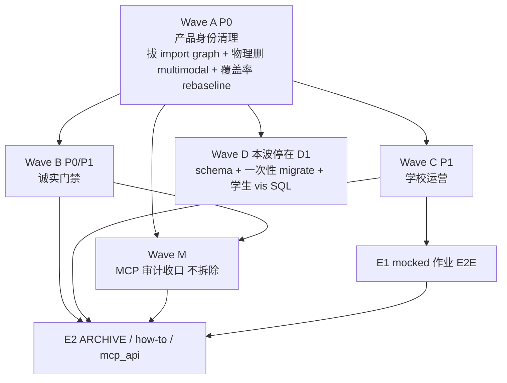
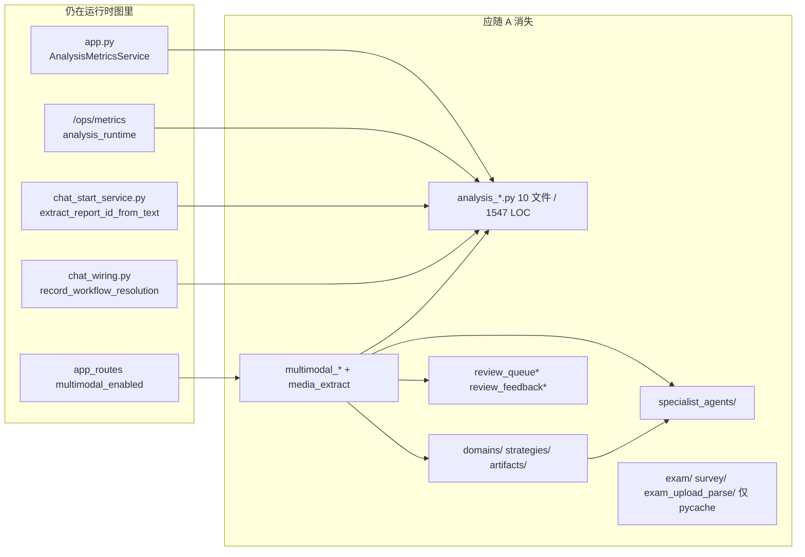
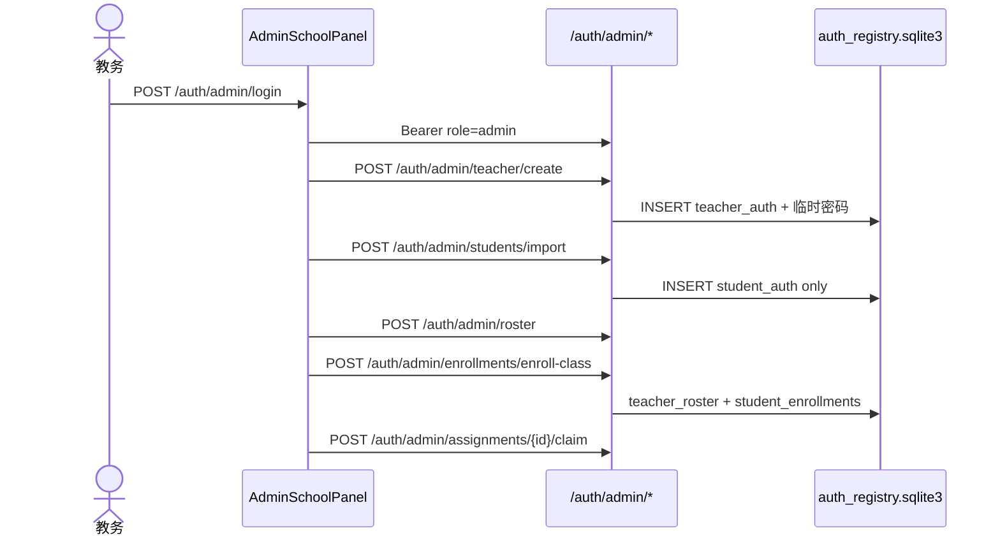
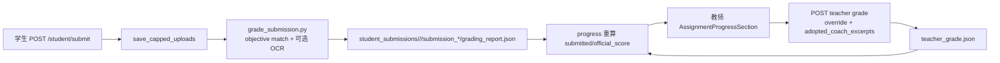
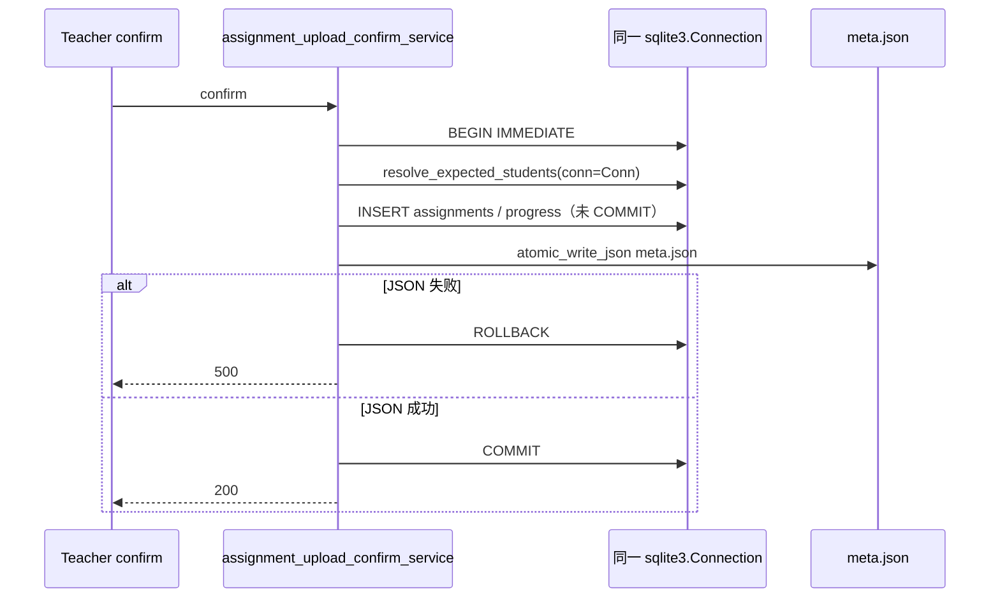
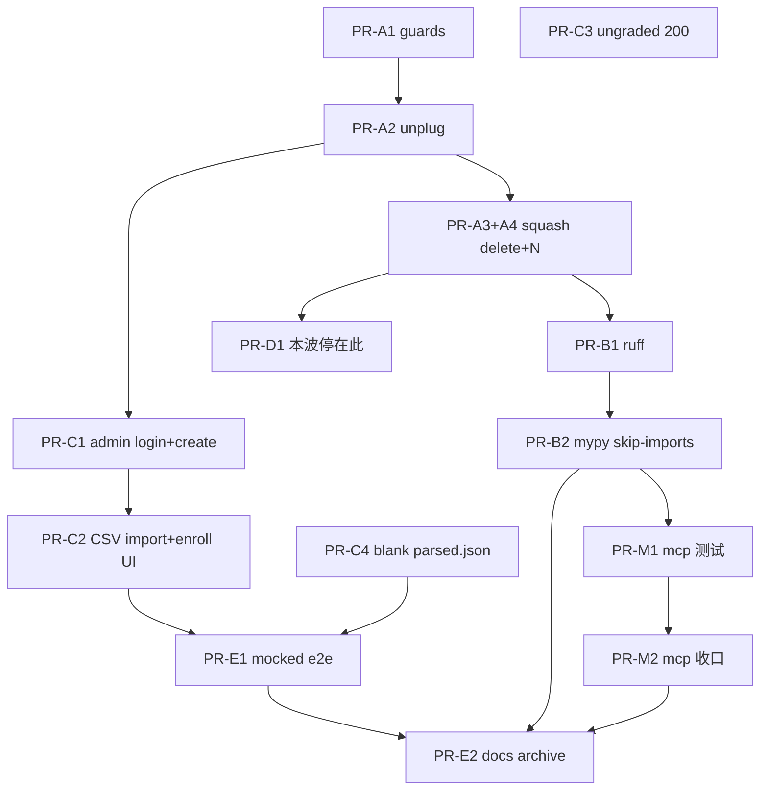

# teacherAgent 2026-09-05 全量审计后的下一阶段计划

> **本文件是 08-28 作业内核之后的下一阶段权威计划。** 不把 exam / survey / class_report 做成产品 UI，也不取代 08-28 作为产品身份文档。08-26 审计修复方案仍是安全/暴露面历史权威；本文件只承接「作业内核已落地之后还剩什么」。
>
> **D1–D9 与 D10 的非数字约束不重开**（fail-closed、Bearer、MCP sidecar、无 filter-repo、prod backup 默认关、无 AES-GCM、M/H TDD）。**仅 D10 的覆盖率数字地板 84% 本波测量一次并改写**（KD-A4）：那 84% 被 D8 卸载后仍留在树上的 analysis 测试撑着。Owner 在 A4 签字 N。禁止把「不重开 D10」读成「必须留 analysis 测试才能过 84」。

| 字段 | 值 |
| --- | --- |
| 文档标题 | Next-phase plan after 2026-09-05 full-repo audit |
| 作者 | TBD（平台 Owner 签字后生效） |
| 日期 | 2026-09-05 |
| 状态 | Draft（**Open Questions 已由 Owner 于 2026-09-05 关闭**；整份计划仍须签字后执行） |
| 产品 | 单校作业产品（teacher 上传/确认/进度，student 今日列表/陪练/显式提交，admin 运维面） |
| 仓库 | `/home/tdcasual/codework/teacherAgent` |
| 分支上下文 | `execute-plan/67da4340-audit-fixes`（作业内核身份已落地） |
| 权威关系 | 产品身份：08-28。本文件：08-28 之后的工程与校内部署阶段。 |
| 治理约束 | `CONTRIBUTING.md` L/M/H；M/H 必须 TDD；fail-closed；Bearer not Cookie |
| 团队 | 2 人。PR 按两人可审可合来切，不按五名 Owner 编制。`.github/CODEOWNERS` 全是 `@tdcasual`（既有 AR-L4），本波不发明编制。 |
| 覆盖率 | Wave A 删除后做**一次**书面 rebaseline；之后只棘轮，不静默降地板，不为保 84% 留死代码 |

---

## Overview

08-28 已经把本仓库收成单校作业产品：HTTP 不再挂 exam/survey/analysis_report；教师默认 skill 是作业运营；学生今日是列表且空态「老师尚未布置」；显式 `POST /student/submit` 有 UI；完成默认 = 已提交；作业 meta 有 `teacher_id`/`subject_id`。这些在当前代码里是真的，本波不重做。

2026-09-05 复审发现的不是「产品身份又漂了」，而是：**卸载后的分析运行时仍在 import graph 里喂覆盖率；质量门禁是文件名话剧；学校教务没有 Web 入职面；官方评分的心智模型还停在 CLI；作业真相在 JSON 目录上，跨 confirm/roster/progress 没有事务。** 两人仓库继续在这条链上堆功能，会把 84% 地板、god file 和「结构测试」锁死成永久税。

本方案推进顺序（**不是** A→B→C→D→E 全序）：**A 必须先于 B/C/D**（先清 import graph 与覆盖率，再开持久化）；**C 与 D 并行**；**M（MCP 审计收口）与 B 并行**，不堵 C/D，须在 E2 文档前合入；本波持久化 **停在 D1**（D2/D3 = phase 2.1）；**E1 不堵在 sql-primary 上**。禁止在分析代码还在撑覆盖率时开 SQLite 重写。禁止把本波写成考试平台、通用 agent 平台、或多校 SaaS。MCP sidecar **保留并本波收口**，不拆除。

---

## Background & Motivation

### 规模（上下文，不是增长目标）

对照 2026-09-05 工作区实测（禁止把旧审计行数当现状）：

| 范围 | 数量 |
| --- | --- |
| `services/api` | 287 个 `.py`，51 137 LOC |
| `tests/` | 434 个 `.py`，52 577 LOC |
| `frontend/` ts/tsx（含 e2e，不含 node_modules） | 222 文件，37 946 LOC；`frontend/apps` 单独 23 865 |
| `docs/` | 161 个 md，37 368 行；其中 `docs/plans/` 122 文件 / 33 731 行 |
| God files | `auth_registry_service.py` 1683；`identity_graph_service.py` 1104；`chat_job_processing_service.py` 1042；`agent_service.py` 896 |
| 前端壳 | student `App.tsx` 718 行，预算 `<1200`（`tests/test_tech_debt_targets.py`）；teacher `App.tsx` 578 行，预算 `<770` |
| 测试结构 | 约 86 个 structure/split/budget/guard/`no_*`/`leftover` 文件 vs 44 assignment + 58 chat + 7 `test_auth*`（另有 identify/security/admin 认证测试） |

Compose 校内负载上限（本波沿用，不调大）：`LLM_MAX_CONCURRENCY_STUDENT=12`、`LLM_MAX_CONCURRENCY_TEACHER=2`、`CHAT_STUDENT_INFLIGHT_LIMIT=1`、API `--workers ${API_WORKERS:-2}`、api `mem_limit: 2g`。这是单校同时在线陪练的硬顶，不是 SaaS 容量规划。

### 审计对照代码（错了就丢掉，对了就进表）

| 审计断言 | 2026-09-05 代码事实 | 本波处置 |
| --- | --- | --- |
| HTTP 已不挂 exam/survey/analysis_report | `services/api/app_routes.py` 只注册 misc/chat/student/teacher/multimodal?/skill/assignment。`tests/test_app_routes_registration.py` 禁止 `/exam` `/teacher/surveys` `/teacher/class-reports` | **KEEP**。本波不重开 D1/D8 |
| 教师默认产品 skill | `services/api/skills/product.py` `PRODUCT_SKILL_IDS` = `teacher-assignment-ops` / `homework-generator` / `student-coach`；物理附属只经 roster `subject_id=physics` | **KEEP** |
| 未知 pack 回退 generic | `subject_pack_service.py` `GENERIC_PACK_ID = "generic"`；两份 pack 都是 `grader: none` | **KEEP** pack 契约；本波不新学科 |
| 学生今日列表 + 显式提交 UI | `StudentSubmitPanel`；空态文案在 how-to | **KEEP** |
| 完成默认 = 已提交 | `_DEFAULT_COMPLETION_POLICY["requires_discussion"] = False` | **KEEP** |
| meta 所有权 + admin claim | `_build_assignment_meta` 写 `teacher_id`/`subject_id`；`POST /auth/admin/assignments/{id}/claim` | **KEEP** |
| compose 回环 / 必填密钥 / Redis `noeviction` / MCP 空钥 503 | 仍在 | **KEEP**。prod backup profile 默认关 |
| AES-GCM 已关 | `RISK-MASTERKEY-CRYPTO-001` 已关闭 | **不**再开加密迁移 |
| 教师工作流不是 ExamDraftSection | `WorkflowTab.tsx` 只挂 Upload / Draft / Progress；frontend 无 `ExamDraftSection` | **KEEP** |
| `app.py` 仍 import 分析 metrics | 属实：`AnalysisMetricsService` / `AnalysisMetricsStore`；`create_app` 挂 `analysis_metrics_service`；`/ops/metrics` 塞 `analysis_runtime` | Wave A 拔掉 |
| `chat_start_service.py` 仍 import `extract_report_id_from_text` | 属实（L7），fingerprint 含 `analysis_target_id` | Wave A 拔掉 |
| multimodal / review / specialist / strategies 仍引用 analysis_* | 属实。`MULTIMODAL_ENABLED` 默认 `0`；这是 **video homework 分析**，不是作业附件 | Wave A 从运行时图删除；见 KD-A2 |
| chart 仍被作业工具使用 | `skills/teacher-assignment-ops/skill.yaml` allow `chart.agent.run` / `chart.exec`；`tool_dispatch_service.py` 有 teacher-only handler | **保留** sandbox。不是 exam 专用 |
| `exam/` `survey/` `exam_upload_parse/` 空，只剩 `__pycache__` | 属实，无 `.py` | Wave A 删 pycache 空目录 |
| 覆盖率 84% 激励留死代码 | `ci.yml` `--cov-fail-under=84`；`pyproject.toml` 无 omit 列表 | 一次书面 rebaseline |
| CI ruff/mypy 是文件名白名单 | `ci.yml` ruff 约 9 路径、mypy **24** 文件（`--ignore-missing-imports --follow-imports=skip`）；`tests/test_ci_backend_scope.py` 钉两个文件名；`tests/test_ci_backend_hardening_workflow.py` 钉 `config.py` / `chat_job_state_machine.py` / `fs_atomic.py` **以及字面 `--cov-fail-under=84`** | Wave B 改写这些钉死测试。**但** `scripts/quality/check_backend_quality_budget.py` 已经对整个 `services/api` 跑 ruff（`ruff_max: 0`）和 mypy skip-imports（`mypy_max: 8`）。话剧在 CI step 与「yml 必须出现文件名」，不在「ruff 从未扫过全树」 |
| CODEOWNERS 为空 | **审计不精确**。`.github/CODEOWNERS` 存在，全部 `@tdcasual`（08-26 AR-L4） | 接受。两人团队不扩 CODEOWNERS 编制 |
| Admin 只有 TUI | 属实。`scripts/admin_manager` → `admin_auth_tui.py`。how-to 最后验证 2026-02-15 | Wave C |
| 教师「管理面板」已存在 | `TeacherAdminPanel.tsx` 是老师自己的认证/模型抽屉（344px）。`TeacherTopbarAdminMenu.tsx` 只走 `POST /auth/teacher/identify` + `/auth/teacher/login`；`_teacher_login_response` **永远** `role: "teacher"`。`isAdmin` 是 localStorage；生产教师登录从不写 `admin`。admin 凭证在 `admin_auth`，与 `teacher_auth` 分表。`POST /auth/admin/login` 后端已有，**教师 SPA 未调用** | Wave C：**先做管理员登录进教师 SPA**，再做学校面板。不新建第三 deployable |
| `tenant_admin_api.py` 可当学校 admin | **否**。那是 `X-Admin-Key` 的多 TENANT 注册面，与单校教务无关 | 本波不扩展它 |
| 官方分走 CLI | `student_submit_service.submit` 已 subprocess `scripts/grade_submission.py`；进度面板已有 `saveStudentGrade`；`official_score_from` 已优先 override。**HTTP 路径没有 RuntimeError→ungraded**：`core_utils.run_script` 对非零退出 **`raise HTTPException(500)`**，超时默认 300s 同样 500 | Wave C：submit 捕获失败，落 `ungraded` 报告，200 而非 500 |
| 学生导入仍是考试答卷 CSV | `student_import_service.py` `source in {responses_scored, responses}`，扫 `data/staging/*responses*` | Wave C 换成名册 CSV |
| 无「创建教师」HTTP | admin 只有 list / set-disabled / reset-password / token export。教师靠 workspace 目录 bootstrap | Wave C 补 API |
| 作业持久化是 JSON 目录 | `data/assignments/<id>/meta.json` + `progress.json`；`data/student_submissions/<aid>/<sid>/`；`fs_atomic.py` 有。身份图已在 `data/auth/auth_registry.sqlite3`（WAL，timeout=3s） | Wave D |
| 默认 CI E2E 不是作业闭环 | `e2e:smoke` = Vite + **API mock**（`setupBasicTeacherApiMocks`）：chat 轮询 + upload status + student shell + mobile menu。`teacher-system-real-assignment.spec.ts` 需 `E2E_REAL=1`，不是 PR 默认。CI **没有** compose-up 作业。`teacher-e2e.yml` path-filter 仅 `frontend/**` | Wave E：必跑 **mocked** how-to 闭环；live compose 可选/nightly |
| Prettier 只扫 shared | `package.json` `format:check` = `apps/shared/**`。AR-L3 | Wave B 可选 |

### 痛点

1. **产品面卸了分析，进程没卸。** `create_app` 仍构造 `data/analysis/metrics_snapshot.json`。`chat_wiring.py` 把 `analysis_metrics_service.record_workflow_resolution` 接到 chat job。chat start 仍解析 `analysis_target`。覆盖率地板把这 ~1.5k（`analysis_*.py`）+ multimodal/review/specialist/strategies/artifacts 链路锁在树上。
2. **门禁惩罚删死代码、奖励加结构测试。** 约 86 个测试在断言源码字符串或 CI 文件名；其中「禁止 exam 路由 / 禁止 physics fallback catalog」是产品身份，必须留。只钉 leftover 行数或 yml 文件名的，要随删除改写。
3. **学校进不来。** 教务要 `docker compose exec api admin_manager`。教师 SPA **没有** `POST /auth/admin/login`；`isAdmin` 只是 localStorage。没有 Web 创建教师、没有名册 CSV。how-to TUI 停在 2026-02-15。list/reset 仍 `_admin_actor()` → `admin_local`。
4. **评分对拍照/主观作业不诚实。** submit 的 `run_script` 非零/超时是 **500**，不是 ungraded。进度面板能覆盖分，但 how-to 仍像 CLI 主路径。
5. **JSON 目录不是作业事务。** confirm 写 `meta.json`、roster 在 sqlite、progress 再写 `progress.json`。两名教师同时 confirm/recompute 没有跨资源事务。`atomic_write_json` 只保证单文件。
6. **E2E 保护的是壳，不是 how-to。** 默认 smoke 不跑「上传 → 确认 → 学生今日 → 提交 → 进度变化」。

---

## Goals & Non-Goals

### Goals

1. 从 **runtime import graph** 和 CI 必跑测试中移除 leftover analysis / exam / survey / chart-specialist（仅当 specialist 只服务分析时）。空 `__pycache__` 目录消失。
2. 守卫测试改为「这些模块/符号不得存在，且不得被 `app.py` / `chat_start_service.py` / `tool_dispatch_service.py` import」。
3. 删除后做一次覆盖率测量，书面设定新地板 **N = ⌊TOTAL⌋**；Owner 已接受 **N 可以低于 84**。不为保 84% 留 analysis/multimodal 测试。产品模块 missing 上升则补仍存在模块的测试，或书面记录后仍设 N。之后只棘轮。
4. CI ruff 以 `services/api` 为准（与已有 budget 脚本对齐）；mypy 用**可增长**的干净文件名单棘轮，而不是冻死的 20 文件列表。
5. 学校管理员用 **`POST /auth/admin/login`** 进入教师 SPA（不走 teacher identify），在 **抽出的 `AdminSchoolPanel`**（仍是 teacher 前端，不是第三 deployable）能：创建/列出教师、导入学生名册（只建 `student_auth`）、在任教关系下 enroll、重置密码、认领孤儿作业。TUI 保留为逃生舱。
6. 老师进度面板成为覆盖分 / 采纳陪练摘录的官方 UX；`grade_submission.py` 是 submit/worker 的客观匹配实现。submit 的 `run_script` 失败必须落 `ungraded` 并 200，不得 500 整单。
7. 作业 meta、progress/roster 快照、提交成绩记录迁到 SQLite（身份图同款：WAL、参数化 SQL、fail-closed 可见性）。confirm 与 enrollments **同一 `sqlite3.Connection`**。本波持久化 **停在 PR-D1**（schema + 一次性 migrate + 学生 vis SQL-gated）。会话与 chat job 本波留文件。
8. 默认 CI 含一条 **mocked** 作业 how-to 闭环（upload fixture → confirm → 学生今日 → submit → 进度计数），外加现有 backend pytest。live compose E2E 不进 PR 必跑。how-to 验证日期随行为更新。`docs/plans/` 做 ARCHIVE 索引，不 `git rm` 122 份历史稿。
9. **MCP sidecar 保留并本波审计收口**（KD-M1）：loopback + 空钥 503 + `X-API-Key`；工具面收到作业内核；不新功能、不拆服务、不绑 0.0.0.0。

### Non-Goals（本波明确不做）

- 重开 08-28 D1–D9，或 D10 除覆盖率数字外的约束；考试产品、survey UI、class_report UI、skill marketplace、多校 SaaS。覆盖率数字见 KD-A4，不是静默改 08-28。
- 让 admin Bearer 冒充无名教师打作业 upload/confirm（admin 不做 of-record 老师）。
- 把 `ChatRequest.extra` 改成 `ignore` 来兼容 `analysis_target`（见 A.2：保留废弃字段，`extra=forbid` 不动）。
- `git filter-repo`、改写 `main` 历史、第一步 `rm -rf` 教师历史数据目录。
- 拆除 MCP sidecar，或把 MCP 绑到 `0.0.0.0`，或用 admin Bearer 当 `MCP_API_KEY`，或做 MCP marketplace。本波 **审计收口** 不等于拆除。
- 打开 prod backup profile；上 Grafana / 30 天 SLO 平台。
- 再做 AES-GCM / Cookie / CSRF 重设计。
- 双师共教 PK 变更。
- 为行数而拆 `auth_registry_service.py` / `identity_graph_service.py` / `chat_job_processing_service.py`，除非某 bug 或 mypy 棘轮被它挡住。
- 新学科 pack、新 skill、新命令。本任务只出设计。
- 把教师端重做成「纯表单无聊天」。聊天保留为陪练与工具执行器；产品真相仍是 workflow，不是 tool loop（`docs/architecture/module-boundaries.md` 规则 7）。

---

## Key Decisions

下列为本波 Owner 意图落地。Wave 依赖见 KD-A1，不是 A→E 全序。

| # | 决定 | 理由（对照现状） |
| --- | --- | --- |
| KD-A1 | **A 先于 B/C/D；C ∥ D；M ∥ B**（不堵 C/D，E2 前合入）；D 在 A4 之后且 **本波停在 D1**；E1 依赖 C 的 how-to 面，**不依赖 D2/D3**；E2 在行为 PR 之后。 | 持久化不得与 analysis 删除抢 H PR。D2/D3 已定为 2.1，E1 不得画成依赖它们。 |
| KD-A2 | **Multimodal 物理删除（Owner 2026-09-05 已决）。** `MULTIMODAL_ENABLED` 默认 0；`multimodal_*` + `specialist_agents/video_homework_analyst.py` + `domains/` + `strategies/` + `artifacts/` + `review_*` 属 video/analysis。作业附件走 `chat_attachment_service` 与 `POST /student/submit`。Wave A 从 import graph **删除并 `git rm` 这些模块与测试**。不留 flag，不做 2.1 实验分叉。 | D8 禁止永久僵尸。Owner 关闭「留着做 2.1」选项。 |
| KD-A3 | **Chart sandbox 保留。** `chart.exec` / `chart.agent.run` 仍在 `teacher-assignment-ops` 与 `homework-generator` allow-list，且 `tool_dispatch_service` 有 teacher-only + confirm。本波不删 `chart_sandbox.py`。 | 审计「若只被 exam 用则删」不成立。 |
| KD-A4 | **覆盖率一次书面 rebaseline；Owner 已接受 N 可以低于 84。** 禁止 omit、禁止留 analysis/multimodal 测试保 84%、禁止 N-5 余量。A3+A4 squash。N = ⌊TOTAL⌋。产品模块 missing 上升：补**仍存在**模块的测试，或书面记录后仍设 N。之后只棘轮。08-28 D10 数字地板明示修订。 | 24 个 `test_analysis_*.py` 在撑 84%。Owner 2026-09-05：诚实测量，不留死代码。 |
| KD-A5 | **不 `git filter-repo`，不删 `data/assignments/**` 作为 step 1。** 只删源码/测试/空 pycache。磁盘上历史 `data/analysis/`、`data/exams/` 继续不读。 | 沿用 D1/D10 非数字约束。 |
| KD-B1 | **CI ruff 以 `services/api`（外加现有 mcp/tests 安全文件）为门禁。** 改写 `test_ci_backend_scope.py` **和** `test_ci_backend_hardening_workflow.py` 的文件名/84 钉死，改为「这些路径被 ruff/mypy 实际执行」。 | `ruff_max: 0` 已在 budget 脚本；CI step 仍是切片 = 话剧。 |
| KD-B2 | **mypy 本波：增长 allowlist + `--follow-imports=skip` + 名单内 0 error。不做 `--strict`。** 每次只加文件。`mypy_max: 8` 全树 skip-imports 计数器仅观测，不是配额。 | god file 未拆；strict 会变成行数虚荣重构。 |
| KD-B3 | **学生 `App.tsx` 预算 `<800`（718+余量）。** 教师 `App.tsx` `<770` 保持。C 抽出的 `AdminSchoolPanel.tsx` 另设 `<500` 行预算（不塞进 344px 抽屉，也不胀 `TeacherTopbarAdminMenu.tsx` 的 679 行）。 | 1200 太松；admin UI 不会改 student App。 |
| KD-B4 | **不为行数拆 god file。** 例外：Wave D 的 assignment store **新建**模块，不把 SQL 塞进 1683 行 registry。 | 08-26 F34 是虚荣债。 |
| KD-C1 | **Admin 进教师 SPA 必须走 `POST /auth/admin/login`。** 不复用 teacher identify/login。会话：Bearer + `role=admin`；`writeTeacherAuthSession` 的 `teacherId` 存 admin `subject_id`（`admin_username`），并写 `role`。admin **不得**当无名教师打 upload/confirm。学校功能放 `AdminSchoolPanel`（teacher 前端内的宽面板/页），不是 344px `TeacherAdminPanel` 抽屉。TUI 逃生舱保留。 | 现状教师登录永远 `role: "teacher"`；`isAdmin` 只在测试里被 mock。 |
| KD-C1b | **所有本波新建及本波改动的 `/auth/admin/*` 用 `_require_admin_principal()`，禁止 `_admin_actor()` 的 `admin_local` 回落。** 本波顺手把 list/disable/reset/export-token 从 `_admin_actor` 迁到同一 helper。测试：`AUTH_REQUIRED=0` + 无 Bearer → create/import **401**。 | identity 路由已经拒绝 fallback；list/reset 仍 `admin_local`。克隆相邻模式会让开通账号在 `AUTH_REQUIRED=0` 时裸奔。 |
| KD-C2 | **官方成绩 UX = 进度面板；实现 = submit 调用的 `grade_submission.py` + 老师覆盖。** CLI 仅调试。`student_submit_service.submit` **捕获** `run_script` 非零退出与 timeout：仍保存上传文件，写入 `ungraded` 的 `grading_report.json`，按现有 `counted_grade_item` 算 `submitted`，**HTTP 200**。不得声称 HTTP 路径已有 RuntimeError 分支（那是脚本进程内 `ocr_utils` 缺失时的 in-process raise，submit 走的是 subprocess）。 | `core_utils.run_script` 非零 → 500。 |
| KD-C3 | **Confirm 逃生舱只有一条路：** job `status=failed` 或缺少 `parsed.json` 时，扩展现有 **`POST /assignment/upload/draft/save`**（`save_assignment_upload_draft`）：先物化空白 `parsed.json` + 8 点模板，再按今日逻辑写 `draft_override.json`。`GET /assignment/upload/draft` 只读。confirm **不改 schema**，仍拒 `requirements_missing`。不新造 `POST /assignment/upload/draft`，不加 `manual_questions`。 | 现 save 只写 `draft_override.json`；confirm 仍 `_load_parsed_or_fail`。 |
| KD-C4 | **名册 CSV 只创建/更新 `student_auth`，不自动 enroll。** enroll 走已有 `POST /auth/admin/roster` + `enroll-class`/`enroll`，必须带 `teacher_id`+`subject_id`+`class_name`。`student_id` 规则见 §C.1。 | enrollments PK 是 `(student_id, subject_id, class_name)`；缺 enroll 则 `expected_students` 为空，学校仍不可运营。 |
| KD-D1 | **作业行进 `data/auth/auth_registry.sqlite3`；模块 `assignment/store.py`。** confirm 必须把 **同一个** `sqlite3.Connection` 传入 enrollments 读取与 assignment INSERT（给 `resolve_expected_students` 加可选 `conn=`）。blob 留盘。会话/chat job 本波不迁。**学生 vis 切到 SQL 之前，同一 squash 必须先 `--apply` 把现有 JSON 迁进表**（见 KD-D3）。 | 第二连接上的 `BEGIN IMMEDIATE` 罩不住 enrollment 读；只切读不迁会把全部旧作业变成 SQL miss。 |
| KD-D2 | **双写唯一 2PC 顺序（D1 起全程）：** `BEGIN IMMEDIATE` → 同连接算 snapshot + INSERT（未提交）→ `atomic_write_json` → JSON 失败则 `ROLLBACK`+500 → 成功则 `COMMIT`（confirm 仅此时 200）。文件系统 JSON **不在** SQLite 事务里；**ROLLBACK 不删除已落地的 `meta.json`。** 禁止「或标 draft」分叉。JSON 在、SQL 缺：教师 confirm 重试 **heal upsert SQL**（同一 `teacher_id`）。 | 两种回滚策略不能并存。 |
| KD-D3 | **学生 vis 跟 SQL，必须先迁完再切读。本波计划生产态 = 停在 D1**（Owner 2026-09-05）。PR-D1 squash：(1) schema + 双写；(2) 一次性 JSON 导入写入 `assignment_schema_migrations` v2；(3) 切学生 `today`/`submit` 只认 SQL `published`。`ensure()` 之后只建表，不每 boot 扫 JSON。D2 教师 dual-read、D3 sql-primary、停 JSON 写 = **phase 2.1 backlog**，不是本波必做。 | 启动再扫会复活 crash 孤儿；D2/D3 不进 6–8 周必做图。 |
| KD-E1 | **PR 必跑 E2E = mocked how-to 闭环**（Vite + 现有 Playwright mock 风格：upload fixture → confirm → 学生今日 → submit → 进度计数变化）+ 现有 backend pytest（confirm/submit/visibility）。**不**把 live compose 作业环放进 25min `smoke-e2e`。live/`E2E_REAL=1` 可 nightly。`teacher-e2e.yml` path-filter 仍加上 `services/api/assignment*`。 | 现 smoke 全是 mock；CI 无 compose-up。 |
| KD-E2 | **`docs/plans/` 用 `ARCHIVE.md` + 可选 `git mv` 到 `archive/`；不删 122 文件。** 现行权威：08-26、08-28、本文件。08-28 D10 数字地板以 A4 签字的 N 为准，并在 08-28 加一句指向本文件。 | AR-L1。 |
| KD-M1 | **MCP sidecar 保留并本波收口，不拆除。** compose `mcp` 服务、`127.0.0.1:9000`、空钥 503、`X-API-Key` 不变。本波把 MCP 工具面收到作业内核（见 §Wave M），不新 MCP 产品功能，不暴露非 loopback，不用 admin Bearer 当 MCP key。 | Owner 2026-09-05：不是「原样留到 2.1 再讨论拆除」。 |
| KD-G1 | **沿用硬约束：** fail-closed；Bearer not Cookie；**MCP 服务保留**（收口见 KD-M1）；Python 3.13 / Node 24 / Compose；PR 独立可合；assignment-core 测试保持绿。 | D10 非数字部分 + CONTRIBUTING。 |

---

## Proposed Design

### 波次总图



C 与 D 都依赖 A，彼此不硬依赖。M 与 B 并行，不堵 C/D。E1 **不**依赖 D2/D3。本波 D 的计划生产态是 **停在 D1**。推荐两人分工：一人 A→D1，一人 A 守卫 + C + M，会合于 E。

校内负载假设（用于 D 的 SQLite 与 C 的 admin，不是容量 KPI）：单校，教师并发个位数，学生陪练被 inflight=1 与 LLM 12 卡住。SQLite WAL + timeout=3s 足够；不要借此引入连接池中间件。

---

### Wave A — 产品身份清理（P0）

#### A.1 删除依赖（必须按图，禁止先删被 app.py 直接 import 的文件而不改 app.py）



**保留（核对过，审计若说删则是错的）：**

- `teacher_assignment_preflight_service._assignment_analysis_or_skip`：这是作业 intent gate，不是 exam analysis。
- `chart/` + `chart_executor.py` + `chart_sandbox.py`：作业教师工具仍用。
- `chat_attachment_service.py`：陪练附件，不是 multimodal 分析。
- `packs/subjects/*`、`assignment_*`、`student_submit_service.py`。

**删除清单（源码 + 对应测试；文档见 E，不在 A `rm` 122 plans）：**

| 组 | 路径 | 规模（2026-09-05） |
| --- | --- | --- |
| analysis 服务 | `services/api/analysis_*.py`（10） | 1 547 LOC |
| analysis 测试 | `tests/test_analysis_*.py`（24） | 2 655 LOC |
| analysis 脚本 | `scripts/*analysis*`、`scripts/quality/build_analysis_*`、`scripts/quality/check_analysis_*`、`scripts/replay_analysis_run.py`、`scripts/compare_analysis_runs.py` 等 | 17 文件 / 2 587 LOC |
| multimodal | `multimodal_*.py`、`routes/multimodal_routes.py`、`media_extract_service.py`、`media_segment_models.py` | 含 report 346 + orchestrator 306 |
| 分析运行时 | `domains/`、`strategies/`、`artifacts/`、`specialist_agents/` | specialist+strategies+artifacts 合计约 2.3k+ |
| review | `review_queue_service.py` 368、`review_feedback_service.py` 290 及 store/models | 随 multimodal 删 |
| 空包 | `services/api/exam/`、`survey/`、`exam_upload_parse/` 的 `__pycache__` | 无 `.py` |
| 路由 pycache | `routes/exam_*.pyc`、`survey_routes.pyc`、`class_report_routes.pyc`、`analysis_report_routes.pyc` | 只删缓存 |
| 设置 | `settings.py` 中 `analysis_*` / `survey_analysis_enabled` / `multimodal_enabled` 在无引用后删除 | 避免僵尸 flag |
| 前端 | 若仍有 multimodal/video 区块（当前 WorkflowTab 无）则不要加回来 | 守卫测试钉死 |
| 配置 | `config/analysis_policy.json` | 随模块删 |
| 路径残留 | `paths.py` 的 `resolve_analysis_dir` | 考试分析目录，assignment 不用 |
| 仅脚本引用 | `analysis_gate_ownership_service.py`（现仅 `scripts/quality/check_analysis_preflight.py` + 其测试） | 随脚本删 |
| 模型字段 | `api_models.ChatAnalysisTarget` 类：A2 保留字段但 job 不写；A3 后可仍留一版兼容，类定义可内联在 `api_models.py` | 不在 `analysis_*.py` |

`tests/test_leftover_survey_and_catalog.py` 里 **KEEP**：禁止 exam 路由、禁止 physics fallback catalog、compose loopback、学生 lazy submit。**改写**：`test_create_app_does_not_boot_analysis_ops` 升级为「`app.py` 不得 import `analysis_*` / 不得出现 `analysis_runtime`」。删除只为分析文件存在而存在的测试。

#### A.2 守卫测试形态（TDD，先于删除 PR 或同一 PR 的先提交）

```python
FORBIDDEN_IMPORT_ROOTS = (
    "services.api.analysis_metrics_service",
    "services.api.analysis_metrics_store",
    "services.api.analysis_target_resolution_service",
    "services.api.analysis_target_models",
    "services.api.analysis_ops_service",
    "services.api.analysis_policy_service",
    "services.api.analysis_lineage_service",
    "services.api.analysis_metadata_repository",
    "services.api.analysis_gate_ownership_service",
    "services.api.analysis_specialist_failure_service",
    "services.api.multimodal_orchestrator_service",
    "services.api.review_queue_service",
    "services.api.review_feedback_service",
    "services.api.domains.runtime_builder",
    "services.api.specialist_agents.video_homework_analyst",
)
# 另断言 paths.py 无 resolve_analysis_dir；app.py 无 analysis_runtime

def test_app_module_does_not_import_analysis(monkeypatch):
    # 解析 services/api/app.py AST 或 sys.modules after import create_app
    ...

def test_forbidden_modules_are_absent():
    for rel in (
        "services/api/analysis_metrics_service.py",
        "services/api/exam/application.py",
        "services/api/survey/application.py",
    ):
        assert not Path(rel).exists()
```

`chat_start_service.py`：删除 `analysis_target` 归一化与 `extract_report_id_from_text`。fingerprint 只留 `skill_id|assignment_id|last_user_text|attachment_ids`。

`ChatRequest`：**保留** `analysis_target: Optional[ChatAnalysisTarget] = None` 作为一版废弃字段，`ConfigDict(extra="forbid")` **不改**。旧客户端带该字段 → 200，**不写入 job、不进 fingerprint**。禁止改 `extra="ignore"`（会放行任意未知键）。同一 PR-A2 拔掉透传：`chat_job_processing_service.py`、`agent_service.py`、`core_services_runtime.py` 的 `analysis_target` kwargs。

`/ops/metrics`：只返回 `ObservabilityStore.snapshot()`。禁止 `analysis_runtime` 键。

`chat_wiring.py`：workflow resolution 指标若仍要，写入现有 `ObservabilityStore`，**不要**为它留下 `AnalysisMetricsService`。

`paths.py`：删除 `resolve_analysis_dir`。

#### A.3 一次覆盖率 rebaseline（强制书面程序）

A3 删除与 A4 改地板是 **一次 squash 合入 main**（或 stacked review，但 coverage 门禁只在该 train 上临时非阻断，**禁止** A3 单独进 main 预期 CI 红）。

1. 在同一分支上完成删除后跑：
   ```bash
   python -m pytest tests/ -q -m "not stress" \
     --cov=services/api --cov-report=term-missing --cov-fail-under=0
   ```
2. PR 描述贴完整 `TOTAL` 行，**以及** `assignment_*`、`auth*`、`student_submit*`、`chat_start_service.py` 的 missing 行（对照 main 同批命令）。这些产品文件 missing 上升 → 先补测试；只有 Owner 书面接受「产品覆盖回归」才能仍用该 N。
3. 新地板 \(N = \lfloor p \rfloor\)。**禁止**为好看设回 84。**禁止** N-5 余量。**禁止** `omit` 残留模块。
4. 同一 squash 改：
   - `.github/workflows/ci.yml` `--cov-fail-under=N`
   - `tests/test_ci_backend_hardening_workflow.py`（今日字面钉 `84`）及任何其它钉 84 的测试/INDEX/CONTRIBUTING
   - `docs/plans/2026-08-28-assignment-core-product-design.md` D10：**加一句**「数字地板以 2026-09-05 计划 A4 签字的 N 为准；其余 D10 约束不变」——这是明示修订，不是静默改字
   - `docs/reference/risk-register.md` 关闭条 `RISK-COV-REBASELINE-20260905`（旧 84 → 新 N，命令，日期）
5. 之后任何 PR 覆盖率下降：修测试或产品代码，**不许**再降 N。

#### A.4 风险（A）

| 风险 | 严重度 | 缓解 |
| --- | --- | --- |
| 误删 chart / 作业 preflight / chat 附件 | H | KD-A3；删除 PR 必须跑现有 assignment + chat 测试；chart e2e/unit 保持 |
| 误删仍被 MCP/skill 引用的脚本 | M | `rg` 删除符号；MCP allow-list 回归 `tests/test_mcp_script_allowlist.py` |
| 覆盖率骤降导致主分支红 | H | A3+A4 squash；先合 A1/A2（守卫+拔引用，覆盖率仍 84）；删除与改 N 不同时落 main |
| 前端或 how-to 仍写「视频分析」 | L | 守卫 + how-to 在 E 更新；A 不改老师历史数据 |

---

### Wave B — 诚实工程门禁（P0/P1）

#### B.1 ruff

- CI `Ruff` step 改为：`python -m ruff check services/api services/mcp/app.py tests/test_ci_workflow_quality.py tests/test_ci_backend_scope.py`（可再加 `scripts/grade_submission.py` 若该文件已干净）。
- 改写 `tests/test_ci_backend_scope.py`：不再 `assert "teacher_model_config_service.py" in yml`。
- 改写 `tests/test_ci_backend_hardening_workflow.py`：去掉字面 `--cov-fail-under=84` 与「yml 必须含 config.py / chat_job_state_machine.py / fs_atomic.py」。改为断言 `config/mypy_gate_files.txt` 被 CI mypy 读入，且覆盖率地板来自该文件或 ci.yml 的**现行 N**（与 A4 同步）。
- `tests/test_ci_workflow_quality.py` 的 `_SECURITY_CRITICAL_RUFF_PATHS` 可保留为**超集检查**（这些文件必须在 ruff 命令里），但 ruff 命令本身必须覆盖全 `services/api`。
- `config/backend_quality_budget.json` `ruff_max: 0` 保持。`app_core_max_lines: 260` 保持（当前 `app_core.py` 248）。**不**把 complexity 从 1600 行文件「搬回」app_core 来满足预算。

#### B.2 mypy 增长名单

现状：CI **24** 个文件 + `--ignore-missing-imports --follow-imports=skip`。Budget 脚本对全树 skip-imports 允许 8 error。

本波：

1. 把 CI mypy 文件列表抽到 `config/mypy_gate_files.txt`。
2. CI 与测试对该名单跑 `mypy --ignore-missing-imports --follow-imports=skip`，**0 error**。本波 **不做 `--strict`**。
3. 每个涉及被名单覆盖模块的 M PR，只许**加**文件进名单，不许删。目标本波至少纳入：`assignment/visibility.py`、`assignment/store.py`（D 新增）、`fs_atomic.py`（已在）、`auth_service.py`（已在）、`subject_pack_service.py`。
4. 不把 `auth_registry_service.py` 强行纳入，除非有人顺便修类型且不拆文件。
5. `test_ci_backend_hardening_workflow.py` 改为读 `mypy_gate_files.txt`，不再钉 yml 里的三个文件名。

#### B.3 结构测试分层

| 类别 | 例子 | 处置 |
| --- | --- | --- |
| 产品身份 | 无 exam 路由；teacher catalog 无 physics 默认；student 无 auto_generate | **KEEP** |
| 安全契约 | Bearer；`/student/verify` 有角色门 | **KEEP** |
| CI 文件名话剧 | `test_ci_backend_scope.py`、`test_ci_backend_hardening_workflow.py` 钉 yml 字符串 / 84 | **改写** |
| 纯行数钉死 leftover | 若有「analysis 文件必须仍存在」 | **删除** |
| App 行数 | student `<1200` → `<800`；teacher `<770` 保持；新 `AdminSchoolPanel.tsx` `<500` | **收紧 / 新增** |

#### B.4 Prettier（可选，L）

AR-L3：`format:check` 现只扫 `apps/shared`。若本波有余力，一次 PR 把 teacher+student 纳入并 format。不阻塞 C/D。

---

### Wave C — 学校运营（P1）

#### C.1 Admin 登录、会话、学校面板（最小，不是新产品）

**登录（PR-C1 必做，不是抽屉附带）：**

- 教师 SPA 增加「管理员登录」表单，只调用已有 `POST /auth/admin/login` `{username, password}`。**禁止**走 `/auth/teacher/identify` + `/auth/teacher/login`。
- `_teacher_login_response` 继续永远 `role: "teacher"`，不要让教师密码误发 admin 角色。
- `writeTeacherAuthSession`：admin 时 `teacherId` = token `subject_id`（即 `admin_username`），`teacherName` = username，`role: "admin"`。无 `teacherId` 则今日实现直接 return，所以必须写入。可把内部字段改名为 `subject_id` 并让 `teacher_id` 做 alias，但 wire 必须在 C1 完成。
- `readTeacherAuthRole()` 读 session `role`；`isAdmin` 仅当 role 真是 admin。
- Admin Bearer **403** 于教师作业写路径（upload start/confirm、generate、archive），除非请求带的是已 claim 的 admin-only 路由。admin 不是 of-record 老师，工作台作业 API 保持 teacher 所有权。
- 登录限流：已有 `_LOGIN_PATHS` 含 `/auth/admin/login`（默认 10 rpm × 2 workers）。

**授权（新路由 + 本波改动的旧路由）：**

- 一律 `_require_admin_principal()`（`auth_identity_route_handlers.py` 已有：principal 为 None → 401，不回落 `admin_local`）。
- **禁止**在 `auth_route_handlers.py` 用 `_admin_actor()` 实现 create/import。本波把 list/set-disabled/reset-password/export-token 从 `_admin_actor` 迁到 `_require_admin_principal`。
- 测试：`AUTH_REQUIRED=0`、无 Bearer → `POST /auth/admin/teacher/create` 与 `POST /auth/admin/students/import` 返回 401。

**布局：** 抽出 `frontend/apps/teacher/src/features/admin/AdminSchoolPanel.tsx`（teacher 应用内页面或 ≥720px 面板），从 topbar 在 `role=admin` 时打开。**不**往 344px `TeacherAdminPanel` 塞名册。`TeacherAdminPanel` / `TeacherTopbarAdminMenu` 仍负责教师自己登录、模型设置、老师重置学生密码。行数预算：`AdminSchoolPanel.tsx` `<500`。临时密码只进 text node +「复制一次」按钮，不进 HTML 属性、不打日志。



**已有、学校面板只接 UI（授权改为 `_require_admin_principal`）：**

- `GET /auth/admin/teacher/list`、`POST .../set-disabled`、`POST .../reset-password`
- `GET/POST /auth/admin/subjects`、`roster`、`enrollments/*`
- `GET /auth/admin/assignments/orphans`、`POST .../claim`

**本波新 API：**

| 方法 | 路径 | 请求 | 响应 / 错误 |
| --- | --- | --- | --- |
| POST | `/auth/admin/teacher/create` | JSON：`teacher_name` 必填；`email` 可选（非空则 unique，冲突 409 `email_taken`）；`teacher_id` 可选，须匹配 `^[A-Za-z0-9][A-Za-z0-9_-]{0,63}$` 且 **不得** 为 `teacher` | 201：`teacher_id`、一次性 `temp_password`（`_generate_bootstrap_password` + `validate_password_strength`）。省略 id 时 `t_` + sha1(`normalize(name)+'|'+normalize(email)`)[:12]。409 `teacher_id_taken`。限流见下。 |
| POST | `/auth/admin/students/import` | `multipart` 一个 CSV，**不是** 20MB 上传限额。上限 **2000 行 / 256KB**；UTF-8（允许 BOM）。表头白名单：必填 `student_name,class_name`；可选 `student_id`；多余列 → 400 `unknown_column` | **只写 `student_auth`**，不 enroll。全有或全无（一事务）。回执每行 `student_id` + 一次性 `temp_password`。 |
| GET | `/auth/admin/students` | `?class_name=&page=` | 可选；import 回执不够再做。 |

开通限流：`RATE_LIMIT_ADMIN_PROVISION_RPM` 默认 **10**（独立 bucket，路径 create + import）。两 worker ≈ 20/分钟。不走通用 120 rpm。

**`student_id` 与 re-import：**

- CSV 提供合法 `student_id` → 用之。
- 省略 → `s_` + sha1(`normalize(class_name)+'|'+normalize(student_name)`)[:12]（稳定，重导更新同一行）。
- 同班同名两人必须带不同 `student_id`，否则合并为一人（idempotent update）。
- 重导：已存在则更新姓名/班级，**不**轮换密码（除非 `reset_passwords=true` 显式列，默认 false）。

**Import 与 enroll 拆开。** CSV 不带 `subject_id`/`teacher_id`。导完后教务在面板选教师+学科+班级，调已有 `POST /auth/admin/roster` 与 `enroll-class`。`class_name` 不在 roster → enroll-class 已有错误，UI 提示先加任教。无 enrollments 则 class 作业 `expected_students` 为空——这是契约，不是 import 的副作用。

例：CSV

```
student_name,class_name
张三,高二1班
李四,高二1班
```

结果 `student_auth`（id 为哈希，下表示意）：

| student_id | student_name | class_name |
| --- | --- | --- |
| s_a1b2c3d4e5f6 | 张三 | 高二1班 |
| s_b2c3d4e5f607 | 李四 | 高二1班 |

随后 `roster add t_zhang physics 高二1班` + `enroll-class t_zhang physics 高二1班` → 两行 `student_enrollments`。

`POST /student/import`（exam responses）本波 **410**。TUI 加 `teacher add` / `students import`。

**不要做：** 租户 CRUD、权限矩阵、审计日志产品、批量邮件、第三 frontend 应用。

#### C.2 评分



- **实现：** 保持 submit 调用 `scripts/grade_submission.py`（已是事实）。教师 UX 不得变成「去容器里跑 CLI」。本波默认仍同步 subprocess；不把 RQ 当成必须。
- **官方分：** `teacher_grade_service.official_score_from`：有 override 用 override，否则自动分。聊天评语必须「采纳摘录」才进成绩（已实现，KEEP）。
- **HTTP 失败路径（现状不是 ungraded）：** `StudentSubmitDeps.run_script` → `core_utils.run_script` → `subprocess.run`；非零退出 **`HTTPException(500)`**；`RUN_SCRIPT_TIMEOUT_SEC` 默认 300s 超时同样 500。脚本里 `raise RuntimeError("ocr_utils not available")` 只发生在 **CLI 同进程 import**，不会变成 submit 的本地 except。
- **本波必须：** `student_submit_service.submit` 捕获 `HTTPException`/`TimeoutExpired`/非零：上传文件已经落盘则写 `grading_report.json`（`items` 标 `status=ungraded`，或空 items + `error`），再走现有 `_read_progress` / `counted_grade_item`。返回 **200** 且 `submitted` 按既有规则（通常 false）。面板文案「未自动出分，请老师覆盖」。
- **主观/照片：** `counted_grade_item` 对 `ungraded` / 低 confidence 已不计提交（KEEP）。how-to 删「以 CLI 为准」。
- pack `grader: none`：本波不写新 adapter。

#### C.3 Confirm 逃生舱

现状：`confirm_assignment_upload` → `_load_parsed_or_fail`；8 点缺一不可（`compute_requirements_missing` / `AssignmentDraftSection` 按钮禁用）。草稿已能改题干与 8 点。

缺口：解析 job 失败时没有合法 `parsed.json`，老师无法「手打题目后创建」。

**唯一写路径：** 扩展现有 `POST /assignment/upload/draft/save`（`assignment_upload_routes.py` → `save_assignment_upload_draft` / `assignment_upload_draft_service.py`）。今日该 handler **只**写 `draft_override.json`。本波：若 `parsed.json` 缺失或 job `status=failed`，**先**物化空白 `parsed.json`（`questions: []`，老师在 UI 加题）+ 8 点 requirements 模板（缺项进 `requirements_missing`），**再**按现状写 `draft_override.json`。

`GET /assignment/upload/draft` 只读，不写。不新增 `POST /assignment/upload/draft`。confirm **不改 schema**，仍 `_load_parsed_or_fail` + `_ensure_requirements_ready`。UI 失败态显示「手动录入题目」，复用 `AssignmentDraftSection`。

不在 confirm 上增加 `manual_questions`。不把 8 点改成可选。`extra_constraints` 本来就可空。how-to 加「解析失败时」一节。

---

### Wave D — 作业内核持久化（P1，必须在 A 之后）

#### D.1 为什么现在才做

JSON 目录：`assignment_data_service.load_assignment_meta` 读 `meta.json`；confirm 写同一文件；`assignment_progress_service` 写 `progress.json`；`teacher_grade_service` 写 `student_submissions/.../teacher_grade.json`；roster 已在 sqlite。confirm 的 `expected_students` 来自 `identity_graph_service.resolve_expected_students`，但写入 meta 与 enrollments 不在同一事务。两名教师同时 `recompute_roster` / confirm 会丢更新。

身份图样板（必须抄，禁止新发明 ORM）：

- `AuthRegistryStore._connect`：`sqlite3.connect(..., timeout=3.0, isolation_level=None)` + `row_factory=Row` + `PRAGMA journal_mode=WAL`
- `identity_graph_service.ensure_roster_tables` 的 `CREATE TABLE IF NOT EXISTS`
- 所有 SQL 参数化；路径穿越仍用 `safe_fs_id` / `_safe_child`

#### D.2 模式（关系数据进库，blob 留盘）

同一文件 `data/auth/auth_registry.sqlite3`，新表由 `assignment/store.py` 管理，**不**把函数堆进 `AuthRegistryStore`。`store.ensure(conn)` 幂等创建表，并维护：

```sql
CREATE TABLE IF NOT EXISTS assignment_schema_migrations (
  version INTEGER PRIMARY KEY,
  applied_at TEXT NOT NULL
);
-- v1 = 下列作业表（CREATE TABLE IF NOT EXISTS）
-- v2 = 一次性遗产 JSON 导入；写入后 ensure() 不得再扫盘
```

`store.ensure(conn)`：**每次**只保证表存在。若 `version=2` 未应用，才扫描 `data/assignments/*/meta.json` 与 submissions 并 `INSERT` version 2。之后任何 boot / 请求路径 **禁止**再扫 JSON 进 SQL。Crash 孤儿保持 SQL miss，直到教师 confirm heal-upsert。

`visibility_status` 用 CHECK：`IN ('draft','published','archived','orphan_draft','retired_auto')`。v1 **不**加 FK 到 `teacher_auth`（孤儿认领需要先写行再补 teacher）；应用层校验。

```sql
CREATE TABLE IF NOT EXISTS assignments (
  assignment_id TEXT PRIMARY KEY,
  teacher_id TEXT NOT NULL,
  subject_id TEXT NOT NULL,
  pack_id TEXT NOT NULL,
  date TEXT NOT NULL DEFAULT '',
  due_at TEXT NOT NULL DEFAULT '',
  visibility_status TEXT NOT NULL,
  archived_at TEXT,
  scope TEXT NOT NULL,
  class_name TEXT NOT NULL DEFAULT '',
  expected_students_json TEXT NOT NULL, -- snapshot, not live join
  expected_students_generated_at TEXT,
  completion_policy_json TEXT NOT NULL,
  meta_json TEXT NOT NULL,              -- 其余字段（source_files 等）
  updated_at TEXT NOT NULL
);
CREATE INDEX IF NOT EXISTS idx_assignments_owner
  ON assignments(teacher_id, visibility_status, date);
CREATE INDEX IF NOT EXISTS idx_assignments_subject
  ON assignments(subject_id, class_name);

CREATE TABLE IF NOT EXISTS assignment_progress (
  assignment_id TEXT NOT NULL,
  student_id TEXT NOT NULL,
  submitted INTEGER NOT NULL,
  overdue INTEGER NOT NULL,
  official_score REAL,
  process_status TEXT NOT NULL DEFAULT 'none',
  payload_json TEXT NOT NULL,
  updated_at TEXT NOT NULL,
  PRIMARY KEY (assignment_id, student_id)
);

CREATE TABLE IF NOT EXISTS student_submission_attempts (
  assignment_id TEXT NOT NULL,
  student_id TEXT NOT NULL,
  attempt_id TEXT NOT NULL,
  submitted_at TEXT NOT NULL,
  grading_report_json TEXT NOT NULL,
  files_json TEXT NOT NULL,             -- 磁盘相对路径列表
  PRIMARY KEY (assignment_id, student_id, attempt_id)
);

CREATE TABLE IF NOT EXISTS teacher_grades (
  assignment_id TEXT NOT NULL,
  student_id TEXT NOT NULL,
  payload_json TEXT NOT NULL,           -- teacher_grade/v1
  updated_at TEXT NOT NULL,
  PRIMARY KEY (assignment_id, student_id)
);
```

磁盘仍保存：`data/assignments/<id>/source/**`、`answer_source/**`、`questions.csv`、`requirements.json`（D 可选择把 requirements 折进 `meta_json`，但 confirm 现写独立文件，双写阶段两处都写）。学生原件仍在 `uploads/` 或 submissions 目录。

**本波不迁：** `STUDENT_SESSIONS_DIR`、`TEACHER_SESSIONS_DIR`、`CHAT_JOB_DIR`、`UPLOAD_JOB_DIR`、`data/tool_confirms/`。理由：chat job 已有 Redis/RQ + 文件 claim lock；会话是大 JSONL；与作业事务无关。写进 Open Questions 的 2.1。

#### D.3 同一连接 + 双写顺序 + 切流

**连接：** confirm 从 `AuthRegistryStore._connect()`（或 `assignment/store.py` 打开**一次**后把 `conn` 交给 identity 读）取得单一 `sqlite3.Connection`。给 `resolve_expected_students` / `list_enrollment_student_ids` 增加可选 `conn=`；若 `conn` 已提供则不得再 `_connect()`。禁止 store 自己再连一次去调 mixin 黑盒。



文件系统 JSON **不能**进 SQLite 事务。顺序锁定：**先未提交 SQL，再 JSON，再 COMMIT**；JSON 失败只 `ROLLBACK` SQL，**禁止**「改标 draft 再 500」分叉。**`ROLLBACK` / COMMIT 失败都不会 unlink 已落地的 `meta.json`。** 因此学生可见性从 D1 起就必须跟 SQL，不能把该文件当真相。

Confirm **200 只在 COMMIT 成功之后**。另一 worker 在 COMMIT 前即使用 JSON 已 published，学生 `today`/`submit` 仍看不见。

若 JSON 已落地、COMMIT 失败或 SQL 行缺失：学生 **fail-closed 跟 SQL**（无 published 行 → 不可见）。教师再点 confirm：JSON 存在且 `teacher_id` 一致 → **heal upsert SQL** 后 200，不 409 丢作业。两边都已确认 → 保持今日 409 `assignment already exists`。

**`ASSIGNMENT_STORE`：** `dual` | `sqlite`（D1 落地后 **不再**提供「学生 json-primary」档）。两 uvicorn worker 必须 **一次 compose recreate** 切换，禁止滚动混模。

| 阶段 | PR | 学生 today/submit 读 | 教师/修复读 | JSON 写 | 回滚 |
| --- | --- | --- | --- | --- | --- |
| 1 schema+双写+**先 migrate 再切学生 SQL 读** | D1 squash | 切读后只认 SQL `published`（遗产已 upsert） | 可读 JSON（含 crash 孤儿） | 开 | git revert D1；**停在 D1 合法**（表里已有旧作业） |
| 2 教师 dual-read | **phase 2.1 / PR-D2** | 仍只认 SQL published | SQL 优先，miss→JSON | **仍开** | 恢复 sqlite |
| 3 sql-primary | **phase 2.1 / PR-D3** | 只 SQL | 只 SQL | **仍开** | 恢复 sqlite 文件 |
| 4 停 JSON 写 | **phase 2.1** | 只 SQL | 只 SQL | 关（blob 仍盘） | 回滚 = sqlite 备份 restore |

**D1 squash 顺序（禁止拆开合 main）：**

1. 建表 + 新 confirm 双写。此时学生读路径 **仍 JSON**（仅存在于该 train，不进 main）。
2. **一次性遗产导入**（在切学生 SQL 读之前）：`scripts/migrate_assignment_json_to_sqlite.py --apply` 扫描 `data/assignments/*/meta.json` 与 `data/student_submissions/**`，缺 `teacher_id` → `orphan_draft`，不填 `DEFAULT_TEACHER_ID`，不 `rm` JSON，然后写入 `assignment_schema_migrations.version=2`。部署可先跑 CLI 再起 worker。若运维忘了 CLI，**第一次** `store.ensure()` 发现缺 v2 时跑同一扫描并记 version——这是「不能忘」的唯一自动路径。v2 已在之后：`ensure()` **只建表，不再扫盘**。默认 `--apply` 在 v2 已应用时也是 no-op（不把 JSON-only published INSERT 成新行）。`--force-scan` 仅运维急救，文档写明会复活 crash 孤儿，**不**挂启动路径。
3. **然后** 学生 `today`/`submit` 改为只认 SQL `published`。Confirm 200 仍只在 COMMIT 后。Crash 孤儿只靠教师 heal-upsert，不靠下次 boot。

**学生 vis（D1 切读之后）：** 只有 SQL 行且 `published` 才进 today / 允许 submit。此时 SQL miss + 盘上 published JSON **只可能是** JSON-before-COMMIT 的 crash 孤儿，必须隐藏。遗产作业已在步骤 2 进表，测试必须分开这两种夹具。

Fail-closed 回归：`tests/test_assignment_visibility_fail_closed.py` + 所有权 migrate 测试，外加 D1：

- 仅 JSON 的 published 作业 → 跑 migrate → 学生 today 可见。
- migrate+切读之后：SQL miss + 盘上 published JSON（模拟 COMMIT 失败）→ 学生不可见；再调 `store.ensure()` **仍**不可见；教师 heal-upsert 后可见。

无 Postgres。无跨 `TENANT_ID`。本波 **不实施** 阶段 2–4。

---

### Wave M — MCP sidecar 审计收口（P1，不拆除）

对照 2026-09-05 代码（`services/mcp/app.py`、`docker-compose.yml` `mcp`、`docs/mcp_api.md`、`tests/test_mcp_server.py`、`tests/test_mcp_script_allowlist.py`）。

**KEEP（已正确，本波加回归，不改行为）：**

| 项 | 代码事实 |
| --- | --- |
| 空钥 503 | `auth()`：`MCP_API_KEY` 空 → 503 `mcp_auth_not_configured`；错钥 401；`hmac.compare_digest` |
| loopback | compose `127.0.0.1:9000:9000`；`MCP_API_KEY:?` |
| `/health` 匿名 | 仅因 loopback；不改为公网 |
| `assignment.generate` 不是 MCP 工具 | `mcp_tool_names()` 无此名；生成走 HTTP |
| exam.* 已不在 MCP | 文档与 `mcp_tool_names()` 均无 |
| bound 过滤作业 | `_tool_assignment_list` 只返回 `teacher_id == MCP_BOUND_TEACHER_ID`；`assignment.render` 无 bound → 403 `mcp_teacher_unbound`，owner ≠ bound → 403 `forbidden_assignment_owner` |
| 路径门 | `_USER_PATH_ARG_KEYS` + `_require_contained_path`（DATA_DIR/UPLOADS_DIR）；`run_script` 只允许 `scripts/render_assignment_pdf.py` 或 `skills/*/scripts/*.py`；超时 `MCP_SCRIPT_TIMEOUT_SEC` 默认 600 |

**本波收口（选「MCP 只留作业/学生工具」，不在 sidecar 里查 roster）：**

未绑定已对任意持 `X-API-Key` 的客户端列出 `lesson.list` / `core_example.search`；绑定后还有 `lesson.capture` / `core_example.register` / `core_example.render`，脚本在 `skills/physics-lesson-capture` 与 `skills/physics-core-examples`。HTTP 产品规则是物理附属只给 roster `subject_id=physics` 的老师。MCP **没有** `AuthPrincipal` / roster。若本波在 MCP 里接 sqlite 名册，会超过「1–2 个 PR」。因此 **从 MCP 注销全部 `lesson.*` / `core_example.*`**，只留：

- 未绑定：`student.search`、`student.profile.get`
- `MCP_BOUND_TEACHER_ID` 非空：再加 `student.profile.update`、`assignment.list`、`assignment.render`

物理课堂采集 / 核心例题继续走教师 HTTP/chat + pack 附属 skill，不走 MCP。`run_script` allowlist 收到仍被 MCP 调用的脚本：`skills/student-coach/scripts/update_profile.py` 与 `scripts/render_assignment_pdf.py`（收紧；现实现允许任意 `skills/*/scripts/*.py`，M2 改为显式名单）。

不改：不绑 `0.0.0.0`、不 marketplace、不把 admin Bearer 当 MCP key、不拆 `mcp` 服务。

`docs/mcp_api.md` 必须改成收口后的工具表（E2 或 M2 同一批）。

---

### Wave E — 与 how-to 一致的 E2E（P2）

**PR 必跑 = mocked how-to 闭环**（与今日 `e2e:smoke` 一样走 Vite + `setupBasicTeacherApiMocks` 风格，**不**起 compose、不打 live API）。新 spec（或改编 workbench-flow）必须覆盖：

1. 教师上传 fixture → 页面进入可 confirm 态（mock parse done / 可 seed 前端状态）。
2. 点创建作业 → mock `POST /assignment/upload/confirm` 200。
3. 学生今日列表 mock 出现该作业（空态文案不出现）。
4. `StudentSubmitPanel` 提交 fixture → mock `POST /student/submit`。
5. 教师进度 mock 计数从 0 已交变为 1。

后端契约仍由 **pytest** 保护（confirm/submit/visibility fail-closed）。mobile-menu smoke 可留。

**不**把 `teacher-system-real-assignment.spec.ts`（`E2E_REAL=1`）放进 25min `smoke-e2e`。live compose 环若要做：另开 nightly job，自带 compose、fixture、超时预算——本波非必须。

`teacher-e2e.yml` path-filter 加上 `services/api/assignment*`、`services/api/routes/assignment*`、`tests/test_assignment*`（改后端时至少跑 teacher e2e 里与作业相关的 mock spec）。完整 `npm run e2e:teacher` 仍可只对 `frontend/**`。

how-to：行为变更的 PR 更新「最后验证日期」。admin how-to 改为「Web 为主、TUI 为逃生」，日期拉到本波。

文档权威：

- `docs/INDEX.md` 设计与演进只列：08-28（产品身份）、08-26（审计修复历史）、**本文件**（下一阶段）。
- `docs/plans/ARCHIVE.md` 说明其余 119 份是历史，禁止当运行时契约。
- 可选 chore：`git mv docs/plans/2026-0{2,3}-*.md docs/plans/archive/`（一批，L）。不 `git rm`。

---

## API / Interface Changes

| 方法 | 路径 | 变更 | Wave |
| --- | --- | --- | --- |
| GET | `/ops/metrics` | 删除 `analysis_runtime` | A |
| POST | chat 入口 | `analysis_target` 仍合法（废弃），忽略且不进 job | A |
| * | `/teacher/multimodal/*` | 卸载 | A |
| POST | `/auth/admin/login` | 后端已有；**教师 SPA 首次接上** | C |
| POST | `/auth/admin/teacher/create` | **新增**；`_require_admin_principal` | C |
| POST | `/auth/admin/students/import` | **新增** 名册 CSV → 仅 `student_auth` | C |
| GET | `/auth/admin/students` | 可选 | C |
| POST | `/student/import` | **410** | C |
| POST | `/assignment/upload/draft/save` | 扩展：缺 `parsed.json` 或 job failed 时先物化空白 parsed + 8 点模板，再写 `draft_override.json` | C |
| GET | `/assignment/upload/draft` | 只读；不改 | C |
| POST | `/assignment/upload/confirm` | schema 不变；存储 dual/sqlite | C/D |
| POST | `/student/submit` | `run_script` 失败 → 200 + ungraded；写 sqlite；学生 vis 从 D1 起认 SQL published | C/D |
| POST | `/teacher/assignment/{id}/student/{sid}/grade` | 行为不变；写 sqlite | D |
| GET | `/assignment/today` | D1 起学生只认 SQL `published` 行 | D |
| GET | `/teacher/assignment/progress` | D1 教师可读 JSON 修复；D3 起只 SQL | D |

学生/教师 API 继续 `Authorization: Bearer`。不改 Cookie。MCP 工具表本波不扩；空密钥仍 503。

---

## Data Model Changes

### 已存在（08-28，不改语义）

- `subjects` / `teacher_roster` / `student_enrollments` 在 `auth_registry.sqlite3`
- 作业 meta 字段：`teacher_id`、`subject_id`、`visibility_status`、`expected_students` 快照、`completion_policy.version=2`

### 本波新增表

见 §D.2（含 `assignment_schema_migrations`、`visibility_status` CHECK）。迁移脚本只 **插入** sqlite，不删除 JSON，不 rewrite git。`student_id` 分配见 §C.1。

### 删除/停止读取

- 运行时停止读 `data/analysis/**`、`config/analysis_policy.json`
- 停止 `POST /student/import` 的 exam responses 源
- 磁盘 `data/exams/` 仍不删内容（D1）

### 迁移策略

1. Wave A 不碰教师作业数据。
2. **PR-D1 squash 内** 一次性 `--apply`（或首次 `ensure()` 补跑）写入 `assignment_schema_migrations` v2，须在学生读切 SQL **之前**。缺 `teacher_id` → `orphan_draft`。v2 之后启动路径 **不再**扫 JSON。
3. 切读之后：遗产行在 SQL；SQL miss + JSON published 只测 crash 孤儿。dual-write 期间新 confirm 的 vis 以 SQL COMMIT 为准。

---

## Alternatives Considered

### 1. 先做 SQLite，分析残留留着「反正有测试」

- 优点：学校并发痛点来得快。
- 缺点：覆盖率与 import 图继续说谎；D 的 H 级 PR 无法证明失败来自存储还是死代码。**拒绝。** KD-A1。

### 2. 覆盖率改为 omit `analysis_*` 以保住 84%

- 优点：主分支不红。
- 缺点：正是审计批评的激励。**拒绝。** KD-A4。

### 3. 新建 `frontend/apps/admin`

- 优点：和教师抽屉解耦。
- 缺点：第三人应用、第三份 nginx/CSP/Bearer、两人养不起。admin **不能**用教师 identify 登录；本波在同一 teacher SPA 接 `POST /auth/admin/login` 并抽出 `AdminSchoolPanel`。**拒绝第三 app。** KD-C1。

### 4. 作业表用独立 `assignments.sqlite3`，需要时 `ATTACH`

- 优点：auth 文件不膨胀。
- 缺点：confirm 与 enrollments 跨库事务在 sqlite 里脆弱；backup 变两份。单校文件已经按 `DATA_DIR` 隔离。**拒绝（本波）。** 若 WAL 文件过大再在 2.1 拆。

### 5. 本波拆除 MCP，或把 lesson/core_example 留在未绑定 MCP 上

- 拆除：推翻 D10 与 Owner 2026-09-05「保留并收口」。**拒绝。**
- 在 MCP 内接 roster 才暴露物理附属：超过 1–2 PR，且 sidecar 本无 principal。**拒绝。** 改为从 MCP 去掉 `lesson.*` / `core_example.*`。

### 6. 全仓 mypy strict

- 优点：类型诚实。
- 缺点：强迫拆 1683 行 registry，变成 08-26 F34 虚荣重构。**拒绝。** KD-B2 增长名单。

---

## Security & Privacy Considerations

| 威胁 | 缓解 |
| --- | --- |
| Admin Web 扩大攻击面（创建教师、导名册、吐临时密码） | `_require_admin_principal()`，无 `admin_local`。临时密码一次、text node + 复制一次、不写日志。CSV **2000 行 / 256KB**、表头白名单，**不是** `upload_limits` 20/20MB/80MB。create/import 独立 10 rpm provision bucket。XSS：密码不进 attribute。 |
| 名册 CSV 含 PII | 落在学校 `DATA_DIR`；不进 git；backup profile 仍默认关。 |
| 认领孤儿作业到错误教师 | claim 已校验 roster；UI 必须选已存在 `teacher_id`+`subject_id`，禁止默认 `teacher`。 |
| Admin token 当老师布置作业 | 403；admin 无默认 of-record。 |
| SQLite 双写不一致导致学生看见未授权作业 | dual-read：学生 published **要求 SQL 行**；sql-primary 零 JSON vis 回退。停写前 JSON 一直是热副本。 |
| 删除 multimodal 后仍有未鉴权路由 | 卸载 + 守卫测试禁止 `/teacher/multimodal` 出现在 `register_routes`。 |
| Bearer 被换成 Cookie「方便教务」 | 禁止。本波不改 CSRF 模型。 |
| MCP 空密钥 | 不回退；D10。 |

风险登记：C 的 admin create/import 开 `RISK-ADMIN-WEB-001`（进行中，补偿=admin only + 临时密码一次性）。D 开 `RISK-ASSIGNMENT-DUALWRITE-001`，切 sql-primary 后关闭。A 的覆盖率用 `RISK-COV-REBASELINE-20260905` 关闭条。

---

## Observability

沿用 `docs/operations/slo-and-observability.md`：进程内 `ObservabilityStore`，5000 样本，per-worker，无 Prometheus 平台。

本波：

- 删除 `/ops/metrics` 的 `analysis_runtime`。不要为「看起来少一块」再造分析仪表。
- D 双写：`diag_log("assignment.store.write", {backend, assignment_id, vis})`；fallback 计数可进现有 snapshot 的小计数器，不新开 Grafana。
- C admin：`/auth/admin/login` 已在 login 10 rpm；create/import 走 provision 10 rpm。成功/失败 `diag_log` 带 `actor_id`，**不含** temp_password。
- 不改 SLO 窗口定义。

---

## Rollout Plan

部署单元仍是 Docker Compose。无独立 flag 服务。

| Wave | 默认开关 | 回滚 |
| --- | --- | --- |
| A | 无 flag。删除即生效 | `git revert` 单 PR。不恢复 analysis 数据读取 |
| B | 无 flag | revert CI yml |
| C | 无 flag。新 API 仅 admin | revert；TUI 仍可用 |
| D1 | dual 写 + **一次性** JSON 导入（migrations v2）+ 然后学生 vis 跟 SQL | git revert D1。**停在 D1 可上生产**。后续 boot 不重扫 JSON |
| D2 / D3 / 停 JSON 写 | **phase 2.1**，本波不部署 | 本波不切这些档 |
| M1/M2 | 无 flag；工具名单变更即生效 | `git revert` |
| E | mocked 作业环进 smoke | allow-failure 仅紧急，24h 内修 |

每个 PR 独立绿：assignment-core 现有测试不得红。M/H 先失败测试。H（D 切主、C 新建教师 API、A 删运行时）按 CONTRIBUTING：计划 + 回滚 + 风险条。两人团队：H 的「2 名评审」按所有权图尽力；CODEOWNERS 仍是 `@tdcasual`，不假装有五名 Owner。

建议日历（专注，不是编制）：A 1.5–2 周，B 3–5 天，C 1.5–2 周，D1 约 1–1.5 周，M 2–4 天（与 B 并行），E 3–5 天。合计仍 **6–8 周**，不因 MCP 收到 10 周。**本波计划生产态 = 停在 D1**。D2/D3 与停 JSON 写是 2.1 backlog。E1 不依赖 D2。

---

## 风险汇总

| ID | 严重度 | 描述 | 缓解 |
| --- | --- | --- | --- |
| R1 | H | 删除后覆盖率跌破 84，主分支红或被诱惑留死代码 | KD-A4 书面 rebaseline |
| R2 | H | JSON-before-COMMIT 孤儿 vs 遗产 JSON；启动再扫会把孤儿 published | D1 squash：先一次性 v2 导入再切读；`ensure()` 之后只建表；crash 孤儿靠教师 heal。测试含「ensure 后再 miss 仍隐藏」 |
| R3 | H | Admin Web 未授权开通账号 | `_require_admin_principal`；provision 10 rpm；无 Cookie；无 `admin_local` |
| R3b | H | 教师 SPA 没有 admin 登录却做学校面板 | PR-C1 先接线 `POST /auth/admin/login` |
| R4 | H | 误删 chart 或作业附件路径 | KD-A3；assignment/chat 测试门 |
| R5 | M | 手动 confirm 逃生舱被做成「跳过 8 点」 | 只写空白 parsed.json；confirm schema 不变 |
| R6 | M | submit `run_script` 500 导致整单失败 | 捕获后 ungraded + 200 |
| R7 | M | sqlite 与 god registry 抢同一文件锁 | timeout=3；`BEGIN IMMEDIATE`；短事务；不在锁内跑 LLM |
| R8 | L | prettier 全量 format 炸 teacher/student diff | 可选独立 L PR |
| R9 | L | ARCHIVE `git mv` 破坏旧链接 | INDEX + ARCHIVE.md 留原文件名映射 |
| R10 | M | MCP 收口后物理老师仍想从 sidecar 跑 lesson.capture | 产品身份：附属 skill 走 HTTP/chat + roster，不走未绑定 MCP。文档写明 |

---

## Open Questions

本波分叉已由 Owner 于 **2026-09-05** 关闭，实施中不得再打开。

### Owner 签字（Open Questions）

| # | 原问题 | 决定 | 状态 |
| --- | --- | --- | --- |
| 1 | 覆盖率 N 可否低于 84 | 接受诚实测量。不为保 84 留 analysis/multimodal 测试。产品模块 missing 上升则补仍存在模块的测试，或书面记录后仍 N=⌊TOTAL⌋ | **已关闭** |
| 2 | Multimodal 删还是留 2.1 | **物理删除**（KD-A2）。无 2.1 实验分叉 | **已关闭** |
| 3 | MCP 2.1 拆除？ | **不拆除。** 本波审计收口（KD-M1）：loopback、空钥 503、工具面收到作业/学生；去掉 MCP 上的 `lesson.*`/`core_example.*` | **已关闭** |
| 4 | Chat 会话进 sqlite | 本波否。仅当出现会话丢失工单时进 2.1 | **已关闭** |
| 5 | D2/D3/停 JSON 写是否本波 | **本波停在 D1**（计划生产态）。D2/D3/停写 = phase 2.1 backlog | **已关闭** |

---

## References

- 产品身份：`docs/plans/2026-08-28-assignment-core-product-design.md`（D1–D9 与 D10 非数字约束不重开；**仅覆盖率数字地板由 A4 明示修订**）
- 审计修复历史：`docs/plans/2026-08-26-audit-remediation-design.md`
- 文档入口：`docs/INDEX.md`
- 风险：`docs/reference/risk-register.md`（`RISK-MASTERKEY-CRYPTO-001` 已关闭，本波不重开）
- 治理：`CONTRIBUTING.md`；`docs/operations/change-management-and-governance.md`（日期仍 2026-02-15，E 波顺手更新）
- 所有权：`docs/architecture/ownership-map.md`（角色名存在，CODEOWNERS 不映射到多人）
- 边界：`docs/architecture/module-boundaries.md`（tool loop 不是真相）
- SLO：`docs/operations/slo-and-observability.md`（诚实窗口）
- How-to：`docs/how-to/teacher-daily-workflow.md`、`student-login-and-submit.md`、`admin-manage-teachers-tui.md`
- 身份图：`services/api/auth/identity_graph_service.py`、`auth_registry_service.py`
- 作业写路径：`assignment_upload_confirm_service.py`、`assignment_progress_service.py`、`assignment/visibility.py`
- 提交/评分：`student_submit_service.py`、`scripts/grade_submission.py`、`teacher_grade_service.py`、`AssignmentProgressSection.tsx`
- 路由：`app_routes.py`、`app.py`、`routes/auth_identity_route_handlers.py`、`routes/auth_route_handlers.py`
- CI：`.github/workflows/ci.yml`、`teacher-e2e.yml`、`config/backend_quality_budget.json`
- Pack：`packs/subjects/generic/pack.yaml`、`packs/subjects/physics/pack.yaml`
- MCP：`services/mcp/app.py`、`services/common/tool_registry.py`、`docs/mcp_api.md`、`tests/test_mcp_server.py`、`tests/test_mcp_script_allowlist.py`

---

## PR Plan

两人、约 6–8 周、**本波必做 14 个逻辑 PR**（A1, A2, A3+A4 squash 计 1, B1, B2, C1–C4, D1, M1, M2, E1, E2）。B3 prettier 可选。D2/D3 **不进本波必做图**（phase 2.1 backlog）。A3 不得单独进 main。风险等级 = CONTRIBUTING L/M/H。

### Wave A

**PR-A1** — `test(identity): forbid analysis imports in app and chat_start`  
- 文件：新 `tests/test_product_identity_import_graph.py`；改 `tests/test_leftover_survey_and_catalog.py`（加强、不删身份断言）  
- 依赖：无  
- 描述：失败测试先行。断言 `app.py` / `chat_start_service.py` / `app_routes.py` 不得 import `analysis_*`；`/ops/metrics` 不得含 `analysis_runtime`；`exam/application.py` 不得存在。当前必红。  
- 风险：**M**（TDD）

**PR-A2** — `fix(runtime): unplug analysis metrics from app, chat_start, ops, wiring`  
- 文件：`app.py`、`chat_start_service.py`、`api_models.py`（**保留**废弃 `analysis_target` 字段，`extra=forbid`）、`wiring/chat_wiring.py`、`chat_job_processing_service.py`、`agent_service.py`、`core_services_runtime.py`、`paths.py`（删 `resolve_analysis_dir`）、`settings.py`、`app_routes.py`  
- 依赖：PR-A1  
- 描述：让 A1 变绿，暂不 `git rm` 大目录。job/fingerprint 不写 `analysis_target`。卸载 multimodal 挂载。  
- 风险：**M**

**PR-A3 + PR-A4（squash 进 main）** — `chore(cleanup): delete leftover analysis/multimodal` + `ci(coverage): rebaseline to N`  
- 文件：`analysis_*.py`（含 `analysis_gate_ownership_service`）、`multimodal_*`、`media_extract_service.py`、`domains/`、`strategies/`、`artifacts/`、`specialist_agents/`、`review_*`、`routes/multimodal_routes.py`、对应测试与 `scripts/*analysis*`、空 exam/survey pycache、`config/analysis_policy.json`、`ci.yml`、`tests/test_ci_backend_hardening_workflow.py`、风险登记、08-28 D10 加一句指向 N  
- 依赖：PR-A2  
- 描述：物理删除 + §A.3 测量。贴 TOTAL 与产品模块 term-missing。设 N。**禁止** A3 单独合 main 让 coverage 门红。  
- 风险：**H**

### Wave B

**PR-B1** — `ci(ruff): gate services/api and drop filename theater tests`  
- 文件：`.github/workflows/ci.yml`、`tests/test_ci_backend_scope.py`、`tests/test_ci_workflow_quality.py`、`tests/test_ci_backend_hardening_workflow.py`  
- 依赖：PR-A4 squash  
- 描述：ruff 扫 `services/api`。结构测试改为路径集合被执行；84 字面已在 A4 改掉，B1 继续去掉 mypy 文件名钉死（或与 B2 分担）。  
- 风险：**L**

**PR-B2** — `ci(mypy): growing allowlist skip-imports 0 errors; student App budget 800`  
- 文件：`config/mypy_gate_files.txt`、`ci.yml`、`tests/test_tech_debt_targets.py`、`tests/test_ci_backend_hardening_workflow.py`、新 `AdminSchoolPanel` 预算可等到 C1  
- 依赖：PR-B1  
- 描述：名单内 `--follow-imports=skip` 且 0 error（**非 strict**）。student `<800`。  
- 风险：**M**

**PR-B3** — `style(frontend): prettier teacher and student`（可选）  
- 文件：`frontend/package.json`、teacher/student 源码 format  
- 依赖：无（避开 C 的 UI PR）  
- 描述：关闭 AR-L3 或保持接受。不阻塞 C/D。  
- 风险：**L**

### Wave C

**PR-C1** — `feat(admin): admin login into teacher SPA, fail-closed admin principal, create teacher`  
- 文件：`teacherAuth.ts`、`TeacherTopbarAdminMenu.tsx`（管理员登录表单）、新 `AdminSchoolPanel.tsx`、`auth_route_handlers.py`（create + 把 list/reset 迁离 `_admin_actor`）、`auth_registry_service.py`（create，不拆文件）、`rate_limit.py`（provision bucket）、测试含 `AUTH_REQUIRED=0` 无 Bearer → 401  
- 依赖：PR-A2  
- 描述：接线 `POST /auth/admin/login`；session `role=admin`；`POST /auth/admin/teacher/create`；面板列表/禁用/重置。不塞 344px 抽屉。  
- 风险：**H**

**PR-C2** — `feat(admin): roster CSV import (student_auth only) + enroll/claim UI`  
- 文件：import handler、`student_import_service.py`（410 旧 responses）、`AdminSchoolPanel.tsx`、TUI、`tests/test_student_import_service.py`  
- 依赖：PR-C1  
- 描述：CSV 只建 `student_auth`；enroll 走已有 roster/enroll-class；孤儿 claim UI。how-to admin。  
- 风险：**H**

**PR-C3** — `feat(grade): catch run_script failure as ungraded 200; progress panel official UX`  
- 文件：`student_submit_service.py`、`AssignmentProgressSection.tsx`、how-to、`scripts/grade_submission.py` 头注释  
- 依赖：建议 A4 之后  
- 描述：非零/超时 → 落 ungraded 报告 + 200。不声称已有 RuntimeError 分支。  
- 风险：**M**

**PR-C4** — `feat(assignment): draft/save materializes blank parsed.json when parse fails`  
- 文件：`assignment_upload_draft_service.py`、`routes/assignment_upload_routes.py`（仍只挂 `POST /assignment/upload/draft/save`）、`AssignmentDraftSection.tsx`、`useAssignmentWorkflow.ts`、how-to  
- 依赖：无  
- 描述：扩展 **现有** save：缺 parsed 或 job failed → 写空白 `parsed.json` + 8 点模板，再写 `draft_override.json`。不新路由。confirm schema 不变。  
- 风险：**M**

### Wave D

**PR-D1** — `feat(persist): schema, dual-write, one-shot JSON migrate, then SQL-gate student vis`（squash，同 A3+A4）  
- 文件：新 `assignment/store.py`（`ensure` 建表；**仅缺 migrations v2 时**扫 JSON）、`scripts/migrate_assignment_json_to_sqlite.py`、`identity_graph_service.py`（`conn=`）、confirm/today/submit/visibility/progress/grade、compose、`tests/test_assignment_visibility_fail_closed.py` + migrate 夹具  
- 依赖：PR-A4 squash  
- 描述：同一 merge：**先**表+双写+一次性 `--apply`（记 v2），**再**学生 today/submit 只认 SQL published。忘跑 CLI 时第一次 `ensure()` 补跑并记 v2；之后 boot **不扫盘**。测试：(1) JSON-only published → 一次性 migrate → 学生可见；(2) 切读后 SQL miss + 盘上 JSON → 学生不可见；(3) 再 `ensure()` 仍不可见。ROLLBACK 不删 JSON。Confirm 200 仅 COMMIT 后。**本波计划生产态 = 停在 D1。**  
- 风险：**H**

### Wave M

**PR-M1** — `test(mcp): product-identity tool allowlist and bind/path regressions`  
- 文件：`tests/test_mcp_server.py`、`tests/test_mcp_script_allowlist.py`  
- 依赖：无（可与 B 并行）  
- 描述：失败测试先行。未绑定工具名单不得含 `lesson.*`/`core_example.*`/`exam.*`/`assignment.generate`；绑定后仅 student 更新 + `assignment.list`/`render`。`assignment.list`/`render`：未绑定 403、owner≠bound 403。`run_script` 拒绝非 allowlist 路径。  
- 风险：**M**（TDD）

**PR-M2** — `fix(mcp): drop physics-affiliate tools; tighten script allowlist; update mcp_api.md`  
- 文件：`services/mcp/app.py`（`mcp_tool_names`、handlers、`_require_allowed_script`）、`docs/mcp_api.md`、上述测试  
- 依赖：PR-M1  
- 描述：从 MCP 删除 `lesson.list`/`lesson.capture`/`core_example.*`。脚本白名单收到 `update_profile.py` + `render_assignment_pdf.py`。不改 compose 发布面、不拆服务。  
- 风险：**M**

### Phase 2.1 backlog（本波不排进 6–8 周必做图）

**PR-D2** — `feat(persist): teacher dual-read (JSON writes stay on)`  
- 文件：教师 list/progress 读路径  
- 依赖：PR-D1  
- 描述：教师 SQL 优先、miss→JSON。学生路径不改。  
- 风险：**M**

**PR-D3** — `feat(persist): sql-primary reads, JSON writes still on`  
- 文件：读路径、compose 默认 `sqlite`、测试  
- 依赖：PR-D2  
- 描述：读只走 SQL。停 JSON 写仍属更后的 2.1。  
- 风险：**H**

### Wave E

**PR-E1** — `test(e2e): mocked assignment how-to loop in default CI`  
- 文件：`frontend/e2e/assignment-core-loop.spec.ts`（Playwright **mocks**，非 `E2E_REAL`）、`package.json` `e2e:smoke`、`ci.yml`、`teacher-e2e.yml` path-filter 加 `services/api/assignment*`  
- 依赖：**PR-C2 + PR-C4**。D1 可选。**不依赖 D2/D3**  
- 描述：upload→confirm→today→submit→进度计数。backend pytest 继续守契约。live compose 不进本 job。  
- 风险：**M**

**PR-E2** — `docs: archive plans index and refresh how-to dates`  
- 文件：`docs/INDEX.md`、`docs/plans/ARCHIVE.md`、`docs/reference/plan-migration-map.md`、how-to 三份、`docs/operations/change-management-and-governance.md` 日期、可选 `git mv` 旧 plans；若 M2 未改完则含 `docs/mcp_api.md`  
- 依赖：行为 PR 已合（至少 A/C）；**M2 应先于或同批**  
- 描述：权威只剩 08-26 / 08-28 / 本文件。不删历史文件。  
- 风险：**L**

### 依赖图（本波必做）



B3 prettier 可选、独立。D2/D3 在 2.1 backlog，**不画进本图**。E1 不依赖 D2/D3。
